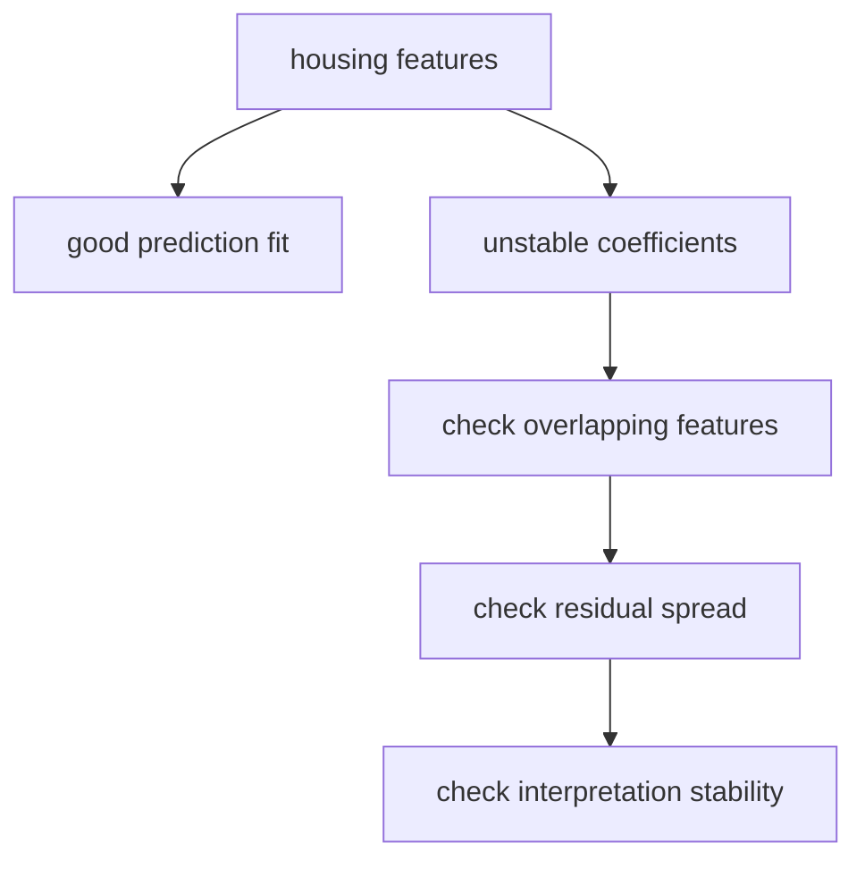

# P4-10.3 补充学习：第一次读回归诊断(regression diagnostics)的方法

> Section ID: `P4-10.3`
> Version: `v2026.07.10`

读到 P4-10.2 为止，linear regression 的基本评估已经齐了。但在真实文档或课程里，读者很快就会遇到下面这些表达。

- 统计显著性(significance)
- residual 的正态性(normality)
- 同方差性(homoscedasticity)
- 多重共线性(multicollinearity)

这一节的目的，不是学习这些概念全部的证明，而是整理 `这些词到底在担心什么`，让读者在看回归结果表时不要停住。

这份补充学习并不是一节把 linear regression 定义再扩展讲一遍的内容。基本直觉和评估抓手仍然放在 P4-10.1、P4-10.2 和 [概念词汇表](../../../reference/concept-glossary.md)，这里则只整理：这些回归诊断术语到底指向哪一类风险。

## 这份补充学习的范围

这一节回答下面这些问题。

- 为什么 regression diagnostics 会跟在 linear regression 后面出现？
- 统计显著性要小心地读什么？
- residual 的正态性、同方差性，到底是在担心哪种问题？
- 为什么 multicollinearity 会摇晃 coefficient 的解释？

这一节不会深入讲下面这些内容。

- 各个检验统计量的公式推导
- p-value 解释争议的完整历史
- VIF 计算实作和高级回归套件的用法

这些细部步骤，会放在这本书当前本篇范围之外。

## 这份补充学习的目标

- 你可以把 regression diagnostics 解释成 `为了不对 linear regression 结果过度相信而做的检查`。
- 你可以区分：significance、normality、homoscedasticity、multicollinearity 各自在担心什么。
- 当你读回归系数表时，你不会把 `有一个数字` 和 `这个解释很稳定` 当成同一句话。

## 为什么回归诊断要单独出现

linear regression 是拟合直线的模型，但并不是画出一条直线，解释就会自动变安全。所以 regression diagnostics 通常会继续追问下面这些问题。

1. 这条直线平均偏了多少？
2. 这些误差会不会朝某个方向偏？
3. 输入特征之间会不会重叠得太厉害，以致 coefficient 解释不稳定？
4. 系数表里的数字，到底能信到什么程度？

也就是说，regression diagnostics 是检查 `解释稳定性` 的语言，而不是 `性能分数` 的语言。

## 统计显著性在问什么

`这个 coefficient 或这种关系，会不会只靠偶然波动也看得见，还是在数据里看起来像某种相对一致的信号？`

重要的是，显著性并不立即等于实务重要度或预测性能。

| 表达 | 入门读取 |
| --- | --- |
| statistically significant | 一个很难只用偶然来解释的信号 |
| practically important | 在真实决策里影响很大 |

这两者可能不一样。因此，significance 是追问 `这个数字为什么存在` 的一个轴，但它并不能代替整个 model 质量。

## residual 的正态性在担心什么

如果说得很简单，residual 的正态性担心的是 `误差是不是以某种奇怪的形状严重偏向一边`。

对做 prediction 本身来说，正态性不需要被感受成一种绝对条件。但在 coefficient 解释和部分统计检验语境里，如果 residual 形状严重向一边扭曲，解释就可能不那么稳定。

- 如果 residual 向一边拖出很长的尾巴，解释就需要更小心
- 一个大的 outlier 可能强烈摇晃 residual 的形状

用一个很小的比较练习来看，可以这样读。

```python
balanced_residuals = [-3, -1, 0, 1, 3]
skewed_residuals = [-1, 0, 1, 2, 12]

print("balanced residuals:", balanced_residuals)
print("skewed residuals  :", skewed_residuals)
print("balanced range    :", max(balanced_residuals) - min(balanced_residuals))
print("skewed range      :", max(skewed_residuals) - min(skewed_residuals))
```

执行结果示例如下。

```text
balanced residuals: [-3, -1, 0, 1, 3]
skewed residuals  : [-1, 0, 1, 2, 12]
balanced range    : 6
skewed range      : 13
```

这个比较并不能代替正态性检验，但它在入门层面立刻展示了 `误差大体均衡地散开` 和 `一边出现很长尾巴` 这两种场景的差异。也就是说，把 residual 的正态性先理解成一种语言，去担心 `误差会不会向一边拉得太长，以致摇晃解释`，就已经足够。

## 同方差性在担心什么

同方差性担心的是：误差的散开程度，会不会随着输入区间不同而差得太多。

例如，如果在小值区间误差很小，而越到大值区间误差越大，就会出现下面这些问题。

- model 会不会只在某个区间里特别不稳定？
- 会不会藏着一种很难只用一条直线解释的结构？

也就是说，同方差性是在看 `误差是不是在所有区间里都以差不多的程度散开`。

用一个很小的比较表来看，可以这样读。

| 输入区间 | residual 示例 | 最先浮现的担心 |
| --- | --- | --- |
| 低价区间 | `-2, 1, 0` | 误差散布相对较小 |
| 高价区间 | `-15, 12, 18` | 某个区间里的误差散布明显更大 |

在这种场景里，比起先说 `平均性能还不错`，更该先确认 `到底是哪个区间的解释正在塌掉`。

## 为什么 multicollinearity 会摇晃 coefficient 解释

multicollinearity 出现在输入特征之间装着太多相似信息的时候。

例如：

- `monthly_spend`
- `quarterly_spend`
- `yearly_spend`

如果这些强烈重叠的特征一起进入模型，那么 prediction 本身也许还能做到一定程度，但 `到底哪个特征的 coefficient 才是真的更重要` 就会变得很难稳定地说。

核心是下面这句话。

`能做 prediction` 和 `coefficient 解释稳定` 不是同一句话。

## 案例及示例

### 案例 1. 房价预测好像对了，但 coefficient 解释一直在摇晃时

房地产分析团队正在建立房价预测回归式。人们最先看的标准，是 `面积大是否会更贵`、`离地铁站更近是否会更贵`、`越新房价是否越高` 这类问题。

不过，就算输入列里没有像 `monthly_spend` 这种直接重复项，也会一起进来很多彼此强烈重叠的信息，例如 `专用面积`、`建筑面积`、`房间数`、`客厅数`。模型的 prediction 本身看起来还不错，但有的实验里面积 coefficient 很大，有的实验里房间数 coefficient 更大，甚至 coefficient 的方向也会变得不稳定。在这种场景里，prediction 性能和 coefficient 解释稳定性不能被当成同一句话。



这时，regression diagnostics 会追问：`这些数字到底能信到哪里？` multicollinearity 可能因为相似特征在彼此分摊解释而摇晃 coefficient 解释；如果同方差性被破坏，某些价格区间里的误差散布就会更大；如果 residual 形状明显偏向一边，解释就要更谨慎。也就是说，并不是得到一条直线之后，整张 coefficient 表就自动成了安全解释。

可确认的结果，会在把 residual 分布和输入特征的重叠程度一起看时显现出来。如果 prediction 维持得差不多，但 coefficient 的大小和符号会随着实验一起摇晃，那么这个回归式就可能是 `可以拿来做 prediction，但做解释时必须更谨慎的模型`。

## 练习与示例

### 用 Python 看重叠特征会怎样摇晃 coefficient 解释

下面这个例子展示：当像 `monthly_spend` 和 `yearly_spend_proxy` 这样几乎装着相同信息的两个特征一起进入时，就算 prediction 很接近，coefficient 解释也可能明显摇晃。

- 问题场景：读取一个把月支出和年支出代理值一起放进来的回归式
- 输入(input)：`monthly_spend`, `yearly_spend_proxy`
- 正答(label)：下个月销售额
- 要确认的概念：
  - 如果强烈重叠的特征一起出现，coefficient 的角色会看起来像被拆开了
  - prediction 维持住，不等于 coefficient 解释也稳定

```python
import numpy as np
from sklearn.linear_model import LinearRegression

monthly_spend = np.array([10, 12, 14, 16, 18, 20], dtype=float)
yearly_spend_proxy = np.array([121, 145, 167, 193, 215, 239], dtype=float)
y = np.array([30, 35, 40, 45, 50, 55], dtype=float)

X_two_features = np.column_stack([monthly_spend, yearly_spend_proxy])
X_one_feature = monthly_spend.reshape(-1, 1)

model_two = LinearRegression()
model_two.fit(X_two_features, y)

model_one = LinearRegression()
model_one.fit(X_one_feature, y)

query_two = np.array([[17, 203]], dtype=float)
query_one = np.array([[17]], dtype=float)

print("two-feature coefficients :", np.round(model_two.coef_, 3))
print("two-feature prediction   :", round(model_two.predict(query_two)[0], 3))
print("one-feature coefficient  :", round(model_one.coef_[0], 3))
print("one-feature prediction   :", round(model_one.predict(query_one)[0], 3))
```

执行结果示例如下。

```text
two-feature coefficients : [1.661 0.143]
two-feature prediction   : 47.517
one-feature coefficient  : 2.5
one-feature prediction   : 47.5
```

从这个结果里，首先要读到下面几点。

- 两个模型的 prediction 几乎一样。
- 但当两个特征一起进去时，coefficient 解释会看起来被拆成 `1.661` 和 `0.143`。
- 也就是说，就算 prediction 保持住了，`到底哪个特征真的更重要` 仍然可能更容易摇晃。

### 再改一个值试试看：重叠特征只摇一个点时，什么保持不变，什么会变化

这次只把 `yearly_spend_proxy` 的最后一个值从 `239` 改成 `233`，再重新训练一次。

```python
import numpy as np
from sklearn.linear_model import LinearRegression

monthly_spend = np.array([10, 12, 14, 16, 18, 20], dtype=float)
yearly_spend_proxy = np.array([121, 145, 167, 193, 215, 239], dtype=float)
yearly_spend_shifted = np.array([121, 145, 167, 193, 215, 233], dtype=float)
y = np.array([30, 35, 40, 45, 50, 55], dtype=float)

query = np.array([[17, 203]], dtype=float)

model_original = LinearRegression().fit(
    np.column_stack([monthly_spend, yearly_spend_proxy]), y
)
model_shifted = LinearRegression().fit(
    np.column_stack([monthly_spend, yearly_spend_shifted]), y
)

print("original coefficients :", np.round(model_original.coef_, 3))
print("original prediction   :", round(model_original.predict(query)[0], 3))
print("shifted coefficients  :", np.round(model_shifted.coef_, 3))
print("shifted prediction    :", round(model_shifted.predict(query)[0], 3))
```

执行结果示例如下。

```text
original coefficients : [1.661 0.143]
original prediction   : 47.517
shifted coefficients  : [2.157 0.097]
shifted prediction    : 47.479
```

### 什么保持不变，什么发生变化

- 保持不变的点：两个模型的 prediction 仍然几乎一样。
- 发生变化的点：就算只轻微改动了一个重叠特征里的一个值，coefficient 的分配方式也会移动得相当明显。
- 先留下的判断：在这种场景里，应该先想起 regression diagnostics 的警告，即 `prediction 可以用，但 coefficient 解释必须更小心`。

### 这个练习如何回收 Part 4 的目标

这个练习把 regression diagnostics 从 `以后才学的统计术语列表`，重新绑回 `到底能把模型结果信到什么程度` 的程序。Part 4 的目标不是把分数和 coefficient 表照单全收，而是区分：哪些变化会摇晃 prediction，哪些变化只会摇晃解释。multicollinearity 正是最典型地要求这种区分的场景。

| 共同记录语言 | 这次练习里应该立刻留下的内容 |
| --- | --- |
| 看见的结构 | 只要有重叠特征，prediction 可以维持住，但 coefficient 解释仍然很容易摇晃 |
| 解释边界 | 不能只看 coefficient 变化，就断定某个特征的真实影响力突然改变了 |
| 下一个问题 | 如果再把 residual 散布和按区间出现的失败一起看，这个回归式是否还适合拿来做解释 |

### 也用一个小比较一起读同方差性

不要只看 multicollinearity 就结束，读者还可以非常小地比较一个按区间误差散布不同的场景。

```python
low_range_residuals = [-2, 1, 0]
high_range_residuals = [-15, 12, 18]

print("low-range spread  :", max(low_range_residuals) - min(low_range_residuals))
print("high-range spread :", max(high_range_residuals) - min(high_range_residuals))
```

执行结果示例如下。

```text
low-range spread  : 3
high-range spread : 33
```

这个数字并不能代替复杂检验，但它在入门层面立刻展示了同方差性所担心的东西：`就算用的是同一个回归式，某些区间里的误差也可能散得大得多`。也就是说，regression diagnostics 不只是问 coefficient 解释会不会摇晃，也会一起问 `误差散布是否失衡`。

### 如果把这份补充学习里的小练习一起读

- residual 正态性比较，会先让读者看 `误差形状是不是向一边拖得很长`
- 同方差性比较，会先让读者看 `哪个区间里的误差散布更大`
- multicollinearity 比较，会先让读者看 `prediction 维持住了，但只有 coefficient 解释在摇晃吗`

也就是说，regression diagnostics 不是一节用来背某个检验名字的内容，而更适合被读成一节：去区分到底是 `误差形状`、`误差散布`、还是 `coefficient 解释稳定性` 在摇晃。

## 这一节要记住的视角

- regression diagnostics 与其说是提高分数的技术，不如说是让解释变得更谨慎的检查。
- significance 特别会摇晃关系解释的信号，homoscedasticity 会摇晃误差散布，multicollinearity 会摇晃 coefficient 解释稳定性。
- 在读 linear regression 表时，要一起问的不是只有 `有没有数字`，而是 `这个数字到底能信到哪里`。

## 什么时候要先想到这个视角

- 当你需要检查自己是不是把 prediction 性能和 coefficient 解释稳定性当成同一句话时，就先想到 regression diagnostics 的视角。
- 当你需要重新解释 significance、homoscedasticity、multicollinearity 各自在摇晃什么时，就回到这一节。
- 当你需要先问的不是 `有一个数字`，而是 `那个数字到底能信到哪里` 时，这一节就是基准。

## 理解点检

- 你能不能不把 significance 和实务重要度当成同一句话？
- 你能不能说明同方差性担心的是 `误差大小会不会按区间变化`？
- 你能不能解释为什么 multicollinearity 会摇晃 coefficient 解释？

## 出处与参考资料

- statsmodels developers, [Regression diagnostics](https://www.statsmodels.org/stable/examples/notebooks/generated/regression_diagnostics.html){: target="_blank" rel="noopener noreferrer" }，确认日期：2026-07-01。
- Gareth James, Daniela Witten, Trevor Hastie, Robert Tibshirani, [An Introduction to Statistical Learning](https://www.statlearning.com/){: target="_blank" rel="noopener noreferrer" }，确认日期：2026-07-01。
