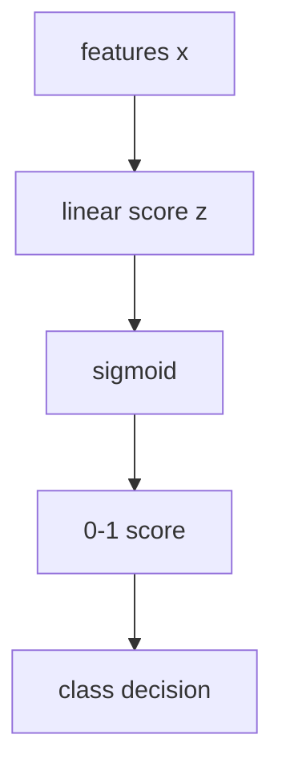
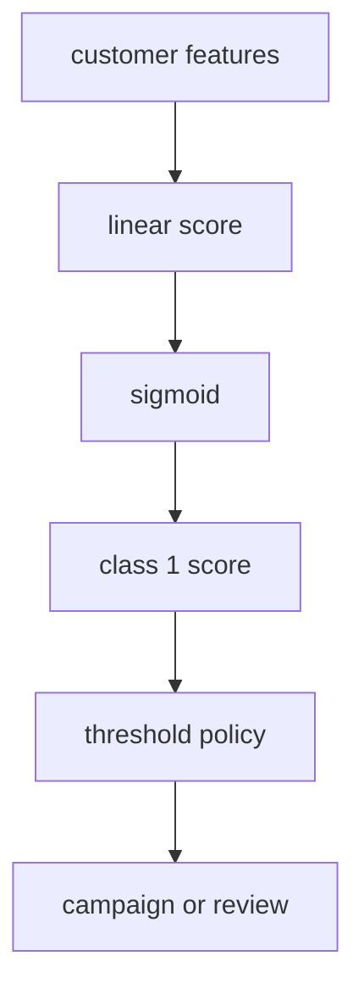

# P4-11.1 逻辑回归(logistic regression)的直觉

> Section ID: `P4-11.1`
> Version: `v2026.07.10`

在 P4-10 里，我们通过 linear regression 看过 `如何用直线预测连续值`。现在要进入：同样的线性思维在 classification 里会怎样变化。

这一节的中心问题如下。

如果保持线性计算，但又想把输出读成 0 到 1 之间的值，该怎么办？

这个问题正是 logistic regression 的出发点。

很多人会因为名字而混淆。既然叫 `regression`，为什么做的是分类？logistic regression 的最终目的虽然是 classification，但在内部它仍然计算 linear combination，再把那个值变成一种可以像概率那样读取的形式，所以这个名字才保留下来。

也就是说，logistic regression 不是 `把 linear regression 原封不动拿去做分类的模型`，而是 `把线性计算的输出改造成可以像分类概率那样解释的模型`。

这一节说明 `logistic regression`、`sigmoid`、`predict_proba`、`threshold` 的基本含义。后面的章节会在这些抓手上继续当前语境下的判断，而把线性计算读成分类概率的基本直觉，会再通过这一节和 [概念词汇表](../../../reference/concept-glossary.md) 接回。

## 这一节的范围

这一节回答下面这些问题。

- 为什么 logistic regression 会用在 classification 问题里？
- 为什么名字是 `regression`，结果却像分类那样来读？
- linear combination 会怎样变成 0 到 1 之间的值？
- `predict_proba` 这样的输出到底是什么意思？
- 为什么需要 threshold？

这一节不会深入讲下面这些内容。

- log-odds 的严格推导
- maximum likelihood estimation (MLE) 的公式展开
- 多类别(multinomial) logistic regression 的细部公式
- 按 solver 区分的差异与 regularization 设置

decision boundary 和 threshold 的空间解释，会在 P4-11.2 里直接继续。`为什么会开始看到 log-odds`、`为什么要用 MLE` 会在 P4-11.3 回收，`二元分类如何扩展到 multinomial` 会在 P4-11.4 回收，而 `为什么 solver 和 regularization 会作为实现设置出现` 会在 P4-11.5 回收。regularization 的更宽一般原理和相关 hyperparameter 的读取，会通过 P4-9.1、P4-9.2 和 P5-8.1 再次接回。

## 这一节的目标

- 你可以把 logistic regression 解释成 `在分类问题里产生可像概率那样读取输出的线性模型`。
- 你可以区分 linear regression 和 logistic regression 的共同点与差异。
- 你可以用入门水平说明 sigmoid 函数为什么会出现。
- 你可以理解 `predict_proba` 和最终 class prediction 不是同一个阶段。
- 你可以说明 threshold 会介入分类判断。

## 学习背景

Part 4 的算法脉络被设计成不会让讨论从 regression 突然跳到 classification。先看 linear regression 的原因，是为了说明 logistic regression 不是一个完全新的世界，而是在同一个 linear model 家族里，只是输出解释改变了的例子。

| 课程位置 | logistic regression 的角色 |
| --- | --- |
| 在 P4-10 linear regression 之后 | 把线性思维扩展到 classification 问题 |
| 在 P4-6 评估指标之后 | 为概率输出与 classification 指标之间的连接做准备 |
| 在 P4-11.2 之前 | 引入 decision boundary 概念 |

也就是说，11.1 既是 `第一次介绍 classification model 的一节`，同时也是展示 `它和 linear regression 连续性` 的一节。

## 主要学习内容

### logistic regression 处理的是什么问题

logistic regression 通常是在 `二选一的分类问题(binary classification)` 里被介绍。

例如：

| 业务场景 | 想预测的值 |
| --- | --- |
| 客户会流失吗？ | 流失 / 不流失 |
| 电子邮件是垃圾邮件吗？ | 垃圾邮件 / 正常 |
| 交易是欺诈吗？ | 欺诈 / 正常 |
| 病人是否有较高的某种疾病风险？ | 高风险 / 低风险 |

这些问题的共同点在于：输出不是连续值，而是 `类别`。但内部计算仍然是数字。

`logistic regression 是一个根据输入先估计“属于某一类的可能性”的 0 到 1 之间数值，再根据这个值决定分类的模型。`

### 为什么名字叫 regression，却做 classification

这一节最先要拆开的误解就是这个。logistic regression 虽然做分类，但在内部仍然会计算一个 linear score。

最简单的形式可以这样想。

\[
z = w_1x_1 + w_2x_2 + \cdots + w_nx_n + b
\]

这个式子和 linear regression 里看到的结构是一样的。区别在于，它不会停在这里。linear regression 试图把这个值直接读成 prediction，而 logistic regression 会把这个值送进 sigmoid 函数，变成 0 到 1 之间的值。

也就是说，名字里的 `regression` 是线性组合和数值估计方式留下来的痕迹，而真实用途更接近 `classification`。

### 为什么需要 sigmoid 函数

如果在分类问题里直接使用线性式的输出，就可能出现 1.7、-2.3、5.8 这类数值。但在分类里，这样的值很难直接读取。读者通常更想在 0 到 1 之间读取 `属于这个类的可能性有多大`。

sigmoid 函数就是干这个用的。

- 很大的正输入会被送到接近 1 的值
- 很大的负输入会被送到接近 0 的值
- 中间值会被送到接近 0.5 的位置

`sigmoid 是把线性计算结果压进 0~1 区间、使其更容易被分类读取的函数。`

把这个脉络简单画出来，就是下面这样。



关键在于，logistic regression 不是抛弃了直线，而是 `在线性计算之后又接上了一个解释用变换`。

### linear regression 和 logistic regression 有什么相同，又有什么不同

两个模型都使用 linear combination，这一点很相似。但输出的意义不同。

| 项目 | linear regression | logistic regression |
| --- | --- | --- |
| 主要处理的问题 | regression | classification |
| 内部计算 | linear combination | linear combination |
| 最终输出 | 连续值 | 0~1 之间的值，以及 class 决定 |
| 入门解释 | 预测多少分、多少分钟、多少钱 | 哪个 class 的可能性更大 |

也就是说，logistic regression 不是和 linear regression 完全不同起点的模型，而是把同样的线性结构重新解释给 classification 用的模型。

### `predict_proba` 显示的是什么

在 scikit-learn 的 logistic regression 文档里，一个很重要的输出是 `predict_proba`。读者很容易直接把它读成 `最终正确答案`，但实际上它是更前一层的信息。

例如，出现 `0.82` 这样的值时，通常意味着 `model 认为它属于 positive class 的可能性相当高`。但最终到底是写成 0 还是 1，是由 threshold 决定的。

也就是说：

- `predict_proba`：可能性的程度
- `predict`：最终分类决定

这就是基本区分。

如果漏掉这个差异，就会把 `score` 和 `decision` 误当成同一回事。

用一个很小的例子来看会更清楚。

| 用户 | 用 `predict_proba` 读出的 class 1 分数 | 按 0.5 基准的判断 |
| --- | ---: | --- |
| A | 0.18 | class 0 |
| B | 0.49 | class 0 |
| C | 0.51 | class 1 |
| D | 0.87 | class 1 |

这个表里最重要的是 B 和 C。两位用户的分数差并不大，但在 threshold 0.5 之下，最终 class 却被分开了。也就是说，model 造出来的 score space 是连续的，但 service judgment 可以在上面被不连续地切开。

### 为什么需要 threshold

logistic regression 一开始通常会通过 `用 0.5 作为基准做分类` 这种例子来介绍。

- 如果像概率那样读取的值 >= 0.5，那么 class 1
- 如果像概率那样读取的值 < 0.5，那么 class 0

但这个基准不是自然法则，而是被选择出来的 policy。

例如，在 fraud detection 里，因为漏掉的成本很大，可能想把它设得更敏感。反过来，在不能过度阻断正常用户的服务里，threshold 可以设得更保守。

也就是说，logistic regression 负责制造 `可像概率那样读取的值`，而真实服务则在这个值之上决定 `应该在哪里画线`。

这一点也会连接到 P4-6 的评估指标、P4-8 的 baseline、P4-9 的 tuning。

再看一个简单例子。

| 客户 | 流失分数 | threshold = 0.5 | threshold = 0.7 |
| --- | ---: | --- | --- |
| E | 0.42 | 维持 | 维持 |
| F | 0.58 | 警告 | 维持 |
| G | 0.73 | 警告 | 警告 |

即使是同一个分数，threshold 变了，服务行为也会变。正因为这样，读 logistic regression 时，必须把 `model score` 和 `运营 policy` 分开看。边界区间里的案例，首先应读成提高 review 优先级的信号，而不能因为改了 threshold，就认为对原因的解释已经结束了。

这里的比较框架也必须保持一致。只有把同一个 baseline、同一个分数区间、同一种代表失败案例放在 threshold 前后比较，才能更清楚地区分 `什么是 policy 变化造成的`，以及 `什么是 model 表达不足造成的`。

如果把这个点重新写成 project note 的视角，就会更清楚。当 logistic regression 被用作第一个比较模型时，不是只留下分数表，而是会把 `哪个分数区间要被当成 review 对象`、`threshold 改变时什么案例会改变行为`、`相比 baseline 到底什么变好了` 一起记下来。只有这样，面对同样的概率分数，读者之后才能不把 `policy 变化`、`特征不足`、`代表失败案例` 混在一起读。

| 要一起留下的记录 | 为什么需要 |
| --- | --- |
| baseline 和 logistic regression 分数比较 | 为了看出相对简单基准到底什么真的变好了 |
| 不同 threshold 下行为变化的案例 | 为了记录即使分数相同，service policy 会怎样变化 |
| review 对象分数区间 | 为了把靠近边界的案例重新读成人工 review 对象 |
| 下一轮调整问题 | 为了决定要改 threshold、继续看特征，还是去看别的候选模型 |

只有留下这些记录，像 `分数上升了`、`threshold 变了`、`警告变多了` 这样的事实，才不会被读成同一件事。也就是说，logistic regression 这一节同样是在留下这样一种可解释比较：`同一个 score space 正在被什么基准切开。`

### 什么时候适合先把 logistic regression 放进候选

logistic regression 常常被当成 classification 问题里的第一个比较模型，但原因不是因为它 `有名`，而是因为它是一个很适合把 score 和 policy 分开读取的 linear classification model。

| 当前问题状态 | 为什么先放 logistic regression | 先确认什么 |
| --- | --- | --- |
| 目的是二元分类 | 因为 0 到 1 之间的分数和最终 class 可以一起读 | 输出是不是类别性判断 |
| 需要第一个可解释的分类模型 | 因为 linear score、coefficient、threshold 都比较容易直接解释 | 线性边界是否足够 |
| 需要一个比 baseline 略好的 score model | 因为它适合拿来比较相对多数类基准的真实改善 | confusion matrix 里到底减少了什么 |
| 想留下人工 review 对象的分数区间 | 因为可以把 `predict_proba` 和 threshold 分开来设定 review 对象 | 是否把边界附近案例另行记录 |
| 需要区分 operating policy 和 model output | 因为结构很清楚：score 由 model 产生，action 由 policy 决定 | 是否把 threshold 变化和 model 改善混在一起 |

这张表的核心，是把 logistic regression 作为 `超出第一个分类 baseline 的比较模型`，同时也作为 `训练分开读取 score 和 policy 的模型`。

## 细部学习内容

### 学术背景与历史

读到这里，读者会自然产生这样的问题。`为什么偏偏需要这样一种模型？` logistic regression 因为名字，很容易看起来像 linear regression 的简单变体，但从历史上看，它站在 `解释连续值的回归脉络` 与 `处理二元结果的统计需求` 相遇的地方。

1. 首先，在经典统计里，linear regression 被广泛用于解释身高、分数、价格、时间这类 `连续值`。
2. 但现实里有很多问题，结果会落在 `成功/失败`、`通过/淘汰`、`生存/死亡`、`购买/不购买` 这种二选一上。
3. 如果把 linear regression 直接用在这种问题上，输出会跑到小于 0 或大于 1，使它很难被当作概率来读取。
4. 所以统计学并没有丢掉线性式本身，而是整理出一种方法：把 `线性式的结果搬到 0~1 范围里再解释`。

在这条脉络里，logistic function 在 19 世纪也被用来解释增长曲线和累积现象，后来又成了处理 binary outcome 的统计模型中的重要连接环节。

也就是说，logistic regression 的历史意义，更接近的不是 `放弃了直线`，而是 `改变了解释方式，从而让只靠直线难以处理的 classification 问题，也能被统计地处理`。

从这个视角看，linear regression 和 logistic regression 的顺序也会更清楚。

- linear regression：解释连续值的最基本 linear model
- logistic regression：保留 linear model 的思维，但把输出解释改造成适用于 binary classification 的模型

在现代机器学习语境里，这个模型通常会被介绍成 `for classification 的 linear model`。与其去背整个历史，不如把下面这句话当作基准。

`如果 linear regression 是解释连续值的代表性线性模型，那么 logistic regression 就是把这种线性思维扩展到二元分类和概率解释上的模型。`

### 主要讨论点出现在哪里

看过工作方式和例子之后，下一个问题就变成了 `这个模型能信到哪里，又该从哪里开始小心`。logistic regression 经常被当成入门模型，可解释性也被认为相对较高。但实际上，它也是 `正因为看起来容易解释，所以也特别容易被过度简化和误解的模型`。抓住下面这些讨论点很重要。

### 1. score 和 decision 是一回事吗

最常见的误解，是把 model 的输出和 service 的行为当成同一回事。

- model 通常给出的是一种接近 `它有多大可能属于 class 1` 的分数
- service 会在这个分数上决定 `阻断`、`警告`、`review`、`通过` 之类的动作

因此，围绕 logistic regression 的第一个讨论点，就是 `model 到底说到哪里，service policy 又是从哪里开始介入`。

`logistic regression 会产生判断材料，但不会自动替你设定最终行动规则。`

把这句话改成运营记录格式，可以写成下面这样。

| 记录项目 | 示例 |
| --- | --- |
| score | `0.58` |
| 当前 threshold | `0.50` |
| 当前行动 | `警告` |
| 是否需要 review | `因为接近边界，所以要 review` |
| 下一轮问题 | `如果提高到 0.60 以上，FN 会增加多少` |

有了这个表，概率分数、threshold、review 对象案例就不会各自飘开，而会留成一份统一的比较记录。

### 2. 看起来像概率的值，到什么时候才算概率

出现 `0.82` 这样的值，并不意味着它就完美地代表现实世界中的真实概率。根据数据分布、训练方式、calibration 状态，`看起来像概率的分数` 和 `真实频率` 可能并不一样。

这里出现的讨论点很简单。

- 这个值更接近 `排序用分数` 吗
- 还是说可以放心读成 `现实概率`

在实务里，这个差别很重要。如果只是给客户排优先级，分数顺序可能更重要；如果是像医疗风险提示这样对概率解释敏感的场景，calibration 就可能更重要。

核心可以整理成下面这样。

`logistic regression 的输出是可像概率那样读取的分数，但并不总是等于完美真实概率。`

### 3. coefficient 是解释，还是原因

logistic regression 被广泛使用的一个原因，是 coefficient 相对容易读。但 `读得懂` 和 `知道原因` 是不同的话。

- coefficient 的符号可以显示它把分数往哪个方向推
- coefficient 的大小可以成为在 model 内比较相对影响的线索
- 但这并不等于证明了现实里的直接原因

这个讨论点在社会数据、医疗数据、用户行为数据里尤其重要。如果把 correlation 和 causation 混在一起，解释看起来会很容易，但结论会变危险。

### 4. logistic regression 是因为简单才好，还是因为简单才弱

logistic regression 是 linear model。这种简单性既是优点，也是局限。

- 优点：快、适合当 baseline、比较容易解释
- 局限：当输入和结果的关系非常复杂或 nonlinear 时，表达力可能不足

所以在实务里，常常会出现这样的讨论。

- 是不是先从 logistic regression 开始，先立一个基准线
- 还是一开始就直接去更复杂的模型

这本书把前者当作基准。logistic regression 重要，不是因为它是 `最好的模型`，而是因为它是 `最适合第一次结构化理解 classification 问题的模型`。

### 5. 为什么 threshold 0.5 常用，但又不是绝对基准

0.5 只是一个常用 default。真实服务里，会根据 cost structure、class imbalance、policy standard，选择别的 threshold。

- 不能漏掉 spam 的服务
- 不能误封正常用户的服务
- 需要更早、更广泛抓住风险信号的服务

即使使用同一个 logistic regression 输出，也可以用不同的 threshold。

也就是说，围绕 logistic regression 的一个重要讨论点在于：`好分数` 和 `好行动基准` 并不总是一回事。

## 案例及示例

在读案例之前，先把这一节的共同比较框架固定如下。

| 场景 | 人最容易先用的基准 | 这个基准的局限 | logistic regression 改变了什么 | 要确认的结果 |
| --- | --- | --- | --- | --- |
| 流失预测 | 凭感觉挑出高风险客户 | 连同一个客户，不同人也可能看得不一样 | 把可像概率读取的分数和 threshold 放在一起 | 可以把 review 对象和自动行动基准分开 |
| 垃圾邮件分类 | 强力拦住可疑邮件 | 很容易把 FP 和 FN 成本混在一个基准里 | 把 score 和 policy 基准分开读 | 可以解释不同服务的 threshold 差异 |
| 医疗风险分类 | 看起来危险就广泛警告 | 很难一起处理漏判成本与过度警告成本 | 即使相同分数，也可以放更敏感的 threshold | 会看到除了 accuracy 以外还需要别的判断基准 |
| 贷款 / 欺诈检测 | 用一两个基准决定批准和阻断 | 容易漏掉不同领域的成本结构差异 | 即使同一个 model，也会叠加不同的运营 policy | 把 model score 和行动 policy 分开读 |

### 案例 1. 客户流失预测

在客户流失(churn)预测里，logistic regression 经常像 baseline 一样被使用。

- 输出值是 `流失的可能性`
- 真正的服务判断则是 `高于什么分数就发送 retention campaign`

例如，假设一个订阅服务先只看下面三个特征。

| 客户 | 最近 30 天活跃天数 | 最近 30 天支付次数 | 是否有投诉咨询 | class 1 分数 | 按 0.5 基准的行动 |
| --- | ---: | ---: | --- | ---: | --- |
| A | 26 | 4 | 无 | 0.18 | 正常维持 |
| B | 9 | 1 | 有 | 0.61 | 防流失 campaign |
| C | 4 | 0 | 有 | 0.84 | 优先 review + 强 retention |

读者在这个表里首先要抓住的是：`输入特征并不会直接走到行动`。model 先生成分数，而 service 再根据这个分数去划分 `正常维持`、`campaign`、`人工 review` 之类的行动。



在这个场景里，通常会先考虑 logistic regression，原因大致有三点。它能快速立起基准线，比较容易读出哪些特征在把分数推高，而且可以直接通过改动 threshold policy 来比较多种运营场景。

在这个场景里，比起 model 本身，更重要的是 threshold policy。例如，像 B 这种 `0.61` 的客户，是不是应该自动纳入 campaign 对象，还是说像 C 这样 `0.80` 以上才进入强干预，取决于成本结构。也就是说，即使面对同一张分数表，`从哪里开始自动行动` 仍然是 model 外部的运营决定。

### 案例 2. 电子邮件垃圾分类

在 spam filter 里，如果 false positive 太多，正常邮件就会被挡住。反过来，如果 false negative 太多，就会漏掉垃圾邮件。

如果换成一个很小的邮件分类场景，会更清楚。

| 邮件 | model 看到的信号示例 | class 1 分数 | 0.5 基准 | 更保守的 0.8 基准 |
| --- | --- | ---: | --- | --- |
| M1 | 广告词少，发件人正常 | 0.12 | 正常放行 | 正常放行 |
| M2 | 链接多，标题夸张 | 0.57 | 记为 spam | 送人工 review |
| M3 | 链接多，发件人异常，重复短语 | 0.93 | 记为 spam | 记为 spam |

这个表说明了：像 `spam score 0.57` 这样的值，到底要不要立刻拦截、送审查，还是放行，是由 threshold 改变的。

也就是说，即使是同一个 logistic regression：

- 更保守拦截的服务
- 必须更激进过滤的服务

也可能用不同的 threshold。

简单说，下面两个问题总会一起出现。

- 漏掉 spam 的成本更大吗
- 还是误挡正常邮件的成本更大

logistic regression 不会直接回答这些问题。它只是提供了一种分数，使这些问题能被翻译成 threshold policy。

### 案例 3. 医疗风险分类

在医疗领域，漏掉阳性风险的成本可能非常大。此时，就可能需要用比 0.5 更低的 threshold，以更敏感地给出警告。

例如，在门诊筛查阶段，可以这样来读。

| 患者 | model 看到的信号示例 | class 1 分数 | 0.5 基准 | 0.3 基准 |
| --- | --- | ---: | --- | --- |
| P1 | 年龄低，主要指标稳定 | 0.11 | 一般提示 | 一般提示 |
| P2 | 血压升高，有家族史 | 0.34 | 一般提示 | 建议追加检查 |
| P3 | 多项主要指标异常 | 0.79 | 建议追加检查 | 建议追加检查 |

这里像 P2 这样的案例很重要。`0.34` 按 0.5 基准看起来偏低，但在漏判成本很高的环境里，先建议追加检查反而可能更安全。

在这个场景里，就不能只看简单 accuracy，而是更接近 sensitivity 的视角会更重要。所以 logistic regression 通常先被当成 `score model` 使用，而真实运营则会和医疗基准一起另外设计。

### 案例 4. 贷款审核和欺诈交易检测的差异

在贷款审核里，错误批准和错误拒绝的成本都很高。在欺诈交易检测里，挡住正常用户的成本也很高，但漏掉真实欺诈的成本可能更大。

这两个问题看起来都像 binary classification，但运营视角并不一样。

- 贷款审核：explainability 和 policy consistency 可能更重要
- 欺诈检测：快速警告和高 recall 可能更重要

把两个场景放成同一种格式，差异会更清楚。

| 场景 | 同样的分数 0.62 容易被怎么读 |
| --- | --- |
| 贷款审核 | 可以送去补资料或审核员 review，而不是立刻拒绝 |
| 欺诈检测 | 可以更快地临时冻结支付，或要求额外验证 |

也就是说，就算分数相似，只要 `服务允许的错误类型` 不一样，同一个 logistic regression 分数也会通向不同的行动。

因此，同一个 logistic regression 在某些领域会长期作为 baseline 活下来，而在另一些领域里则只会作为更复杂模型的出发点。

这些案例共同展示了下面这个事实。

`logistic regression 负责制造分数，service 会另外决定如何把那个分数变成行动。`

## 练习与示例

### 用 Python 看一个小型 logistic regression

下面这个例子，是一个很小的 binary classification 实作：用学习时间(`study_hours`)预测考试是否通过(`passed`)。

- 问题场景：假设学习时间越多，通过可能性越高。
- 输入(input)：学习时间
- 正答(label)：通过(1) / 不通过(0)
- 要确认的概念：
  - 线性分数经过 sigmoid 后，会被读成 0~1 之间的值
  - `predict_proba` 和 `predict` 不是同一个阶段
  - coefficient 的符号会显示可能性朝哪个方向上升

输入可以这样来读。

| 输入组合 | 含义 |
| --- | --- |
| `study_hours` | 只有一个特征的一维输入 |
| `passed` | 通过 / 不通过 的正确答案 |
| `[[3], [5], [7]]` | 用来确认边界前、边界附近、边界后的样本 |

如果把训练数据重新写成表，可以这样来读。

| 学生 | 学习时间 | 实际结果 |
| --- | ---: | --- |
| S1 | 1 | 不通过 |
| S2 | 2 | 不通过 |
| S3 | 3 | 不通过 |
| S4 | 4 | 不通过 |
| S5 | 5 | 通过 |
| S6 | 6 | 通过 |
| S7 | 7 | 通过 |
| S8 | 8 | 通过 |

也就是说，这个例子是最小的 toy data，用来看 `学习时间从 4 小时段进入 5 小时段时，是否开始被读向通过 class`。

```python
import numpy as np
from sklearn.linear_model import LogisticRegression

study_hours = np.array([1, 2, 3, 4, 5, 6, 7, 8]).reshape(-1, 1)
passed = np.array([0, 0, 0, 0, 1, 1, 1, 1])

model = LogisticRegression()
model.fit(study_hours, passed)

proba = model.predict_proba([[3], [5], [7]])
pred = model.predict([[3], [5], [7]])

print("coefficient      :", round(model.coef_[0][0], 3))
print("intercept        :", round(model.intercept_[0], 3))
print("proba at x=3     :", np.round(proba[0], 3))
print("proba at x=5     :", np.round(proba[1], 3))
print("proba at x=7     :", np.round(proba[2], 3))
print("class prediction :", pred)
```

执行结果示例如下。

```text
coefficient      : 1.236
intercept        : -5.561
proba at x=3     : [0.831 0.169]
proba at x=5     : [0.452 0.548]
proba at x=7     : [0.117 0.883]
class prediction : [0 1 1]
```

这个输出可以这样来读。

- coefficient 是正的，所以随着学习时间增加，分数会朝 `通过 class` 移动。
- 在 `x=3` 时，可被读成 class 1 概率的值较低，所以会被分到不通过一侧。
- 在 `x=5` 时，它会穿过 0.5 附近，分类开始翻转。
- 在 `x=7` 时，它会更高地看向通过一侧。

重要的是，当看到像 `0.548` 这样的值时，要把它读成 `当前 model 看着这批数据时，更倾向于那一侧 class`，而不是把它直接当成绝对事实。

如果直接改值，会有一些地方看得更清楚。

- 如果把 `[[3], [5], [7]]` 改成 `[[4], [5], [6]]`，就能更细地看到边界附近的分数变化。
- 如果在 `passed` 里稍微改动边界附近的正确答案，coefficient 和 intercept 也会一起移动。
- 同样的分数，threshold 一变，最终行动也会变，这一点会直接连到下一个例子。

### 用 Python 一起看 threshold 差异

这次让读者直接用眼睛确认：同样的分数，在不同 threshold 下，最终行动会怎样变化。

- 问题场景：假设已经拿到了客户流失分数。
- 输入(input)：已经计算好的 class 1 分数
- 期待输出(output)：在 threshold 0.5 和 0.7 下，判断会如何变化
- 要确认的概念：
  - 即使分数相同，只要 policy 基准变了，class decision 就会变
  - model output 和 service action 必须分开来读

```python
import numpy as np

scores = np.array([0.42, 0.58, 0.73])

pred_05 = (scores >= 0.5).astype(int)
pred_07 = (scores >= 0.7).astype(int)

print("scores          :", scores)
print("threshold 0.5   :", pred_05)
print("threshold 0.7   :", pred_07)
```

执行结果示例如下。

```text
scores          : [0.42 0.58 0.73]
threshold 0.5   : [0 1 1]
threshold 0.7   : [0 0 1]
```

这个输出再次说明了：`model 负责生成分数，而把分数变成行动的是运营规则。`

例如，像 0.58 这样的分数，到底要不要立刻发出警告，还是送去 review，不是 model 决定的，而是 policy 决定的。下一步动作就是把边界附近分数收集起来，重新检查适合 FP 和 FN 成本的 threshold。也就是说，threshold 这一节的核心，不只是解释分数，而是判断会进一步通向 `该怎样处理边界附近案例`。

### 再改一个值试试看：边界附近一个正确答案变了，分数解释会怎样摇晃

这次把训练数据里边界附近的 `study_hours = 4` 这个案例，从 `不通过(0)` 改成 `通过(1)`。

```python
import numpy as np
from sklearn.linear_model import LogisticRegression

study_hours = np.array([1, 2, 3, 4, 5, 6, 7, 8]).reshape(-1, 1)
passed_original = np.array([0, 0, 0, 0, 1, 1, 1, 1])
passed_shifted = np.array([0, 0, 0, 1, 1, 1, 1, 1])

model_original = LogisticRegression()
model_original.fit(study_hours, passed_original)

model_shifted = LogisticRegression()
model_shifted.fit(study_hours, passed_shifted)

score_original = model_original.predict_proba([[4]])[0][1]
score_shifted = model_shifted.predict_proba([[4]])[0][1]

print("class 1 score at x=4, original labels :", round(score_original, 3))
print("class 1 score at x=4, shifted labels  :", round(score_shifted, 3))
```

执行结果示例如下。

```text
class 1 score at x=4, original labels : 0.327
class 1 score at x=4, shifted labels  : 0.579
```

### 什么保持不变，什么发生变化

- 保持不变的点：学习时间越多，朝通过一侧移动的整体方向仍然保持住了。
- 发生变化的点：边界附近只改了一个正确答案，`x=4` 的 class 1 分数就从 `0.327` 明显跳到了 `0.579`。
- 先留下的判断：logistic regression 的分数并不是发现了自然里本来就存在的概率，而是当前训练数据边界制造出来的解释结果。

### 这个练习如何回收 Part 4 的目标

这个练习让读者把 logistic regression 从 `输出分数的模型` 重新读成 `对边界附近案例很敏感的分类基准`。Part 4 的目标不是去相信某一个分数数字，而是去读：案例变化会把分数和 threshold 判断摇晃到什么程度。把同一个例子反复改动之后，读者会更清楚地看到：在 model output 和 service action 之间，永远还多了一层数据解释步骤。

| 共同记录语言 | 这次练习里应该立刻留下的内容 |
| --- | --- |
| 看见的结构 | 只改边界附近一个正确答案，同一个输入的 class 1 分数解释就会大幅摇晃 |
| 解释边界 | 不能只凭这个分数变化，就断定真实概率突然也那样改变了，样本和数据边界必须一起看 |
| 下一个问题 | 如果收集更多边界附近案例，分数摇晃会不会变小；如果再叠加 threshold policy，哪些行动会改变 |

| 先看到的信号 | 这个信号意味着什么 | 紧接着的下一步动作 |
| --- | --- | --- |
| 很多分数靠近 0.5，而且一改 threshold 判断就经常翻转 | 说明比起 model score，运营边界设置制造的差异更大 | 收集边界附近案例，重新检查适合 FP 和 FN 成本的 threshold |
| 高分很多，但实际频率和体感风险看起来对不上 | 说明把 score 顺序和概率解释当成一回事会有风险 | 重新决定是否需要 calibration，还是只把分数用于排序 |

## 这一节要记住的视角

- logistic regression 是一个在 classification 问题里产生可像概率读取输出的 linear model。
- 内部计算是 linear combination，但最终解释会经过 sigmoid 变成 0~1 的值。
- `predict_proba` 是分数阶段，`predict` 是应用 threshold 之后的决定阶段。
- coefficient 对读取方向很有用，但不会自动证明原因。
- threshold 与其说是 model 的一部分，不如说是和 service policy 咬合在一起的判断基准。

## 简短检查

- 你有没有先确认当前问题是 binary classification？
- 你有没有把 `predict_proba` 和最终 `predict` 读成同一回事？
- 你能不能分开解释 threshold 变化和 model 本身的改善？

## 什么时候要先想到这个视角

- 当你在处理 binary classification，却把分数和最终决定混成一句话时，先想起 logistic regression 里 `predict_proba` 和 `predict` 的区分。
- 当你把调整 threshold 和重新训练 model 当成同一种修改时，把 policy boundary 和 model 本身重新分开。
- 当 coefficient 解释、sigmoid、可像概率读取的输出一下子缠在一起时，重新拿出这样一个视角：这是 `在线性组合后面又多接了一层解释步骤的模型`。

## 与下一节的连接

在 11.1 里，我们把 logistic regression 看成 `制造可像概率读取分数的 linear model`。下一节 P4-11.2 会继续进入：这个分数在输入空间里可以被看成制造了什么样的边界(boundary)，也就是转到 decision boundary 的视角。

也就是说，如果 11.1 是 `输出解释` 的一节，那么 11.2 就是 `空间与边界解释` 的一节。

## 出处与参考资料

- scikit-learn, `1.1.11. Logistic regression`, scikit-learn User Guide，确认日期：2026-06-26。 [https://scikit-learn.org/stable/modules/linear_model.html#logistic-regression](https://scikit-learn.org/stable/modules/linear_model.html#logistic-regression){: target="_blank" rel="noopener noreferrer" }
- scikit-learn, `LogisticRegression`, scikit-learn API Reference，确认日期：2026-06-26。 [https://scikit-learn.org/stable/modules/generated/sklearn.linear_model.LogisticRegression.html](https://scikit-learn.org/stable/modules/generated/sklearn.linear_model.LogisticRegression.html){: target="_blank" rel="noopener noreferrer" }
