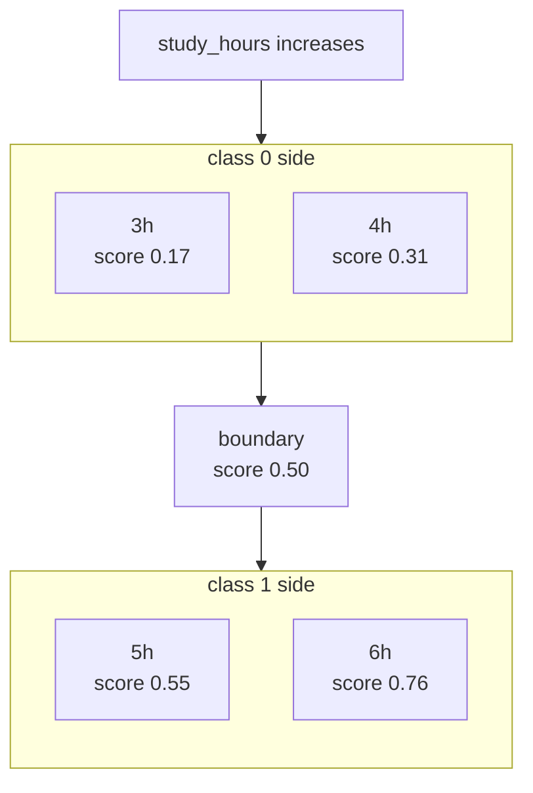
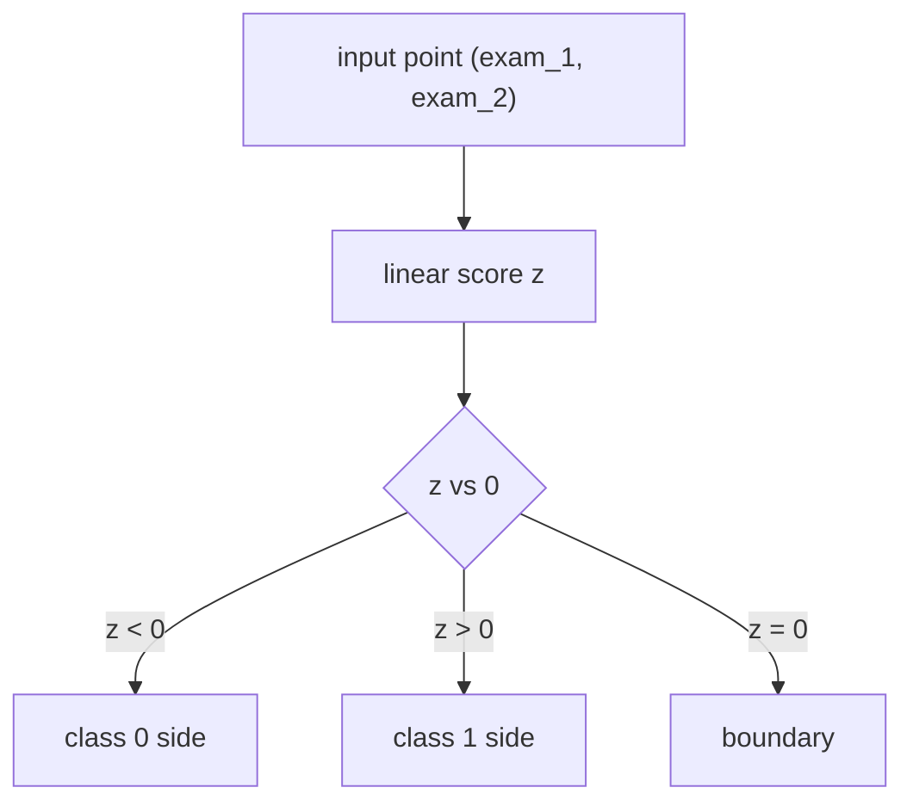
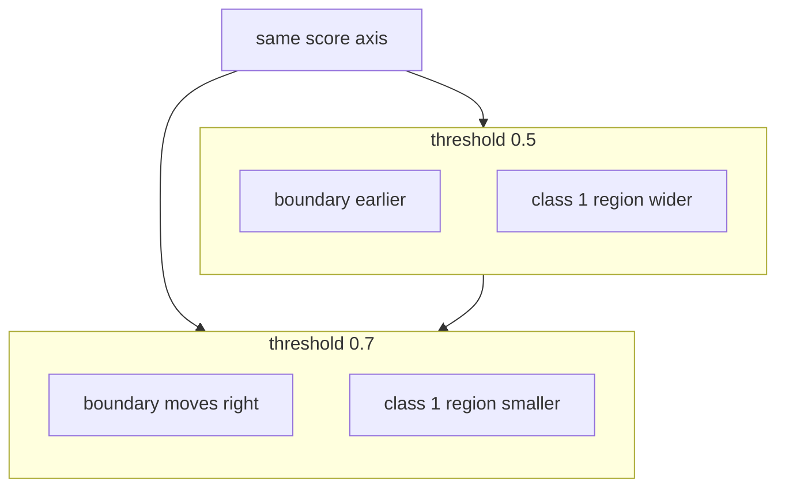
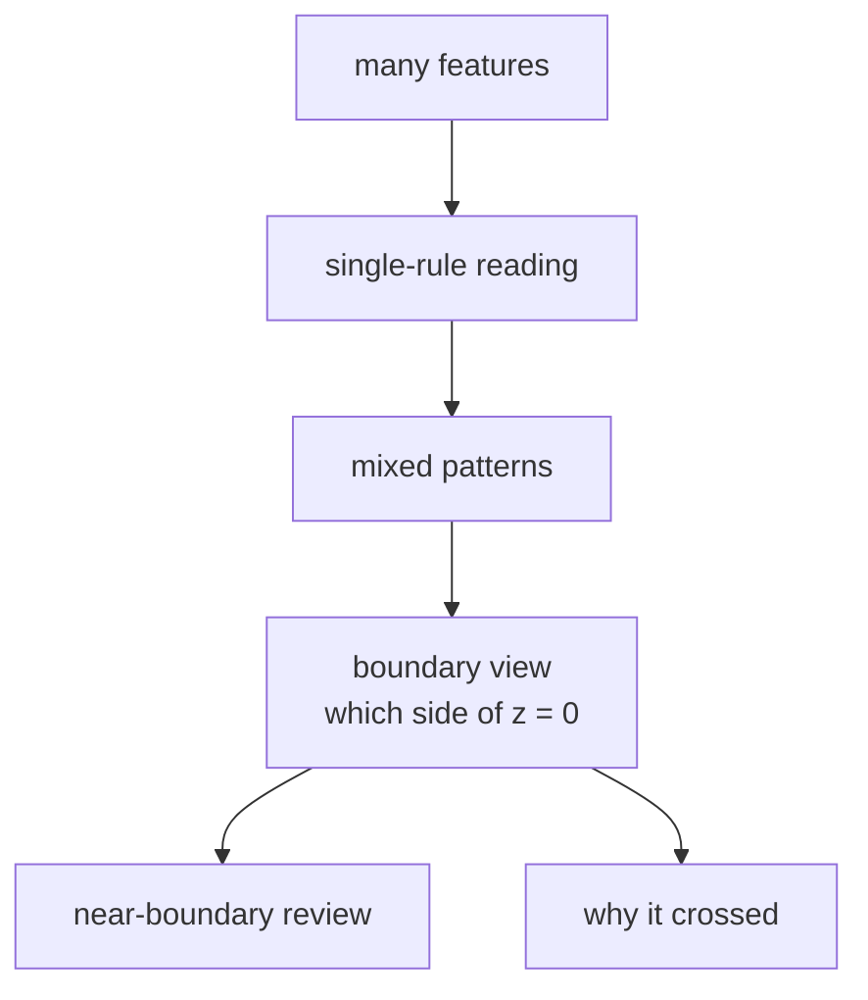

# P4-11.2 决策边界(decision boundary)

> Section ID: `P4-11.2`
> Version: `v2026.07.10`

在 P4-11.1 里，我们把 logistic regression 看成 `制造可像概率读取分数的 linear model`。现在把问题再改一步。

为什么那个分数会把某些输入分成 class 0，而把另一些输入分成 class 1？

要回答这个问题，只看 `概率是多少` 还不够。还必须一起看到 `到哪里为止读成 class 0，从哪里开始读成 class 1` 这个标准。在 input space 里读取这个标准的视角，就是 decision boundary。

所以像 `在输入空间里哪里画了一条线` 这样的说法，更接近结果而不是本质。更本质的问题是下面这个。

model 是按什么标准，把输入读成两边的？

如果 11.1 是读 output 的一节，那么 11.2 就是看 input 的一节。

decision boundary 是 model 用来分开 class 0 和 class 1 的分界线或分界面。

这一节不会再长篇重复 logistic regression 的基本定义。`制造可像概率读取分数的 linear classifier` 这个核心直觉，会通过 P4-11.1 和 [概念词汇表](../../../reference/concept-glossary.md) 接回；这里则只聚焦在：那个分数是怎样切开 input space 的。

一旦读到 decision boundary，下一批问题就会留下来：`为什么概率要这样被改写来读`、`为什么训练解释里会跟着 log-odds 和 MLE`、`这种感觉在多类别和设置比较里又会怎样扩展`。这些回收会在 P4-11.3、P4-11.4、P4-11.5 的补充学习里继续。

## 这一节的范围

这一节回答下面这些问题。

- 什么是 decision boundary？
- 在一维输入里，边界看起来像什么？
- 在二维输入里，边界为什么会看起来像一条线？
- logistic regression 的 coefficient 和边界方向是什么关系？
- threshold 变了以后，边界会怎样变化？

这一节不会深入讲下面这些内容。

- 高维空间里 hyperplane 几何的严格展开
- multiclass classification 里的边界划分
- kernel 方法或 nonlinear boundary 的数学展开
- 用于边界可视化的 plot 细节实现

hyperplane 的直觉会通过 P4-1.2 再接回，kernel 方法和 nonlinear boundary 会在 P4-13.1 和 P4-13.2 再处理。像 `C`、`gamma`、threshold 调整这样的设置和计算成本，会通过 P4-9.1、P4-9.2 再次连接。multiclass 边界划分与 plot 实现细节，仍然放在这本书当前本篇范围之外。

## 这一节的目标

- 你可以把 decision boundary 解释成不是 `输出分数`，而是 `切开 input space 的标准`。
- 你可以理解：在一维里它看起来像 `一个点`，在二维里通常看起来像 `一条线`。
- 你可以说明 logistic regression 的 coefficient 会参与改变边界的方向。
- 你可以说明 threshold 一变，边界本身也可能移动。
- 你可以连接起来：11.1 的概率输出和 11.2 的边界视角，其实是同一个模型的两种表达。

## 学习背景

### 为什么要单独看 decision boundary

在 11.1 里，我们读过 `0.58`、`0.73` 这样的分数。但在实务和学习里，下面这些问题往往更重要。

- 为什么某个输入会变成 class 0？
- 为什么某个输入会变成 class 1？
- 两个 class 之间的标准在哪里？

要回答这些问题，只看输出表还不够。输出表展示的是 `结果`，但它并不能充分解释 `为什么会有那个结果`。

这正是要看 decision boundary 的原因。

- 为了解释某个输入为什么变成了 class 0
- 为了解释某个输入为什么变成了 class 1
- 为了说明分开两个 class 的标准在哪里
- 为了把边界附近的模糊案例单独识别出来

也就是说，decision boundary 不是一个简单的可视化装置，而是 `为了读取分类原因的解释工具`。

当读者需要看到 `input space 到底是按什么标准被分成两边` 时，出现的视角就是 decision boundary。

decision boundary 也必须和下面四件事一起看。

| 要一起看的东西 | 为什么需要 |
| --- | --- |
| baseline 分类结果 | 因为要知道这条线性边界是否真的比简单标准更好 |
| threshold 位置 | 因为即使同样的分数，也要知道 class 是从哪里开始分开的 |
| confusion matrix 的问题格子 | 因为要看这条边界更容易制造哪一类误分类 |
| 边界附近的代表案例 | 因为要解释模糊输入为什么会跨到对面 class |

也就是说，decision boundary 不是一节画一条线的内容，而是一节一起去读 `相对什么变好了`、`class 从哪里分开了`、`因此产生了什么误分类` 的内容。

如果在这里再加一点，decision boundary 这一节就会更直接连接到运营解释。边界附近案例不只是 `模糊点`，而是应该优先留下作为下一步 review 对象的案例。也就是说，decision boundary 也可以读成不是可视化结果，而是一种比较框架：决定 `哪些输入要再由人看一遍`。在这里，靠近边界这个事实首先显示的是变化信号和 review 优先级，而不是一句会自动解释它为什么跨过去的原因句子。

这种比较也最好尽量维持同一个标准。只有把同一个 baseline 分类结果、同一个分数区间、同一个代表失败案例放在边界前后对比，才能更少混淆地去读 `model score 的变化`、`threshold policy 的变化`、`特征表达不足`。

| 看边界时要一起留下的东西 | 为什么需要 |
| --- | --- |
| 边界附近案例 ID | 为了重新找到 review 对象 |
| 相对 baseline 改变了的分类 | 为了看哪些案例真的和简单标准不一样地被分开了 |
| threshold 变化时移动的案例 | 为了看 policy 变化把哪些输入推到了对面 |
| 下一轮审查问题 | 为了决定是继续加特征还是调 threshold |

有了这些记录，就不会把 `边界动了`、`警告变多了`、`新出现了被分开的案例` 分开来读，而能在同一个比较框架里重新读取它们。

## 主要学习内容

### 什么是 decision boundary

classification model 通常会先在内部计算一个 score，再根据这个 score 来分 class。decision boundary 正是 `那个 score 与阈值相等的地方`。

如果把 logistic regression 简化到入门层面，可以这样理解。

\[
z = w_1x_1 + w_2x_2 + \cdots + w_nx_n + b
\]

这个线性分数 \(z\) 放进 sigmoid 之后，会得到 0 到 1 之间的值。如果使用常见 threshold 0.5，那么 sigmoid 输出等于 0.5 的地方，就会成为 class 的边界。

sigmoid 输出等于 0.5，也就意味着线性分数 \(z\) 等于 0。所以 logistic regression 的 decision boundary，通常可以理解成 `linear score = 0 的位置`。

`decision boundary 是概率开始变得模糊的位置，同时也是 class 开始分开的地方。`

### 在一维里，边界看起来像一个点

如果输入只有一个，那么边界看起来就不是一条线，而像 `一个点`。

例如，如果输入只有学习时间(`study_hours`)，model 就可能用某个时间作为标准去分开不通过和通过。

| 学习时间 | class 1 分数 | 预测 |
| ---: | ---: | --- |
| 3 | 0.17 | 不通过 |
| 4 | 0.31 | 不通过 |
| 5 | 0.55 | 通过 |
| 6 | 0.76 | 通过 |

在这种情况下，边界可以读成 `4 小时和 5 小时之间的某个地方`。也就是说，一维 decision boundary 更接近 `一个 cutoff point`。

简单画出来，就是下面这样。这次可以把它读成：`学习时间轴上分数怎样变大，又是从哪里开始切换 class`。



这张图的核心在于：随着输入值增加，分数会上升，而在 `score 0.50` 这个边界点，`class 0 side` 和 `class 1 side` 开始分开。也就是说，在一维里，读者不需要去找复杂的面或区域，只需要找到 `轴上的一个点`。

这个视角在检查 threshold 时非常重要。11.1 里看起来像分数表的东西，到 11.2 就开始重新被看成 `输入轴上的边界点`。

### 在二维里，边界看起来像一条线

现在假设输入有两个，比如用 `exam_1` 和 `exam_2` 两个分数来分类通过与不通过。这时，input space 就不再适合只看成一张表，而可以想成一个平面。

- 一个轴是 `exam_1`
- 另一个轴是 `exam_2`
- 每个学生都是这个平面上的一个点(point)

这时，logistic regression 会尝试找到一条分界线，把这些点分成两边。所以在二维里，decision boundary 通常看起来像 `一条直线(line)`。



这张图把 logistic regression 的 decision boundary 展示成 `比较 score z 与 0 的规则在 input space 里留下来的痕迹`。这里要读到的不是先画了一条线，而是：class 会根据线性分数的符号落到两边。

`只要输入多一个，边界就会从一个点变成一条线。`

这里重要的不是 `先有一条线，再把 class 分开`，而是因为 `比较 score z 与 0 的规则`，所以平面上才会结果性地出现一条边界线。

也就是说，在二维里，下面三个问题最直接的回答其实是同一件事。

- 为什么某个输入会变成 class 0？`因为它的 z 小于 0`
- 为什么某个输入会变成 class 1？`因为它的 z 大于 0`
- 两个 class 之间的标准在哪里？`z = 0 的所有点的集合`

所以，decision boundary 不该被读成一个简单图像，而应被读成 `分类规则在平面上留下的痕迹`。

### coefficient 和边界方向是什么关系

logistic regression 的 coefficient 不只是拿来计算 score。从 input space 的角度看，这些值也会影响边界朝什么方向摆放。

例如，当有两个特征时：

\[
z = w_1x_1 + w_2x_2 + b
\]

那么 \(w_1\) 和 \(w_2\) 的相对大小与符号，就会改变边界线的斜率和方向。

比起公式推导，更重要的是下面这种感觉。

- 如果某个特征的 coefficient 变大，那么那个轴的影响就可能变大
- 如果两个 coefficient 的组合变了，划分 class 的边界斜率也会变
- intercept 会起到把边界平移的作用

也就是说，在 11.1 里 coefficient 是 `制造分数的数字`，而在 11.2 里，它也可以被读成 `决定边界的数字`。

### threshold 一变，边界也会动

在 11.1 里，我们已经看过：threshold 一变，最终行动也会变。到 11.2，这句话必须从空间视角重新读取。

当 threshold 是 0.5 时的边界，和 threshold 是 0.7 时的边界，不一定在同一个位置。原因很简单。

- threshold 0.5：从分数超过这个阈值的地方开始算 class 1
- threshold 0.7：只有在更高分数以后，才算 class 1

也就是说，如果提高 threshold，被分到 class 1 的区域会变小，而边界就可能往更保守的方向移动。

`model 的 coefficient 决定边界的方向，而 threshold 还能再次调整边界放在哪里。`

如果把这种移动概念性地画出来，就是下面这样。



这张图的核心在于：`即使不重新训练 model 本身`，只要把 threshold 设得更严格，同样的 score 轴上边界也会向更右边推，class 1 区域会被读得更窄。因此，边界移动应该被看成一种 policy 变化，它会让读者重新读取 `哪些案例越过了边界`，而不能把这种移动直接读成特征原因解释已经完成。

在 decision-boundary 记录里，要把下面三句话一起留下。

- 边界附近案例首先是提高 review 优先级的信号，而不是自动确认对象。
- threshold 一变，同一个输入也可能进入不同的行动。
- 边界移动已经被观察到，但它本身不会自动完成原因解释。

### 什么时候 decision-boundary 视角特别重要

decision boundary 不是一个简单的可视化场景，而是在需要解释 `为什么这个输入会跨到对面 class` 时特别重要。

| 当前更想看到什么 | 为什么需要 decision-boundary 视角 | 要一起确认什么 |
| --- | --- | --- |
| 靠近边界的模糊案例 | 因为只看分数，为什么会分开这件事解释得还太弱 | threshold 和 review 对象区间 |
| 某一种误分类反复出现 | 因为要看边界到底往哪边倾斜了 | confusion matrix 的问题格子 |
| 正在犹豫要不要改 threshold | 因为要从空间视角读出 policy 变化会移动哪些输入 | threshold 前后的案例变化 |
| 怀疑是否需要追加特征 | 因为要确认当前边界是不是太简单了 | 相对 baseline 新分开的案例 |
| 需要挑出人工 review 对象 | 因为边界附近案例会带来 review 优先级 | 案例 ID 和分数区间记录 |

这张表的目的，不是把边界看成漂亮图片，而是让读者去追踪 `分类规则到底是在哪里分开，又漏掉了什么`。

## 细部学习内容

### 学术背景与历史

decision boundary 这个词第一次看时，很容易像是纯粹给可视化用的表达。但从历史上看，它其实连接着一个关于 `如何理解 classification` 的重要视角变化。

在早期统计和 regression 传统里，中心问题大多是 `估计一个值`。也就是说，给定输入之后，怎样更好地解释一个连续结果，是最核心的问题。但在 classification 问题里，提问方式会有些改变。

- 这个样本属于哪个 class？
- 两个 class 是按什么标准分开的？
- 在同一个 input space 里，风险区域和安全区域在哪里？

随着这些问题出现，classification model 也开始不再只被读成 `产生分数的函数`，而是被读成 `切分空间的装置`。

在回想这条历史脉络时，经常会被提到的一个起点，是 Fisher 的判别(discriminant)传统。1936 年 Ronald A. Fisher 处理过用多个测量值一起区分类别的问题，而这个语境后来会继续通向 linear discriminant 和 classification boundary 视角。在那个时期，人们还不像今天这样把 `decision boundary` 这个词摆在最前面，而是更直接地问：`什么样的 linear combination 能把群体分得更好？`

`classification 最初的问题意识，比起再把一个值预测得更准一点，更接近于如何区分不同群体。`

后来，在 statistical classification 和 pattern recognition 方向上，这种区分问题开始被放进更一般的语言里。特别是在 Bayes classifier、linear discriminant analysis (LDA)、quadratic discriminant analysis (QDA) 的说明里，人们整理出一种读法：把 `两个 class 的 posterior probability 相等的位置`，或 `分类函数值相等的位置` 看成边界。

这个视角重要的原因，在于它说明了 decision boundary 不是单纯为了画图才存在。边界可以被读成下面这些东西。

- 哪一边 class 更像样会发生变化的位置
- 误分类成本和判断规则接上的位置
- 模糊案例聚集的位置

也就是说，从历史上看，decision boundary 更准确的理解方式不是 `在空间里画线的技术`，而是 `表达分类判断会翻转的标准`。

如果从这个视角再看 logistic regression，就可以整理成下面这样。

- 11.1 的视角：logistic regression 会制造可像概率读取的分数
- 11.2 的视角：logistic regression 会在 input space 里画出边界并分开 class

这两个视角不是不同的 model，而是同一个 model 的两种读取方式。

在现代机器学习里，decision-boundary 视角之所以更重要也很清楚。因为读者后面会看到的 SVM、decision tree、neural network，也都可以最终重新读成 `它们是怎样切分输入的`。

因此，如果把 decision boundary 的历史意义整理成入门层次，就会变成下面这样。

`classification 既是分数计算问题，同时也是如何切开 input space 的问题。`

只要抓住这句话，读者就会更清楚地理解：为什么 logistic regression 后面还会继续出现别的 classification algorithm。

## 案例及示例

在读案例之前，先把这一节的共同比较框架固定如下。

| 场景 | 人最容易先用的标准 | 这个标准的局限 | decision-boundary 视角改变了什么 | 要确认的结果 |
| --- | --- | --- | --- | --- |
| 合格预测 | 给一个分数放一条及格线 | 当多个特征一起作用时解释很弱 | 把它看成组合型分界线 | 读法会从一个点变成一条线或一个面 |
| 客户流失 | 只看一个变量判断风险 | 会漏掉组合型模式 | 去看多个特征组合是否形成风险区域 | 可以解释什么组合越过了边界 |
| 医疗风险 | 只看一个数值判断风险 | 会漏掉模糊组合案例 | 把边界附近案例单独看出来 | 可以识别 review 优先级对象 |
| 贷款 / 垃圾邮件 | 用单一规则解释批准和阻断 | 会漏掉复合特征和线性边界的局限 | 去看边界到底在切开什么组合 | 可以把线性边界的优点与局限一起读出来 |



### 案例 1. 合格预测

如果只看一个分数，那么一个 cutoff point 就会成为边界。但如果科目变成两个，就会出现像 `数学高但英语低` 这样的抵消关系。这时，比起 `某一个分数单独的标准`，`同时看两个分数的边界线` 会更合适。

放进一个小表里，可以这样来读。

| 学生 | 数学分数 | 英语分数 | 边界解释 |
| --- | ---: | ---: | --- |
| A | 92 | 38 | 一科很高，但另一科很低，所以可能停在边界附近 |
| B | 71 | 68 | 两科一起都在中等以上，因此容易跨到合格一侧 |
| C | 45 | 44 | 两科都低，很可能停留在不合格一侧 |

这个表的核心在于，只用 `数学有没有超过 90` 这样的单一标准，很难把 A 和 B 的差异解释完整。decision-boundary 视角会让读者看 `两个分数组合落在区域的哪一边`。

这个案例重要，是因为读者很容易一直把 classification 理解成 `一个分数配一条合格线`。decision-boundary 视角则说明：`如果多个特征一起工作，标准也会变成组合。`

### 案例 2. 客户流失预测

如果输入变成 `最近活跃天数`、`支付频率`、`客服咨询次数` 这种多个变量，只看某一个变量就很难解释流失。decision-boundary 视角能让读者看到 `多个特征一起出现时，什么组合会进入风险区域`。

例如，比较下面三位客户。

| 客户 | 最近 30 天活跃天数 | 最近 30 天支付次数 | 咨询次数 | 边界解释 |
| --- | ---: | ---: | ---: | --- |
| A | 22 | 3 | 0 | 很可能停留在维持区域 |
| B | 11 | 1 | 2 | 很容易被读成边界附近的 review 对象 |
| C | 4 | 0 | 4 | 很容易被读成已经跨进风险区域 |

这里 B 很重要。只看活跃天数时，它还不算极低；但如果支付频率下降和咨询增加一起出现，就可能成为边界附近案例。

例如，即使活跃稍有下降，只要支付频率稳定，仍然可以被看作留存客户；但如果活跃下降和支付中断同时出现，就可能跨进风险区域。也就是说，边界让读者去读取 `组合模式`，而不是 `单个数值`。

### 案例 3. 医疗风险分类

只看一个检测数值可能很模糊，但如果把 `血压`、`血糖`、`年龄` 一起看，风险区域就可能更清楚。此时，decision boundary 会帮助读者在脑中想象 `什么样的组合跨进风险 class`。

简单写开，就是下面这样。

| 患者 | 血压 | 血糖 | 年龄 | 边界解释 |
| --- | ---: | ---: | ---: | --- |
| P1 | 正常 | 正常 | 34 | 离风险区域还有距离 |
| P2 | 略高 | 接近边界值 | 58 | 可能属于边界附近案例，需要追加审查 |
| P3 | 高 | 高 | 67 | 很容易被读成已经跨进风险区域 |

这个场景里，P2 才是关键。单个数值看起来都还模糊，但如果多个值同时都贴着边界，真实决策就必须看得更谨慎。

在这个案例里，尤其重要的是 `边界附近患者`。比起分数特别高的患者，很多指标模糊重叠在边界附近的患者，在真实决策里反而更难处理。所以 decision boundary 不只是帮助简单分类，也会帮助读者读出 `什么案例是模糊的`。

### 案例 4. 贷款审核

在贷款审核里，`收入`、`负债比率`、`逾期记录`、`在职时间` 这些特征会一起起作用。此时，decision-boundary 视角对于解释 `哪些申请人在批准区域，哪些申请人在拒绝区域` 很有用。

看一个小例子。

| 申请人 | 收入 | 负债比率 | 逾期记录 | 边界解释 |
| --- | --- | --- | --- | --- |
| D1 | 高 | 低 | 无 | 很容易被读成处在批准一侧 |
| D2 | 中等 | 高 | 无 | 可能在边界附近需要补材料审查 |
| D3 | 低 | 高 | 有 | 很容易被读成已经跨进拒绝一侧 |

这里 D2 很难用一条单一规则来解释。只看收入，它并不算特别差；但如果负债比率偏高，边界就可能改变。

重要的是，现实里确实存在一些申请人，没法只用一个标准讲清楚。收入可以高，但负债比率也高；在职时间可以短，但逾期记录又没有。这种组合型判断，如果没有 decision-boundary 视角，就很难解释。

### 案例 5. 垃圾邮件与正常邮件的分离

在邮件分类里，`特定词语频率`、`发件人模式`、`链接数量`、`标题表达` 等特征可能会一起起作用。此时，边界会让读者去想：`什么样的邮件会从正常区域跨进 spam 区域`。

简单写出来，可以这样读。

| 邮件 | 链接数量 | 发件人异常与否 | 标题表达 | 边界解释 |
| --- | ---: | --- | --- | --- |
| M1 | 0 | 无 | 一般工作标题 | 接近正常区域 |
| M2 | 2 | 无 | 有夸张表达 | 可能是边界附近案例，需要人工 review |
| M3 | 5 | 有 | 夸张表达反复出现 | 很容易被读成已经跨进 spam 区域 |

在这个表里，M2 重要的原因是：只用 `链接很多` 这一条，很难直接把结论说死。只有和其他特征一起放下去，读者才会更清楚它到底是不是边界附近案例。

这个案例把线性边界的优点和局限一起展示了出来。简单分离很快、也容易解释，但真实 spam 的形态非常多样地混在一起，所以一条直线未必足够。

## 练习与示例

### 用 Python 读取二维 decision boundary

这次的例子，是一个很小的 binary classification 实作：用两个考试分数(`exam_1`, `exam_2`)来分类是否通过(`passed`)。

- 问题场景：假设两门分数一起越高，越可能通过。
- 输入(input)：两门科目分数
- 正答(label)：通过(1) / 不通过(0)
- 要确认的概念：
  - logistic regression 会一起使用两个特征来计算分数
  - 两个 coefficient 和一个 intercept 会参与边界的位置与方向
  - 即使在同一个 input space 里，边界两侧的 class 也会不同

输入可以这样来读。

| 输入组合 | 含义 |
| --- | --- |
| `X` | 由两门科目分数组成的二维输入 |
| `y` | 通过 / 不通过 的正确答案 |
| `samples` | 用来确认边界下方、边界附近、边界上方的样本 |

```python
import numpy as np
from sklearn.linear_model import LogisticRegression

X = np.array([
    [35, 40],
    [40, 45],
    [45, 35],
    [55, 60],
    [60, 55],
    [65, 70],
    [50, 52],
    [48, 46],
])
y = np.array([0, 0, 0, 1, 1, 1, 1, 0])

model = LogisticRegression()
model.fit(X, y)

samples = np.array([
    [42, 42],
    [50, 50],
    [62, 60],
])

print("coef            :", np.round(model.coef_[0], 3))
print("intercept       :", round(model.intercept_[0], 3))
print("decision score  :", np.round(model.decision_function(samples), 3))
print("predict_proba   :", np.round(model.predict_proba(samples), 3))
print("prediction      :", model.predict(samples))
```

执行结果示例如下。

```text
coef            : [0.518 0.471]
intercept       : -48.263
decision score  : [-4.102  0.187  12.979]
predict_proba   : [[0.984 0.016]
                   [0.453 0.547]
                   [0.    1.   ]]
prediction      : [0 1 1]
```

这个输出可以这样来读。

- 两个 coefficient 都是正的，所以两门分数一起升高时，分数会朝 class 1 移动。
- `[42, 42]` 在边界的 class 0 一侧。
- `[50, 50]` 在边界附近，所以可像概率读取的值也会出现在 0.5 附近。
- `[62, 60]` 是一个已经进入 class 1 一侧足够远的点。

特别是 `decision score` 接近 0 这件事，可以被读成：这个点正靠近边界。这一点和 11.1 里看到的 `predict_proba 靠近 0.5 时会变得模糊` 的说明正好连在一起。

如果把同样内容再写成表，就会更清楚。

| 样本 | 输入 | decision score \(z\) | 与边界 \(z = 0\) 的关系 | 预测 |
| --- | --- | ---: | --- | --- |
| A | `[42, 42]` | -4.102 | 低于边界 | class 0 |
| B | `[50, 50]` | 0.187 | 刚刚高于边界 | class 1 |
| C | `[62, 60]` | 12.979 | 高于边界很多 | class 1 |

在真实运营里，这种读取会直接继续下去。

- 离边界很远的样本，容易成为自动处理候选。
- 非常靠近边界的样本，容易成为 review 对象。
- 因此，decision boundary 不只是简单可视化，也能连接成 `寻找模糊案例的运营标准`。

直接改值以后，还有一些地方会更清楚。

- 如果把 `samples` 改成 `[48, 49]`、`[50, 50]`、`[52, 51]`，就能更细地看到边界附近分数移动。
- 如果移动 `X` 里的一个或两个点，coefficient 和 intercept 会改变，边界解释也会一起变。
- 即使同一个 model，只要 threshold 不同，边界附近样本的最终行动也会变化，这一点会接到下一个例子。

### 也用一小段代码确认 threshold 变化

这次用已经算好的 class 1 分数，让读者确认：threshold 一变，边界解释也会怎样变化。

问题场景：

- 即使是同一个概率分数，只要 threshold 不同，最终 class 判断就会变

输入(input)：

- 三个样本的 class 1 分数 `proba_class_1`

期待输出(output)：

- threshold 0.5 下的分类结果
- threshold 0.7 下的分类结果

要确认的概念：

- threshold 变化会改变 class 区域的大小
- 边界不只是数学式，也和运营规则连接在一起

```python
import numpy as np

proba_class_1 = np.array([0.48, 0.62, 0.81])

pred_05 = (proba_class_1 >= 0.5).astype(int)
pred_07 = (proba_class_1 >= 0.7).astype(int)

print("class 1 scores  :", proba_class_1)
print("threshold 0.5   :", pred_05)
print("threshold 0.7   :", pred_07)
```

执行结果示例如下。

```text
class 1 scores  : [0.48 0.62 0.81]
threshold 0.5   : [0 1 1]
threshold 0.7   : [0 0 1]
```

这个结果说明，像 0.62 这样的点，`按 model 来看已经相当偏向正类`，但在更严格的 threshold 下，仍然可能还不能被接受进 class 1 区域。

### 再改一个值试试看：threshold 再提高时，什么保持不变，什么发生变化

这次保持同样的分数数组不变，把 threshold 再提高到 `0.9`。

```python
import numpy as np

proba_class_1 = np.array([0.48, 0.62, 0.81])

pred_07 = (proba_class_1 >= 0.7).astype(int)
pred_09 = (proba_class_1 >= 0.9).astype(int)

print("class 1 scores  :", proba_class_1)
print("threshold 0.7   :", pred_07)
print("threshold 0.9   :", pred_09)
```

执行结果示例如下。

```text
class 1 scores  : [0.48 0.62 0.81]
threshold 0.7   : [0 0 1]
threshold 0.9   : [0 0 0]
```

### 什么保持不变，什么发生变化

- 保持不变的点：分数的相对顺序没有变化。`0.81` 仍然最接近 class 1，`0.48` 仍然最远。
- 发生变化的点：threshold 再提高之后，原本算自动处理候选的 `0.81` 现在也不能再被直接确定成 class 1。
- 先留下的判断：分数本身和最终行动不是同一个阶段。不只是边界附近案例，原本看起来很确定的案例，也会因为运营标准变化而重新回到 review 对象里。

### 这个练习如何回收 Part 4 的目标

这个练习会让读者把 classification model 读成不是 `概率计算器`，而是 `运营边界调节装置`。Part 4 里重要的，不是把一个分数抬高一点，而是去读取：threshold 变化时，哪些案例会从自动处理移动到 review，哪些错误成本也会一起改变。拿着同一个分数数组，只去反复改变边界的练习，就是训练读者把 `model output` 和 `实际应用判断` 分开来读。

| 共同记录语言 | 这次练习里应该立刻留下的内容 |
| --- | --- |
| 看见的结构 | 同样的分数下，只要 threshold 提高，class 1 区域就会缩小，原本自动确定的案例也会回到 review 候选 |
| 解释边界 | 更保守的 threshold 并不一定总是更好的 service policy，还必须一起看 FN 增加的成本 |
| 下一个问题 | 现在减少的 FP 是否真的更重要，还是增加的 FN 和 review 量才是更大的成本 |

## 细部学习内容补充

### 主要讨论点出现在哪里

decision boundary 看成图时虽然简单，但读者经常会误解下面这些点。

### 1. 边界线是一堵墙吗

decision boundary 不是现实世界里的墙，而是 `model 为了方便而画出来的分离标准`。边界附近的样本，只要有一点小变化，就可能跨去对面的 class。

### 2. 离边界越远，就越确定吗

在 logistic regression 里，通常离边界越远，分数就越强地偏向一边 class。但这并不意味着它就完美保证了现实里的确定性。数据质量和分布仍然重要。

### 3. 线性边界总是足够的吗

不是。如果数据是曲线形混在一起，或者分开 class 的结构非常复杂，一条直线就可能不够。也正因为这种局限，后面才会出现更复杂的 model。

### 4. 边界会在数据变化后保持不动吗

不会。只要训练数据变了，coefficient 和 intercept 就可能变，而边界的位置和方向也会跟着变。也就是说，decision boundary 与其说是在 `发现自然里本来就有的一条线`，不如说更接近当前数据和 model 共同制造出来的 `学习结果`。

这个讨论点也会连接到为什么 train/test split、sample bias、dataset refresh 很重要。

### 5. 为什么边界附近样本要被特别重视

离边界很远的样本，通常会被 model 稳定分类。反过来，边界附近样本只要一点小变化，class 就可能翻转。

因此，在实务里经常会附着下面这样的 policy。

- 离边界远就自动处理
- 靠近边界就送人工 review
- 把边界附近案例另外收集起来做质量检查

也就是说，decision boundary 不只是切分 class 的工具，它也能用来找出 `什么案例是模糊且运营风险更大的`。

### 6. 好的边界和好的服务总是一回事吗

从 model 角度看，分类也许很干净；但从 service 角度看，那条边界却未必合适。例如，如果不同 class 的误分类成本不同，那么比起数学上看起来漂亮的边界，运营上更安全的边界可能更需要。

这个讨论点会连接到 11.1 的 threshold、Part 4 前半部分的 metric，以及后面的 model selection。

## 这一节要记住的视角

- decision boundary 是分开 class 的分界线或分界面。
- 在一维里，边界看起来像一个点；在二维里，通常看起来像一条线。
- logistic regression 的 coefficient 和 intercept 会参与边界的方向与位置。
- threshold 一变，class 区域和边界解释也会跟着变化。
- 边界是把 model 的计算结果放回 input space 里来读的方法。

这一节不是教你怎么画线，而是教你怎么把边界放进评估流程里来读。

| 要一起看的东西 | 这一节先读的问题 | 后面会重新接回哪里 |
| --- | --- | --- |
| threshold 位置 | class 是从哪里开始分开的，边界有多保守 | P4-6 分类指标, P4-15.3 threshold 调整 |
| confusion matrix 的问题格子 | 这条边界更多在制造 FP 还是 FN | P4-6 评估指标 |
| 边界附近代表案例和 baseline 比较 | 模糊输入为什么会跨到对面 class，以及它是否真的比简单标准更好 | P4-8 baseline 和后面的分类算法比较 |

## 简短检查

- 你是否不只看输出分数，也一起看 input space 里到底是从哪里开始分开的？
- 你是否区分了：哪些案例是因为 threshold 变化才跨过去，哪些案例是因为特征表达不足而分错？
- 你是否把边界附近案例保留下来当作 review 优先级信号，而不是自动确认对象？

## 什么时候要先想到这个视角

- 当分类分数已经看得见，但对 input space 里哪里开始分开的解释变模糊时，先把 decision boundary 画出来。
- 当你需要解释 threshold 改动后哪些样本跨到了对面时，就一起读边界位置和 class 区域变化。
- 当你只是模糊地感觉 linear model 不够用时，就重新把这一节当成一个起点：去区分问题到底是直线边界本身的局限，还是表达不足。

## 与下一节的连接

在 11.2 里，我们看的是 `logistic regression 到底把线画在了哪里`。接下来的章节里，问题会变得更进一步。

- 直线边界真的够了吗？
- 哪些其他 classification algorithm 能更好解释数据？
- 评估指标和 model selection 会怎样比较这些边界？

也就是说，11.2 是一节让读者开始把 classification model 读成 `切分空间的装置` 的内容。这个视角会直接连到后面的 tree、SVM 和更复杂的 classifier。

## 出处与参考资料

- Ronald A. Fisher, `The Use of Multiple Measurements in Taxonomic Problems`, *Annals of Eugenics*, 1936, DOI: [https://doi.org/10.1111/j.1469-1809.1936.tb02137.x](https://doi.org/10.1111/j.1469-1809.1936.tb02137.x){: target="_blank" rel="noopener noreferrer" }，确认日期：2026-06-29。
- Benyamin Ghojogh, Mark Crowley, `Linear and Quadratic Discriminant Analysis: Tutorial`, arXiv, 2019, [https://arxiv.org/abs/1906.02590](https://arxiv.org/abs/1906.02590){: target="_blank" rel="noopener noreferrer" }，确认日期：2026-06-29。
- scikit-learn, `1.1.11. Logistic regression`, scikit-learn User Guide，确认日期：2026-06-26。 [https://scikit-learn.org/stable/modules/linear_model.html#logistic-regression](https://scikit-learn.org/stable/modules/linear_model.html#logistic-regression){: target="_blank" rel="noopener noreferrer" }
- scikit-learn, `LogisticRegression`, scikit-learn API Reference，确认日期：2026-06-26。 [https://scikit-learn.org/stable/modules/generated/sklearn.linear_model.LogisticRegression.html](https://scikit-learn.org/stable/modules/generated/sklearn.linear_model.LogisticRegression.html){: target="_blank" rel="noopener noreferrer" }
