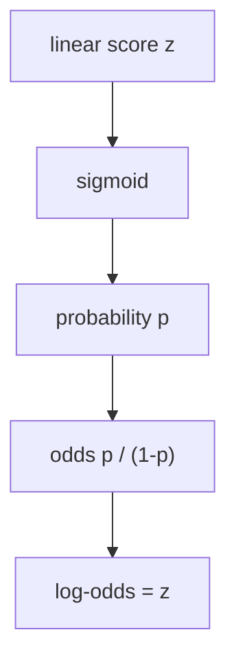
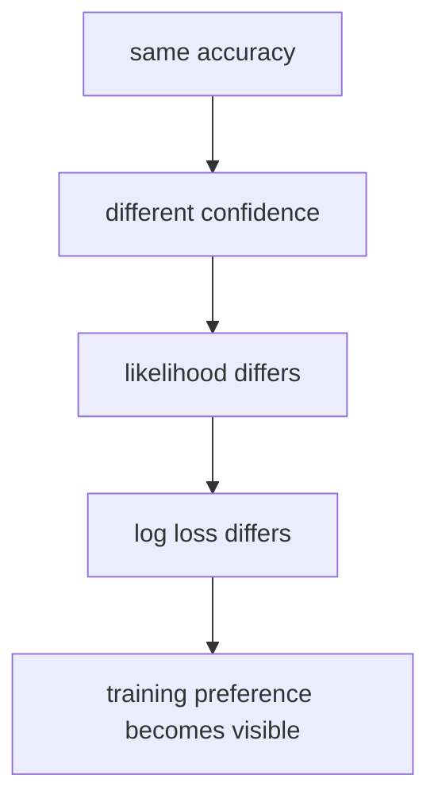

# P4-11.3 补充学习：初次阅读 log-odds 与 MLE 的方法

> Section ID: `P4-11.3`
> Version: `v2026.07.09`

在 P4-11.1 中，我们把 logistic regression 看成 `会生成可像概率读取的分数的线性分类模型`；在 P4-11.2 中，我们又从 decision boundary 的视角读取这个分数如何切开输入空间。走到这里，自然会留下下一个问题。

为什么不直接用线性式处理概率本身，为什么 log-odds 和 maximum likelihood estimation (MLE) 这样的说法会跟着出现？

这一节是回收这个问题的补充学习。中心在于 `logistic regression 的概率解释` 与 `学习目标`。多类别(multinomial)扩展、solver 和 regularization 会在后面的 P4-11.4 与 P4-11.5 中分开处理。

## 本节范围

这一节回答下面这些问题。

- 为什么会出现 log-odds？
- 为什么会说 logistic regression 是用 maximum likelihood estimation (MLE) 来学习的？
- log loss 与 MLE 是怎样连接起来的？

这一节不会深入处理下面这些内容。

- 多类别(multinomial) logistic regression 的细部公式
- softmax 展开与 one-vs-rest 的比较
- 不同 solver 之间的差异与 regularization 设置
- negative log-likelihood 的微分展开与一般优化理论

多类别(multinomial)扩展会在 P4-11.4 继续，solver 与 regularization 会在 P4-11.5 继续。negative log-likelihood 的微分展开与一般优化理论则放在本书当前范围之外。

## 本节目标

- 你可以用入门层次说明 probability、odds、log-odds 之间的关系。
- 你可以说明 `z = 0`、`概率 0.5`、`odds 1` 指向同一个位置。
- 你可以说明 logistic regression 是朝着 `给正确答案更高概率` 的方向学习的。
- 你可以把 MLE 和 log loss 读成同一个学习目标的两种表达。

## 学习背景

logistic regression 往往从 `接上 sigmoid 后，把结果读成 0 到 1 之间的值` 这样的说明开始。这个说明对第一次理解已经够用，但只要再往前一点，很快就会遇到下面这些术语。

- logit 或 log-odds
- likelihood 或 log-likelihood
- MLE
- log loss

初学者在这里容易卡住，是因为术语突然变得像数学教材。但这些名字并不是各说各话，而是把同一个问题从不同方向读出来的结果。

1. probability 被限制在 0 和 1 之间，所以很难直接和线性式相连。
2. 因此，为了把 probability 和线性分数连起来，就会出现 log-odds。
3. 在分类学习里，需要追问 `给正确答案分配了多高的概率`。
4. 所以 likelihood、MLE、log loss 会一起出现。

也就是说，这一节的核心不是背一个新算法，而是理解 `概率解释` 和 `学习目标` 为什么会接在同一章里。

## 主要学习内容

### 因为概率难以直接用线性式处理，所以会出现 log-odds

正如在 P4-11.1 中看到的，logistic regression 先生成线性分数 \(z\)，再让它通过 sigmoid，把结果读成 0 到 1 之间的值。

\[
p = \frac{1}{1 + e^{-z}}
\]

如果带着 `把概率 p 再倒推回 z` 的感觉，一步一步把这个式子反过来读，就会出现下面的流程。

\[
p = \frac{1}{1 + e^{-z}}
\]

\[
\frac{1}{p} = 1 + e^{-z}
\]

\[
\frac{1-p}{p} = e^{-z}
\]

\[
\frac{p}{1-p} = e^z
\]

所以最后再取对数，就会得到下面这个关系。

\[
\log \frac{p}{1-p} = z
\]

左边的 \(\frac{p}{1-p}\) 是 odds，它的对数就是 log-odds，也叫 logit。这个式子重要的原因很简单。

- probability \(p\) 被限制在 0 到 1 之间。
- 相比之下，线性式 \(z\) 可以自由穿过负值和正值。
- 所以，如果想把 `适合用线性式处理的尺度` 和 `适合像概率一样读取的尺度` 连起来，中间就需要像 log-odds 这样的变换。

换句话说，log-odds 并不是什么故意变难的说法，而是 `把概率和线性式连接起来的桥`。

如果用一个简单表格来看，直觉会更清楚。

| 概率 \(p\) | odds \(p / (1-p)\) | log-odds |
| ---: | ---: | ---: |
| 0.10 | 0.111 | -2.197 |
| 0.50 | 1.000 | 0.000 |
| 0.80 | 4.000 | 1.386 |
| 0.90 | 9.000 | 2.197 |

这个表想表达的核心如下。

- 概率 0.5 对应 log-odds 0。
- 越有把握偏向 class 1，log-odds 就会越大并变成正数。
- 越有把握偏向 class 0，log-odds 就会越小并变成负数。

也就是说，在 P4-11.2 中说 `decision boundary 是线性分数 \(z = 0\) 的位置`，最终也可以重新读成：`概率 0.5`、`odds 1`、`log-odds 0` 指向的是同一个位置。



### 最大似然估计(MLE)就是寻找给正确答案高概率的方向

在线性回归(linear regression)里，用平方误差来减少误差是很自然的思路。但在分类里，正确答案是 0 或 1，所以比起 `连续值有多接近`，更重要的是 `给正确 class 分配了多高的概率`。

因此，logistic regression 往往会被解释成最大化 likelihood，更常见地说，就是最大化 log-likelihood。

这时，如果二元分类里单个样本的正确答案 \(y_i\) 是 0 或 1，而模型给出的 class 1 概率是 \(p_i\)，那么单个样本的概率可以用下面这一行写出来。

\[
P(y_i \mid x_i) = p_i^{y_i}(1-p_i)^{1-y_i}
\]

这个式子第一次看会觉得陌生，但本质上只是把 `如果正确答案是 1 就用 p_i，如果正确答案是 0 就用 1-p_i` 这句话压缩成了一个形式。

- 如果 \(y_i = 1\)，那么 \(p_i^{1}(1-p_i)^0 = p_i\)
- 如果 \(y_i = 0\)，那么 \(p_i^{0}(1-p_i)^1 = 1-p_i\)

把全部 \(n\) 个数据一起看时，likelihood 会被写成乘积。

\[
L(w, b) = \prod_{i=1}^{n} p_i^{y_i}(1-p_i)^{1-y_i}
\]

乘积不方便处理，所以通常会取对数，把它变成 log-likelihood。

\[
\log L(w, b) = \sum_{i=1}^{n} \left(y_i \log p_i + (1-y_i)\log(1-p_i)\right)
\]

而在实现里，比起最大化这个值，更常见的是在前面加一个负号，把它写成最小化 negative log-likelihood 的形式。

\[
-\log L(w, b) = - \sum_{i=1}^{n} \left(y_i \log p_i + (1-y_i)\log(1-p_i)\right)
\]

这个式子正是二元 logistic regression 中经常看到的 log loss 的核心形式。

如果一行一行来读这个展开，意思如下。

1. 单个样本会被读成 `对应正确答案的概率`。
2. 整个数据集会被读成 `所有样本概率的乘积`。
3. 为了让计算更容易处理，取对数，把乘积变成求和。
4. 在实现里，`把它做小` 往往比 `把它做大` 更方便，所以加上负号，转成最小化问题。

在入门层次上，先抓住下面这一句话就足够了。

`最大似然估计是一种寻找参数的方法，让当前模型能尽可能合理地解释已经观察到的正确答案。`

### 看到 MLE，就能明白为什么不能只用 accuracy 来解释学习

入门阶段常见的误解是：`既然是分类问题，数一数答对了多少不就够了吗？` 在评估阶段，accuracy 当然重要，但学习过程必须区分更细的差别。

例如，在真实标签为 1 的样本上：

- 如果模型 A 给了 0.51，它只是勉强答对。
- 如果模型 B 给了 0.99，它则是很有把握地答对。

只从 accuracy 来看，这两者都只是 `答对了`。但学习不应该把它们当成一样。MLE 正是用来反映这种差异的。

| 样本 | 真实标签 | 模型 A 的 class 1 概率 | 模型 B 的 class 1 概率 |
| --- | ---: | ---: | ---: |
| 1 | 1 | 0.55 | 0.90 |
| 2 | 0 | 0.45 | 0.10 |

两个模型在 0.5 阈值下都预测正确。但模型 B 给正确 class 分配了更高的概率。这里出现的想法就是：`把给正确答案更高概率的模型看得更好`。在 logistic regression 里，MLE 正是把这个想法整理成数学形式的表达。

因此，在学习过程中经常会一起出现的就是 log loss。log loss 可以被读成 `当模型给正确答案很低概率时，会更重地处罚` 的数值。也就是说，MLE 和 log loss 其实是在相反方向上描述同一个学习目标。

## 案例及示例

在读案例之前，先把这一节的比较框架用一张表固定下来。

| 场景 | 人最容易先用的标准 | 这个标准的局限 | logistic regression 改变了什么 | 要确认的结果 |
| --- | --- | --- | --- | --- |
| 概率解释 | 只看 0 到 1 之间的值 | 看不到它和线性分数的连接 | 用 log-odds 把 probability 与线性分数连起来 | \(z = 0\)、\(p = 0.5\)、odds 1 会连到一起 |
| 学习目标 | 只看是否答对 | 会漏掉相同 accuracy 里的置信差异 | 用 MLE 和 log loss 去读取置信差异 | 即使 accuracy 相同，学习评价也可能不同 |

### 案例 1. 为什么边界附近的分数会让人觉得暧昧

在考试合格预测里，如果某个学生的 class 1 概率是 0.51，模型会把他看成偏向合格。但这个值并不是强置信，而是边界附近的判断。此时如果想起 log-odds，`概率刚刚超过 0.5` 这句话，就会和 `线性分数 \(z\) 刚刚超过 0` 这句话连起来。

也就是说，原本只在概率表里显得模糊的暧昧，会被重新读成 `边界附近分数` 这个结构。

### 案例 2. 为什么 accuracy 一样，学习评价却会不同

假设在客户流失预测里，两个模型都在 100 人中答对了 86 人。但其中一个模型对边界附近案例只给出 0.51、0.52 这样的分数，另一个模型却对那些同样答对的案例给出 0.80、0.88 这样的分数。两个模型的 accuracy 相同，但 `给正确答案多强的置信` 却不同。

这个场景正好说明为什么需要 MLE 和 log loss。因为分类模型不仅要区分 `有没有答对`，还要区分 `它把正确答案解释得有多像回事`。



## 练习与示例

### 用 Python 一起读取 accuracy 和 log loss

下面这个例子展示的是：`即使预测结果同样正确，log loss 也会随着概率置信程度不同而改变`。

| 输入组 | 含义 |
| --- | --- |
| `true_binary` | 二元分类的真实标签 |
| `proba_model_a`, `proba_model_b` | 对同一组正确答案给出不同置信程度的两组概率示例 |

```python
import numpy as np
from sklearn.metrics import log_loss

true_binary = np.array([1, 0, 1, 0])
proba_model_a = np.array([0.55, 0.45, 0.60, 0.40])
proba_model_b = np.array([0.90, 0.10, 0.85, 0.15])

pred_a = (proba_model_a >= 0.5).astype(int)
pred_b = (proba_model_b >= 0.5).astype(int)

print("binary accuracy A :", (pred_a == true_binary).mean())
print("binary accuracy B :", (pred_b == true_binary).mean())
print("log loss A        :", round(log_loss(true_binary, proba_model_a), 4))
print("log loss B        :", round(log_loss(true_binary, proba_model_b), 4))
```

执行结果示例如下。

```text
binary accuracy A : 1.0
binary accuracy B : 1.0
log loss A        : 0.5543
log loss B        : 0.1446
```

这个输出可以这样来读。

- 两个模型的 accuracy 相同，但 log loss 不同。
- 也就是说，在和 MLE 相连的学习视角里，`对正确答案支持得有多强` 会被区分出来。
- 所以，在理解 logistic regression 时，区分 `评估指标` 和 `学习目标函数` 的感觉很重要。

## 下一连接

走到这里，logistic regression 的 `概率解释` 与 `学习目标` 就闭合了。下一个补充学习会把这种感觉从 `二选一` 扩展到 `多个类别中选一个`，也就是去看多类别(multinomial) logistic regression 的基本读取结构。

## 出处与参考资料

- C.M. Bishop, *Pattern Recognition and Machine Learning*, Springer, 2006.
- scikit-learn, `log_loss` API documentation, [https://scikit-learn.org/stable/modules/generated/sklearn.metrics.log_loss.html](https://scikit-learn.org/stable/modules/generated/sklearn.metrics.log_loss.html){: target="_blank" rel="noopener noreferrer" }，确认日期：2026-07-09
- scikit-learn, `LogisticRegression` API documentation, [https://scikit-learn.org/stable/modules/generated/sklearn.linear_model.LogisticRegression.html](https://scikit-learn.org/stable/modules/generated/sklearn.linear_model.LogisticRegression.html){: target="_blank" rel="noopener noreferrer" }，确认日期：2026-07-09
