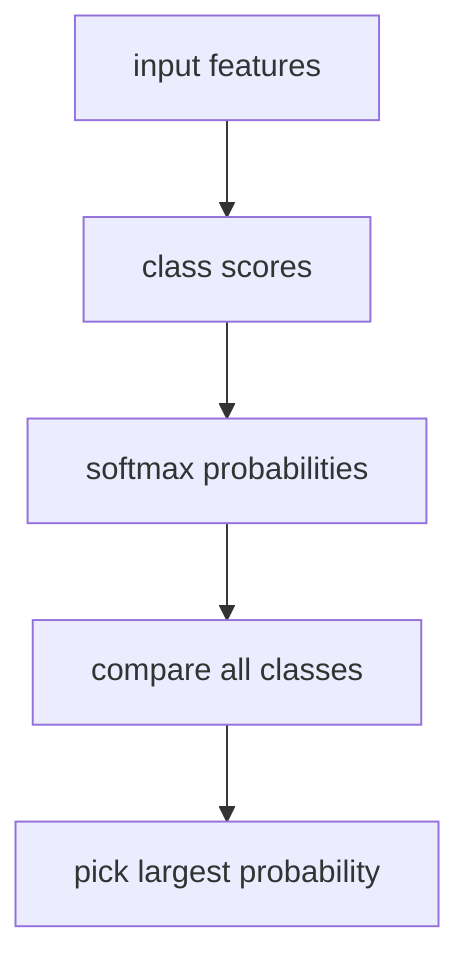

# P4-11.4 补充学习：如何阅读多类别(multinomial) logistic regression

> Section ID: `P4-11.4`
> Version: `v2026.07.09`

P4-11.3 中谈到的 log-odds 与 MLE，基本上都是以 `二元分类(binary classification)，也就是二选一` 为基准来说明的。但现实中的分类问题，很多时候也是要在三个以上的选项里选一个。

这一节的中心问题如下。

在二元分类中学到的 `分数 -> 概率 -> class 选择` 这种感觉，在多类别问题里会如何继续？

## 本节范围

这一节回答下面这些问题。

- 在多类别(multinomial)问题里，什么会被保留下来？
- 为什么会出现 softmax？
- one-vs-rest 与 multinomial 应该怎样读出它们的差异？

这一节不会深入处理下面这些内容。

- softmax 的微分展开
- 多类别 log-likelihood 的严格矩阵公式
- 不同 solver 之间的数值优化差异

solver 与 regularization 的实现视角会在 P4-11.5 继续。softmax 的微分展开与多类别 log-likelihood 的严格矩阵公式，则放在本书当前范围之外。

## 本节目标

- 你可以说明：即使在多类别里，`输入 -> 分数 -> 概率比较 -> class 选择` 的结构也会保留下来。
- 你可以把 softmax 读成 `把各类别分数变成概率分布的函数`。
- 你可以用入门层次说明 one-vs-rest 与 multinomial 的差别。

## 学习背景

在 P4-11.1 第一次看 logistic regression 时，通常会看一个 `class 1 概率` 再去和 threshold 比较。但现实中的很多问题，例如新闻分类、客户咨询分类、图像分类，并不是二选一，而是要在多个类别中选一个。

例如：

| 问题 | 类别示例 |
| --- | --- |
| 新闻分类 | 政治 / 经济 / 体育 |
| 客户咨询分类 | 退款 / 配送 / 账号 |
| 图像分类 | 猫 / 狗 / 鸟 |

此时读者首先要抓住的，不是 `开始了一个完全不同的模型`，而是 `在二元分类中学到的阅读框架被扩宽了`。

## 主要学习内容

### 即使在多类别里，分数与概率比较的结构也会保留下来

在多类别里，可以理解为每个类别 \(k\) 都会生成一个分数 \(z_k\)。

\[
z_k = w_k^\top x + b_k
\]

然后，为了把这些分数变成概率分布，通常会使用 softmax。

\[
P(y = k \mid x) = \frac{e^{z_k}}{\sum_{j=1}^{K} e^{z_j}}
\]

这个式子表达的核心很简单。

- 分子是 `当前类别 k 的分数`
- 分母是 `所有类别分数的总和`
- 因此，一个类别的概率总是通过 `所有类别之间的相对比较` 来决定

也就是说，多类别 logistic regression 最小的公式结构就是两行：`每个类别先生成分数`，再 `把这些分数一起正规化成概率分布`。

### 二元分类里的 threshold 感觉，会在多类别里转成 argmax 的感觉

如果说二元分类里的核心感觉是 `是否超过 0.5`，那么在多类别里，核心感觉通常会变成 `哪个类别的概率最大`。

- 二元分类：看一个 `class 1 概率`，再和 threshold 比较
- 多类别：看 `各类别概率`，再选最大的值

这个变化会直接连到 P4-11.1。初学者在这里很容易误解成 `一下子输出多个概率，难道这是一个更复杂、完全不同的模型吗？` 但核心结构依然还是 `输入 -> 分数 -> 概率比较 -> class 选择`。

### one-vs-rest 与 multinomial 的差别，在于比较方式不同

在入门阶段，对 one-vs-rest 与 multinomial 的差异，大致抓到下面这个程度就够了。

- one-vs-rest：把每个类别分别看成 `是不是这个类别`，之后再去比较
- multinomial：把所有类别一次放在一起，看成相对比较的结构

如果换成一个很小的客户咨询分类场景，这个差异会更容易读出来。

| 阅读方式 | 会怎样看同一条咨询 |
| --- | --- |
| one-vs-rest | 分别去问 `这是退款咨询吗？`、`这是配送咨询吗？`、`这是账号咨询吗？`，之后再比较。 |
| multinomial | 把 `退款 / 配送 / 账号` 一次放在一起，直接比较哪一类最像。 |

当前这一节没有必要把详细矩阵公式和 softmax 展开一路推很长。重要的是这个连接：`在二元分类里学到的分数与概率比较感觉，也会继续延伸到多个类别。`

在 likelihood 那一边，形式也会沿着二元分类的同一套想法扩展。如果把正确类别看成一个 one-hot 向量，那么多类别的 log-likelihood 通常会被读成下面这样的求和形式。

\[
\log L = \sum_{i=1}^{n}\sum_{k=1}^{K} y_{ik} \log P(y=k \mid x_i)
\]

这里的 \(y_{ik}\) 表示 `如果样本 i 的真实答案是类别 k，就取 1；否则取 0`。这个式子最终也是把 `给真实类别更高概率的一方看得更好` 这个想法，写成了多类别版本。

## 案例及示例

在读案例之前，先把这一节的比较框架用一张表固定下来。

| 场景 | 人最容易先用的标准 | 这个标准的局限 | 多类别 logistic regression 改变了什么 | 要确认的结果 |
| --- | --- | --- | --- | --- |
| 多类别分类 | 直接沿用 0.5 阈值 | 会把多类别比较问题读错 | 让你从 softmax 与 argmax 的视角做相对比较 | 选择概率最大的类别 |
| 实现选择 | 把每个类别单独拆开看 | 会漏掉类别之间的相对比较 | 用 multinomial 结构把它们读成一次竞争 | 一起看整个类别分布 |

### 案例 1. 在多类别里，比起 0.5，更重要的是相对比较

假设在客户咨询分类中，三个类别是 `退款`、`配送`、`账号`。如果某条咨询的概率输出是 `[0.41, 0.39, 0.20]`，其中没有任何一个值超过 0.5。但模型仍然会把 `退款` 看成最有可能的类别。

这个场景说明：在多类别里，比起 `是否超过 0.5`，`谁最大` 更重要。

### 案例 2. 即使是同一个输入，one-vs-rest 和 multinomial 的读取方式也不同

如果一条咨询里同时混着 `退款`、`取消支付`、`账号锁定` 这样的表达，one-vs-rest 会先分别检查每个类别，再做比较。相反，multinomial 会把全部类别一次放在一起，给出相对概率。对初学者来说，后者往往更容易读成 `一次比较结构`。



## 练习与示例

### 用 Python 读取多类别概率表

下面这个例子展示的是：在多类别里，基础感觉不再是 `有没有超过 0.5`，而是 `哪个概率最大`。

| 输入组 | 含义 |
| --- | --- |
| `class_names` | 类别名称列表 |
| `multi_proba` | 各类别概率分布示例 |

```python
import numpy as np

class_names = ["refund", "shipping", "account"]
multi_proba = np.array([
    [0.41, 0.39, 0.20],
    [0.18, 0.63, 0.19],
    [0.22, 0.28, 0.50],
])

print("multiclass predictions")
for row in multi_proba:
    best_idx = int(np.argmax(row))
    print(
        "  probs =",
        np.round(row, 2),
        "->",
        class_names[best_idx],
    )
```

执行结果示例如下。

```text
multiclass predictions
  probs = [0.41 0.39 0.2 ] -> refund
  probs = [0.18 0.63 0.19] -> shipping
  probs = [0.22 0.28 0.5 ] -> account
```

这个输出可以这样来读。

- 第一行即使没有任何值超过 0.5，仍然会选择概率最大的 `refund`。
- 在多类别里，比起 `单个概率 vs threshold`，更重要的是 `整张概率分布的相对比较`。
- 也就是说，基础感觉会从 threshold 转向 argmax。

## 下一连接

走到这里，logistic regression 的 `多类别扩展` 就闭合了。下一个补充学习会去看：为什么同样是 logistic regression，还会遇到 solver、penalty、`C` 这样的设置，以及为什么这些设置不只是实现选项，而是比较条件。

## 出处与参考资料

- C.M. Bishop, *Pattern Recognition and Machine Learning*, Springer, 2006.
- scikit-learn, linear models user guide, [https://scikit-learn.org/stable/modules/linear_model.html#logistic-regression](https://scikit-learn.org/stable/modules/linear_model.html#logistic-regression){: target="_blank" rel="noopener noreferrer" }，确认日期：2026-07-09
- scikit-learn, `LogisticRegression` API documentation, [https://scikit-learn.org/stable/modules/generated/sklearn.linear_model.LogisticRegression.html](https://scikit-learn.org/stable/modules/generated/sklearn.linear_model.LogisticRegression.html){: target="_blank" rel="noopener noreferrer" }，确认日期：2026-07-09
