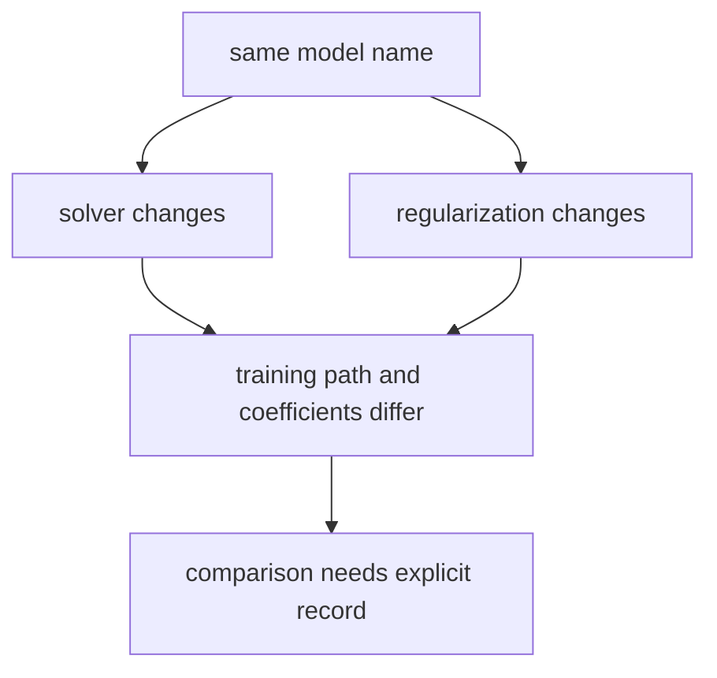

# P4-11.5 补充学习：初次阅读 solver 与 regularization 的方法

> Section ID: `P4-11.5`
> Version: `v2026.07.09`

如果把 logistic regression 当作库来使用，很快就会遇到 solver、penalty、`C` 这样的参数。初学者很容易在这里觉得 `突然跳到实现细节里去了`。但这些设置并不是和理论完全分离的噪音。

这一节的中心问题如下。

为什么即使是同一个 logistic regression，也必须把 solver 与 regularization 设置一起记录并比较？

## 本节范围

这一节回答下面这些问题。

- solver 是做什么的？
- regularization 调节的是什么？
- penalty 和 `C` 应该朝什么方向去理解？

这一节不会深入处理下面这些内容。

- 各个 solver 内部优化算法的证明
- convex optimization 的一般理论
- regularization 的严格统计解释

各个 solver 内部优化算法的证明、convex optimization 的一般理论，以及 regularization 的严格统计解释，都放在本书当前范围之外。

## 本节目标

- 你可以把 solver 解释成 `真正去找到参数的计算过程`。
- 你可以把 regularization 解释成 `控制模型不要贴训练数据太紧的装置`。
- 你可以用初学者层次读出 L1、L2、Elastic-Net、`C` 的方向性。
- 你可以说明：即使模型名相同，设置差异也会改变结果解释。

## 学习背景

logistic regression 通常不是直接写出一个 closed-form solution，而是通过反复计算去找到较好的参数。因此，数据规模多大、是不是 sparse matrix、使用什么样的正则项，都会让设置选择变得重要。

regularization 可以先读成 `控制模型不要贴训练数据太紧的装置`。即使是同一个 logistic regression，如果数据很少或特征很多，系数也可能不稳定地变大，或者过度依赖某几个特征。此时，regularization 会帮助把系数压得更保守。

## 主要学习内容

### solver 是真正执行学习计算的过程

首先，solver 连接的是 `这个模型的参数到底要怎样实际找出来`。

如果先用一张简单的表来整理，可以写成下面这样。

| 设置 | 在本节先理解的意思 | 之后再深入看的问题 |
| --- | --- | --- |
| solver | 真正去找到参数的计算过程 | 数据规模和稀疏性不同，什么更有利 |
| penalty | 决定系数要保守到什么程度的正则方式 | L1 与 L2 会带来什么差异 |
| `C` | 正则强度反方向的调节值 | 该怎样在过拟合与欠拟合之间去读 |

也就是说，solver 不是 `库里一个无关紧要的小选项`，而是把 MLE 或 log loss 设定出来的学习目标，通过实际计算落地的把手。

下表总结的是基于 `2026-07-09` 查阅的 scikit-learn stable 文档所描述的实现行为。由于 solver 支持范围和默认值会随着库版本变化，在实际练习或项目中，应当重新确认自己所用版本的文档。

| solver | 多类别(multinomial) | penalty / regularization | 先读的特征 |
| --- | --- | --- | --- |
| `lbfgs` | 支持 | L2 或无正则 | 作为默认值通常比较稳妥 |
| `liblinear` | 不直接支持 multinomial | L1, L2 | 常在小数据和二元分类中被提到 |
| `newton-cg` | 支持 | L2 或无正则 | 基于二阶信息的优化系列 |
| `newton-cholesky` | 支持 | L2 或无正则 | 当 `n_samples` 很大且 one-hot 特征很多时可作为候选 |
| `sag` | 支持 | L2 或无正则 | 在大数据上通常较快，但对缩放敏感 |
| `saga` | 支持 | L1, L2, Elastic-Net | 对稀疏输入和 Elastic-Net 都较方便 |

读这个表时，先抓住下面这些判断就够了。

- 先看 `是否想直接使用 multinomial`。
- 再看是否需要 `L1` 或 `Elastic-Net`。
- 如果数据很大且特征很多，就先想到在大数据上更有利的系列。
- 如果需要一个默认起点，`lbfgs` 通常是稳妥的第一候选。

### regularization 是让系数更保守的装置

在 regularization 这一边，至少要先看见下面这些感觉。

| 设置 | 在公式里的样子 | 入门时可读的意思 |
| --- | --- | --- |
| L2 | \(\lambda \sum_j w_j^2\) | 整体压小系数，减少过度波动 |
| L1 | \(\lambda \sum_j |w_j|\) | 可以把部分系数强力推向 0，形成稀疏性 |
| Elastic-Net | \(\lambda_1 \sum_j |w_j| + \lambda_2 \sum_j w_j^2\) | 混合 L1 与 L2 的性格 |
| `C` | 正则强度的倒数 | `C` 越小，正则越强 |

如果把这些公式立刻改写成解释句，大致会变成下面这样。

- L2 的意思是 `整体上不太偏好特别大的系数`，因此可以把它读成减少边界被某一个特征过度拉动的情况。
- L1 的意思是 `不那么重要的特征系数可能被推到 0`，因此和特征选择效果的连接更直接。
- Elastic-Net 可以读成一种折中：`既想整体收缩，又想把其中一部分压到 0`。
- `C` 是在 scikit-learn 里经常看到的调节把手，必须记住它的方向：`越小，正则越强`。

### solver 与 regularization 不是实现选项，而是比较条件

在 P4-8 里比较 baseline 时，我们看到：只有放在 `同样的切分、同样的指标、同样的失败案例` 上，比较才成立。solver 与 regularization 也应该用类似的方式来读。

- 改变 solver，计算过程与收敛特性都可能变化。
- 改变 regularization 强度，系数大小与边界的保守程度都可能变化。

也就是说，即使都叫 `同一个 logistic regression`，在实际比较里也必须记录用的是哪个 solver、哪一种正则。只有这样，才能区分性能差异到底是来自 `模型结构本身`，还是来自 `设置差异`。

## 案例及示例

在读案例之前，先把这一节的比较框架用一张表固定下来。

| 场景 | 人最容易先用的标准 | 这个标准的局限 | solver / regularization 改变了什么 | 要确认的结果 |
| --- | --- | --- | --- | --- |
| 设置选择 | 觉得只用默认值就够了 | 会漏掉数据结构与设置差异 | 让你把计算过程与正则强度读成比较条件 | 即使模型名相同，结果解释也可能不同 |
| 系数解释 | 直接接受较大的系数 | 会漏掉数据不足或特征过多带来的波动 | 通过 regularization 去做更保守的系数解释 | 边界与系数的稳定性可能变化 |

### 案例 1. 为什么稀疏文本分类和结构化表数据很难用同一套设置去读

在词汇很多的垃圾邮件分类里，特征数量多而且输入稀疏是常态。相反，在客户流失预测这类结构化表数据中，特征数可能相对较少，而可解释性可能更重要。此时，solver 与 regularization 不是一个固定不变的通用常数，而是必须根据数据结构与运营目标重新解读的把手。

### 案例 2. 怎样区分性能差异来自模型，还是来自设置

假设实验 A 和实验 B 都是 logistic regression，但一边用了 `lbfgs + L2`，另一边用了 `saga + Elastic-Net`。这时不能把结果差异简单读成 `logistic regression 变好了`。在这种情况下，比起模型名，设置差异可能才是更大的原因。



## 练习与示例

### 用 Python 看一看如何留下设置比较记录

下面这个例子不是为了真正训练模型，而是为了展示 `应该如何留下比较记录` 的玩具代码。

```python
from sklearn.linear_model import LogisticRegression

configs = [
    {
        "name": "baseline_lr",
        "solver": "lbfgs",
        "penalty": "l2",
        "C": 1.0,
    },
    {
        "name": "sparse_candidate",
        "solver": "saga",
        "penalty": "elasticnet",
        "l1_ratio": 0.5,
        "C": 0.5,
    },
]

models = []
for cfg in configs:
    kwargs = {
        "solver": cfg["solver"],
        "penalty": cfg["penalty"],
        "C": cfg["C"],
        "max_iter": 1000,
    }
    if "l1_ratio" in cfg:
        kwargs["l1_ratio"] = cfg["l1_ratio"]
    models.append((cfg["name"], LogisticRegression(**kwargs)))

for name, model in models:
    print(name, "->", model)
```

这个例子里真正重要的，不是立刻运行模型，而是 `即使同样是 logistic regression，也要把比较过的设置组合分开记录下来` 这一点。

执行结果示例如下。

```text
baseline_lr -> LogisticRegression(max_iter=1000)
sparse_candidate -> LogisticRegression(C=0.5, l1_ratio=0.5, max_iter=1000,
                                       penalty='elasticnet', solver='saga')
```

## 下一连接

走到这里，Chapter 11 的补充学习轴线就闭合了。也就是说，logistic regression 可以分成五个层次来读：`可像概率读取的分数`、`边界`、`log-odds 与 MLE`、`多类别扩展`、`学习计算与正则设置`。

## 出处与参考资料

- scikit-learn, `LogisticRegression` API documentation, [https://scikit-learn.org/stable/modules/generated/sklearn.linear_model.LogisticRegression.html](https://scikit-learn.org/stable/modules/generated/sklearn.linear_model.LogisticRegression.html){: target="_blank" rel="noopener noreferrer" }，确认日期：2026-07-09
- scikit-learn, linear models user guide, [https://scikit-learn.org/stable/modules/linear_model.html#logistic-regression](https://scikit-learn.org/stable/modules/linear_model.html#logistic-regression){: target="_blank" rel="noopener noreferrer" }，确认日期：2026-07-09
