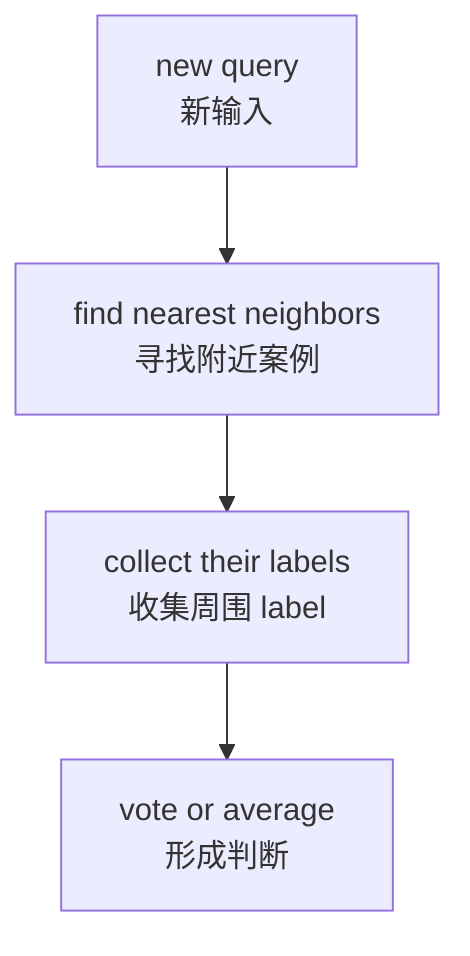
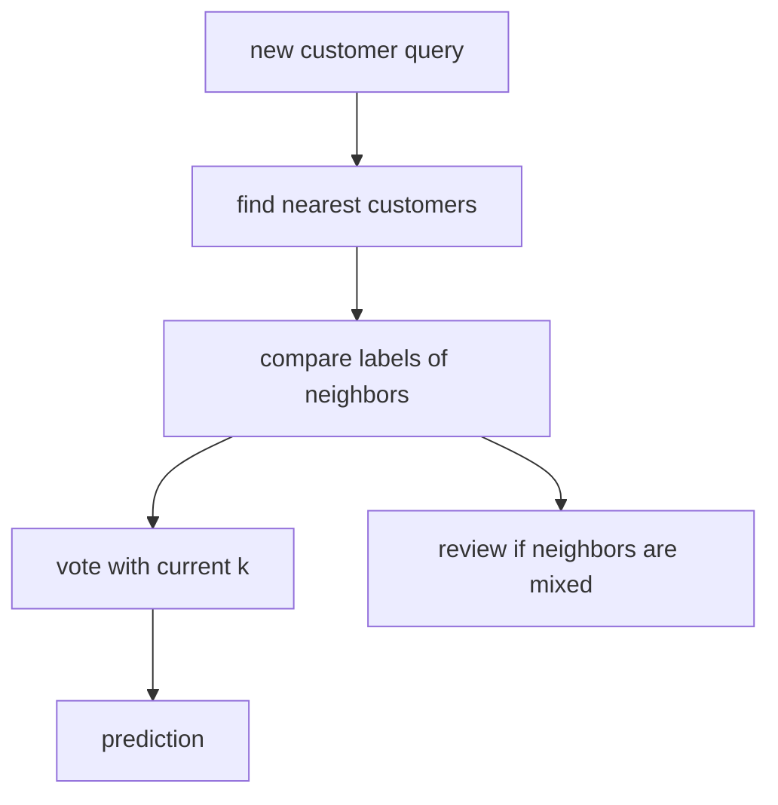

# P4-12.1 k-NN 的直觉

> Section ID: `P4-12.1`
> Version: `v2026.07.10`

在 P4-11.2 中，我们看过 logistic regression 是一种 `在输入空间里画出边界来划分 class 的方法`。现在我们把问题换一下。

如果不先画出一条直线，而是先看周围相似的案例，能不能做出判断？

这个问题就是 k-NN(k-nearest neighbors) 的出发点。与其把 k-NN 读成 `先建立公式的模型`，不如更准确地把它读成 `先寻找新输入周围相似案例的模型`。

## 本节范围

这一节回答下面这些问题。

- k-NN 是基于什么想法做判断的？
- `query`、`neighbor`、`label`、`k` 分别起什么作用？
- 当 `k` 改变时，判断的性质会怎样变化？
- 在 k-NN 中，training 应该被看成是在做什么？

这一节不会深入处理下面这些内容。

- 距离(distance)函数之间的差异
- 为什么 scale 会改变结果
- 使用 k-NN 时，应该先检查什么的应用指引

这些内容会在 `P4-12.2 距离(distance)与 scale` 和 `P4-12.3 使用 k-NN 时，应该先检查什么？` 中继续展开。

## 本节目标

- 你可以把 k-NN 解释成 `把附近案例收集起来，通过多数表决或平均来做判断的方法`。
- 你可以说明 `query`、`training data`、`neighbor`、`label` 在判断里分别承担什么角色。
- 你可以说明 `k` 太小时和太大时会出现什么差异。
- 你可以说明：k-NN 的学习更接近 `准备比较用的参考案例`，而不是 `构造复杂公式`。

## 主要学习内容

### k-NN 是怎样做判断的

k-NN 会先看一个新的输入(query)。接着，它会在已经带有 label 的训练数据(training data)里找到离 query 很近的案例。最后，它会把这些邻居(neighbors)的 label 收集起来，通过多数表决或平均形成判断。

如果简要整理，顺序如下。

1. 一个新的输入(query)进来。
2. 在已有训练数据里找出附近的案例。
3. 收集这些附近案例的 label。
4. 通过多数表决或平均决定结果。

也就是说，可以把 k-NN 读成：`不会单独解释一个新点，而是通过把它和周围已知案例比较后再做判断`。

### 每个术语在判断里承担什么角色

| 术语 | 在判断里承担的角色 |
| --- | --- |
| query | 现在想要预测的新输入。 |
| training data | 已经同时拥有输入和 label 的参考案例集合。 |
| neighbor | 因为离 query 很近而被选作判断依据的案例。 |
| label | 每个参考案例已经拥有的正确答案或类别。 |
| `k` | 决定要看多少个 neighbor 来做判断的数值。 |

这张表之所以重要，是因为 k-NN 更接近 `如何读取参考案例`，而不是 `在模型内部计算出一个公式的方法`。

### 为什么把附近案例当作依据

k-NN 的核心假设是：`相似的输入，很可能拥有相似的输出`。这个假设并不总是正确，但在 local similarity 确实有意义的问题里，它会成为很强的起点。

例如：

- 购买模式相似的客户，可能会表现出相似的反应。
- 点击流程相似的用户，可能更接近相似的商品兴趣类别。
- 分数模式相似的学生，可能会被归入相似的结果类别。

如果把这种直觉压缩成计算顺序，就会变成下面这样。



不过，`近` 并不等于 `对`。因为只要计算接近程度的规则不同，邻居本身也可能改变。正是这一点，会在下一节继续处理。

### `k` 会改变什么

`k` 决定了做判断时要看多少个邻居。

- 如果 `k = 1`，就只看最近的一个。
- 如果 `k = 3`，就看最近的三个。
- 如果 `k = 5`，就看五个，判断得更宽一些。

即使是同一个 query，只要 `k` 改变，判断的性质也会变化。

| `k` 值 | 会呈现出的性质 |
| --- | --- |
| 太小 | 会对一两个邻近案例非常敏感。 |
| 适中 | 能保留局部模式，同时减少波动。 |
| 太大 | 远处案例也可能混进来，使边界变得迟钝。 |

如果用一个小玩具例子来看，会更明显。

| query 周围邻居的 label | `k = 1` | `k = 3` | `k = 5` |
| --- | --- | --- | --- |
| `1, 0, 0, 0, 0` | `1` | `0` | `0` |

这个例子表明：如果只看最近的一个，结果会是 `1`；但如果把范围扩大到三个或五个，因为 `0` 更多，结果就可能改变。也就是说，`k` 不是一个单纯的数字，而是决定 `看得多窄`、`看得多宽` 的把手。

### 在 k-NN 中，training 是在做什么

在线性回归或 logistic regression 里，我们通常会说 `学习的是系数`。k-NN 的气氛则不一样。

在入门层次上，k-NN 的学习大致更接近下面这些事情。

- 存储输入与 label。
- 为了在新输入到来时进行比较而做好准备。
- 如果需要，会使用内部结构来加快距离计算。

也就是说，k-NN 应该被读成 `为以后比较准备参考案例的学习`，而不是 `提前做出精细公式的学习`。

因此，k-NN 会同时带着两个特点。

- 数据如何整理和表示非常重要。
- 在预测时(prediction time)，比较成本可能会变大。

例如，当训练数据只有 100 条时，一个 query 只需要比较 100 次；但如果训练数据有 10 万条，那么同一个 query 就要比较更多次。说 `学习很简单`，并不等于 `准备不重要`，它更接近于说：`判断成本可能会在预测阶段比训练阶段更明显地暴露出来`。

### 它和线性边界模型有什么不同

logistic regression 先问的是：`如何用一个公式或一条边界把整个空间分得更好？` 相反，k-NN 先问的是：`这个点周围聚集的案例是什么样的？`

| 模型视角 | 中心问题 |
| --- | --- |
| logistic regression | 画出怎样的边界线，才能把 class 分得更好？ |
| k-NN | 新点周围相似的案例属于什么 class？ |

因为这个差异，k-NN 会把 `局部(local)邻居` 放在 `全局(global)规则` 前面。

## 案例及示例

### 案例 1. 当你想先通过相似旧客户来判断新客户时

订阅服务团队想判断一位新客户的流失可能性。人们首先会看 `最近访问次数`、`咨询频率`、`支付金额`、`访问时间段` 等行为信号。

但是，这个团队还没有找到足够简单到可以说出 `流失客户总是遵循这种规则` 的公式。相反，从已有客户记录里，他们经常看到：行为相似的客户，其结果也常常相似。这时，k-NN 不会单独解释这位新客户，而是会先在周围找到几个最相似的旧客户，并参考他们的 label。



这个案例展示了三个核心点。

- k-NN 更接近 `先参考附近案例的模型`，而不是 `先建立规则的模型`。
- 如果 `k=1`，它可能会对某一个人的例外情况很敏感；如果 `k=5`，它可能更稳定，但边界也可能变钝。
- 如果邻居构成出现分裂，那首先是一个信号，告诉你 `这个 query 需要再复查一遍`。

## 练习与示例

### 用 Python 看一个小型 k-NN 例子

- 问题场景：观察一个新点更接近已有的两个群体中的哪一边。
- 输入(input)：可以读成二维坐标的两个特征
- 正确答案(label)：class 0 / class 1
- 要确认的概念：
  - 预测是通过查看邻居的 label 形成的。
  - 即使是同一个 query，只要 `k` 改变，结果也可能真的变化。
  - 边界附近的 query 在解释上很容易摇摆。

```python
from math import dist
from collections import Counter

train = [
    ((4.1, 4.1), 1),
    ((3.7, 4.0), 0),
    ((3.8, 4.3), 0),
    ((4.2, 3.8), 0),
    ((4.4, 4.0), 1),
]

query = (4.0, 4.2)

def knn_predict(train, query, k):
    ranked = sorted(
        [(dist(point, query), point, label) for point, label in train],
        key=lambda x: x[0],
    )
    neighbors = ranked[:k]
    labels = [label for _, _, label in neighbors]
    prediction = Counter(labels).most_common(1)[0][0]
    return prediction, neighbors

for k in [1, 3, 5]:
    prediction, neighbors = knn_predict(train, query, k)
    print(f"k={k}, prediction={prediction}")
    for d, point, label in neighbors:
        print(" ", point, "label=", label, "distance=", round(d, 3))
    print()
```

执行结果示例如下。

```text
k=1, prediction=1
  (4.1, 4.1) label= 1 distance= 0.141

k=3, prediction=0
  (4.1, 4.1) label= 1 distance= 0.141
  (3.8, 4.3) label= 0 distance= 0.224
  (3.7, 4.0) label= 0 distance= 0.361

k=5, prediction=0
  (4.1, 4.1) label= 1 distance= 0.141
  (3.8, 4.3) label= 0 distance= 0.224
  (3.7, 4.0) label= 0 distance= 0.361
  (4.4, 4.0) label= 1 distance= 0.447
  (4.2, 3.8) label= 0 distance= 0.447
```

这个输出实际展示了：`k` 不是一个单纯的数字，而是会改变判断范围的把手。

- 在 `k=1` 时，最近的那个点是 class 1，所以预测也是 `1`。
- 但当扩大到 `k=3` 时，最近三个点里有两个属于 class 0，于是预测改成了 `0`。
- 在 `k=5` 时，class 0 仍然更多，所以结果继续保持 `0`。

也就是说，这个例子把 `最近单点的例外` 和 `稍微放宽后看到的局部多数` 可能说出不同结论这一点闭合了。这里首先要读的，不是分数，而是 `哪些邻居被包含进来了，以及因此多数表决是怎样改变的`。

这个 query `(4.0, 4.2)` 也会继续连到后面的章节。在 `P4-12.2` 中，你会看到当 `计算接近程度的规则` 改变时，邻居如何发生变化；在 `P4-12.3` 中，你会读到当同一个 query 变得摇摆时，应该先重新检查什么。

## 本节要记住的视角

- k-NN 会通过把新输入与周围已知案例比较后再做判断。
- `query`、`neighbor`、`label`、`k` 在判断里各自承担不同角色。
- `k` 不是一个单纯数字，而是调节判断范围的把手。
- k-NN 的学习更接近 `准备比较参考案例`，而不是 `构造公式`。

## 简短检查

- 你能否把 k-NN 解释成 `收集附近案例后再做判断的方法`？
- 你能否说明 `k` 太小时和太大时会出现什么差异？
- 你是否理解：在 k-NN 中，预测时的比较成本可能会变大？

## 出处与参考资料

- scikit-learn, *Nearest Neighbors*, scikit-learn User Guide, 确认日期：2026-06-27. <https://scikit-learn.org/stable/modules/neighbors.html>{: target="_blank" rel="noopener noreferrer" }
