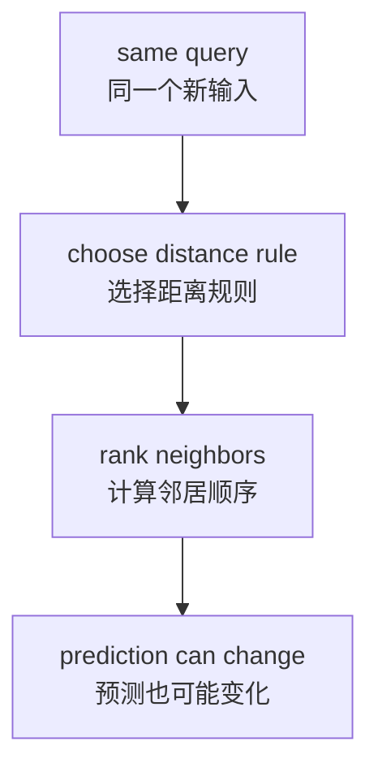
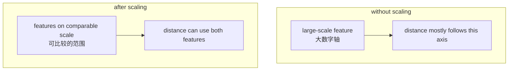
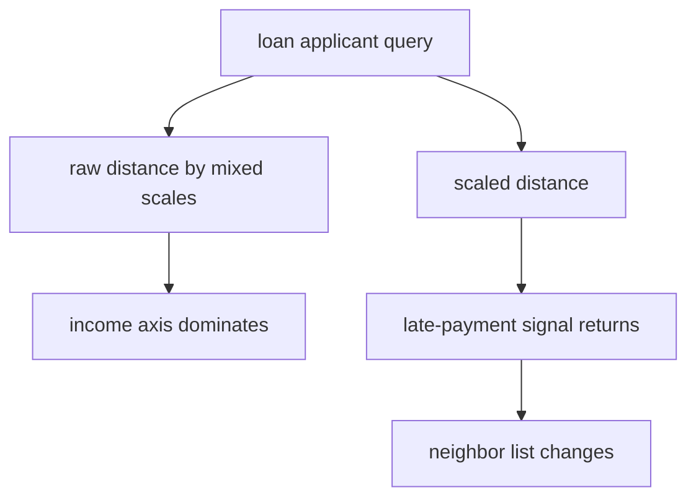

# P4-12.2 距离(distance)与 scale

> Section ID: `P4-12.2`
> Version: `v2026.07.10`

在 P4-12.1 中，我们说 k-NN(k-nearest neighbors) 是一种 `通过观察附近案例来做判断的模型`。但在这里，最重要的词其实是 `近`。

近，究竟是什么意思？

如果绕过这个问题去理解 k-NN，那其实不是理解了模型，而只是看到了结果。因为在 k-NN 里，`用什么标准来计算接近程度` 本身就是模型的一部分。

## 本节范围

这一节回答下面这些问题。

- 距离(distance)在 k-NN 里起什么作用？
- 如果距离函数改变，邻居顺序和预测也会改变吗？
- 为什么 scale 会扭曲距离计算？
- 在解释 k-NN 时，标准化(standardization)改变了什么？

这一节不会深入处理下面这些内容。

- 所有距离函数(metric)数学性质的比较
- preprocessing 的完整体系
- 高维空间中距离集中现象的理论

preprocessing 本身的目的与种类，仍然以 `P4-7.2 preprocessing` 作为基准解释位置。这里仅聚焦于 `为什么在 k-NN 里，距离和 scale 会改变判断`。

## 本节目标

- 你可以说明：距离函数不是 `模型外部的设置`，而是 `判断规则的一部分`。
- 你可以说明：当距离函数改变时，邻居顺序和预测也可能改变。
- 你可以说明：当特征单位(scale)不同时，大的轴可能会主导距离。
- 你可以说明：标准化不是 `把数字变好看`，而是 `重新对齐比较标准`。

## 主要学习内容

### 距离(distance)就是模型的判断规则

k-NN 会先计算新输入与已有数据之间的距离，然后找出最近的邻居。因此，距离函数不是单纯的计算工具，而是决定 `谁会被选成邻居` 的规则。

- 欧几里得距离(Euclidean distance)：可以读成直线距离的方法
- 曼哈顿距离(Manhattan distance)：把沿坐标轴移动量加总的方法

即使是同一个 query，只要距离规则改变，邻居顺序就可能变化，预测也可能随之变化。



核心在这句话。

`距离函数是解释输入视角的一部分。`

### 距离函数一变，邻居顺序就可能变化

例如，假设 query 和两个候选点如下。

| 对象 | 坐标 |
| --- | --- |
| query | (0, 0) |
| 点 A | (3, 0) |
| 点 B | (2, 2) |

如果按欧几里得距离来看：

- query 到 A 的距离 = 3
- query 到 B 的距离 = 约 2.83

也就是说，B 更近。

但如果按曼哈顿距离来看：

- query 到 A 的距离 = 3
- query 到 B 的距离 = 4

这一次 A 更近。

这个例子展示的是 `距离规则变化 -> 邻居顺序变化`。在真实的 k-NN 里，只要邻居顺序改变，进入多数表决的 label 也可能改变，最终预测也就可能随之改变。

### 为什么 scale 会扭曲距离计算

和距离函数一样重要的是 scale。两个特征即使都是数字，也不意味着它们在距离计算里会被以相同权重读取。

例如，假设两个特征如下。

- 年收入(annual income)：从几百万到几千万
- 逾期次数(late payments)：0 次、1 次、2 次、7 次

这两者都可能是重要信息。但如果直接保留原始数值范围，那么年收入这一侧的差异会看起来大得多。这样一来，距离计算就会更强烈地问 `谁的收入数字更相近`，而不是 `谁的逾期情况更相似`。

这里要分开看两件事。

- 单位差异：例如元、秒、次数，从一开始数值规模体系就可能不同。
- 方差差异：即使都是数值型特征，有的轴本身值的分散程度也会大得多。

这两者最终都会通向一个相似的问题：`大的轴主导了距离`。



### 标准化(standardization)改变了什么

标准化并不是一种把数字变漂亮的装饰。更准确地说，它是在重新调整 `每个特征对距离计算影响的平衡`。

通常只要按下面这个顺序理解就够了。

- 对每个特征减去平均值(mean)
- 再用每个特征的标准差(standard deviation)去除
- 这样就能把大单位和小单位移到一个更可比较的范围里

也就是说，可以把标准化看成 `让原本被忽略的特征重新回到比较之中`。

但这并不意味着它 `一定会提高性能`。重新被纳入比较的特征，可能是有用信息，也可能只是噪声(noise)。

## 案例及示例

### 案例 1. 因为收入数值太大，逾期记录被遮住的贷款风险分类

一个贷款审核辅助模型想把新申请人分成 `safe` 和 `risky`。人们最先看的信号是 `年收入`、`逾期次数`、`现有贷款规模`、`还款记录` 等。

问题在于，这些列的单位差别很大。年收入是几百万到几千万级别的数字，而逾期次数则是 0 次到几次的级别。如果在这种状态下直接计算 k-NN 距离，那么即使逾期次数其实很重要，也可能会被收入差异淹没。



这个案例展示的核心如下。

- 距离和 scale 不是 preprocessing 之外的琐碎选择，而是判断规则的一部分。
- 即使数据本身不变，只要表示方式改变，`谁算是近的人` 本身也可能改变。
- 因此，在比较 scale 调整前后时，首先应该读的不是 `分数`，而是 `哪些邻居进来了，哪些邻居出去了`。

## 练习与示例

### 用 Python 对比原始距离与 scale 调整后的距离

- 问题场景：看一位新客户更接近 `safe` 一侧，还是 `risky` 一侧。
- 输入(input)：年收入、逾期次数
- 正确答案(label)：`safe` / `risky`
- 要确认的概念：
  - 在原始数字下，大单位的收入可能会主导距离。
  - 在标准化之后，小轴的信息可能重新变得有效。
  - 因此，即使是同一个 query，最近邻顺序也可能改变。

建议按下面这个顺序来读。

1. 先看在原始距离里，哪个群体显得更近。
2. 再看标准化后，哪些邻居变得重新更近。
3. 如果出现差异，先解释这是不是 `模型变了`，还是 `接近程度的计算标准变了`。

```python
from math import sqrt
from collections import Counter

train = [
    ((1800000, 1), "safe"),
    ((2200000, 0), "safe"),
    ((9000000, 7), "risky"),
    ((9500000, 8), "risky"),
]

query = (6000000, 0)

def euclidean(a, b):
    return sqrt(sum((x - y) ** 2 for x, y in zip(a, b)))

def zscore_from_train(train_points):
    cols = list(zip(*train_points))
    means = [sum(col) / len(col) for col in cols]
    stds = []
    for i, col in enumerate(cols):
        m = means[i]
        var = sum((x - m) ** 2 for x in col) / len(col)
        stds.append(var ** 0.5)
    return means, stds

def scale(point, means, stds):
    return tuple((x - m) / s for x, m, s in zip(point, means, stds))

def ranked_neighbors(points_with_labels, query_point):
    ranked = []
    for point, label in points_with_labels:
        ranked.append((euclidean(point, query_point), point, label))
    return sorted(ranked, key=lambda x: x[0])

def majority_vote(labels):
    return Counter(labels).most_common(1)[0][0]

train_points = [point for point, _ in train]
means, stds = zscore_from_train(train_points)

print("raw distances")
raw_ranked = ranked_neighbors(train, query)
for distance, point, label in raw_ranked:
    print(point, label, round(distance, 3))

print()

scaled_query = scale(query, means, stds)
print("scaled distances")
scaled_ranked = []
for point, label in train:
    scaled_point = scale(point, means, stds)
    scaled_ranked.append((euclidean(scaled_point, scaled_query), point, label, scaled_point))
scaled_ranked.sort(key=lambda x: x[0])

for distance, point, label, scaled_point in scaled_ranked:
    print(
        point,
        label,
        "scaled =", tuple(round(v, 3) for v in scaled_point),
        "distance =", round(distance, 3),
    )

print()
print("top-2 neighbors before scaling =", [(point, label) for _, point, label in raw_ranked[:2]])
print("top-2 neighbors after scaling =", [(point, label) for _, point, label, _ in scaled_ranked[:2]])
raw_top3_labels = [label for _, _, label in raw_ranked[:3]]
scaled_top3_labels = [label for _, _, label, _ in scaled_ranked[:3]]
print("k=3 labels before scaling =", raw_top3_labels)
print("k=3 labels after scaling =", scaled_top3_labels)
print("k=3 prediction before scaling =", majority_vote(raw_top3_labels))
print("k=3 prediction after scaling =", majority_vote(scaled_top3_labels))
```

执行结果示例如下。

```text
raw distances
(9000000, 7) risky 3000000.0
(9500000, 8) risky 3500000.0
(2200000, 0) safe 3800000.0
(1800000, 1) safe 4200000.0

scaled distances
(2200000, 0) safe scaled = (-0.943, -1.131) distance = 1.046
(1800000, 1) safe scaled = (-1.053, -0.849) distance = 1.305
(9000000, 7) risky scaled = (0.929, 0.849) distance = 1.897
(9500000, 8) risky scaled = (1.067, 1.131) distance = 2.179

top-2 neighbors before scaling = [((9000000, 7), 'risky'), ((9500000, 8), 'risky')]
top-2 neighbors after scaling = [((2200000, 0), 'safe'), ((1800000, 1), 'safe')]
k=3 labels before scaling = ['risky', 'risky', 'safe']
k=3 labels after scaling = ['safe', 'safe', 'risky']
k=3 prediction before scaling = risky
k=3 prediction after scaling = safe
```

在这个输出里，首先要抓住的句子是下面这句。

`k-NN 的结果不仅依赖数据本身，也依赖数据的表示方式。`

在原始距离里，`risky` 这一组会先出现，但在标准化之后，`safe` 这一组会先出现。再用 `k=3` 来读时，原始距离下是 `risky, risky, safe`，所以最终预测也是 `risky`；而标准化之后变成 `safe, safe, risky`，所以最终预测变成了 `safe`。因此，这个例子首先应该让读者读到的，不只是分数，而是 `邻居顺序本身改变了，而且这种变化也可能进一步改变 k-NN 的判断`。

### 再改一个值：在同样的 scale 下，只增加逾期次数时，邻居顺序会怎样重新混合

这一次保持标准化方式不变，只把 query 的逾期次数从 `0` 改成 `2`。

```python
from math import sqrt

train = [
    ((1800000, 1), "safe"),
    ((2200000, 0), "safe"),
    ((9000000, 7), "risky"),
    ((9500000, 8), "risky"),
]

def euclidean(a, b):
    return sqrt(sum((x - y) ** 2 for x, y in zip(a, b)))

def zscore_from_train(train_points):
    cols = list(zip(*train_points))
    means = [sum(col) / len(col) for col in cols]
    stds = []
    for i, col in enumerate(cols):
        m = means[i]
        var = sum((x - m) ** 2 for x in col) / len(col)
        stds.append(var ** 0.5)
    return means, stds

def scale(point, means, stds):
    return tuple((x - m) / s for x, m, s in zip(point, means, stds))

def ranked_neighbors(points_with_labels, query_point):
    ranked = []
    for point, label in points_with_labels:
        ranked.append((euclidean(point, query_point), point, label))
    return sorted(ranked, key=lambda x: x[0])

train_points = [point for point, _ in train]
means, stds = zscore_from_train(train_points)

scaled_query_0 = scale((6000000, 0), means, stds)
scaled_query_2 = scale((6000000, 2), means, stds)

ranked_0 = ranked_neighbors([(scale(point, means, stds), label) for point, label in train], scaled_query_0)
ranked_2 = ranked_neighbors([(scale(point, means, stds), label) for point, label in train], scaled_query_2)

print("top-2 after scaling, late_payment=0 :", [(label, round(distance, 3)) for distance, _, label in ranked_0[:2]])
print("top-2 after scaling, late_payment=2 :", [(label, round(distance, 3)) for distance, _, label in ranked_2[:2]])
```

执行结果示例如下。

```text
top-2 after scaling, late_payment=0 : [('safe', 1.046), ('safe', 1.305)]
top-2 after scaling, late_payment=2 : [('safe', 0.975), ('risky', 1.184)]
```

### 什么保持不变，什么发生了变化

- 保持不变的点：在 scale 调整之后，参与实际距离计算的仍然不只是收入，还包括 `逾期次数` 这一轴。
- 发生变化的点：即使只把 query 的逾期次数稍微提高一点，第二个邻居也开始从 `safe` 变成 `risky`。
- 首先要留下的判断：标准化不是做一次就结束的技术检查项，而是重新观察 `某个特征变化会多敏感地摇动邻居构成和预测` 的出发点。

### 这个练习如何回收 Part 4 的目标

这个练习会让读者把 k-NN 从 `拿来附近案例的模型` 重新读成 `对表示方式和输入变化敏感的比较规则`。Part 4 的目标，不是记住一个 k 值，而是能够说明：即使是同一个 query，只要表示方式和特征值稍微变化，哪些邻居会进来、哪些会出去。也就是说，重复变化练习的学习效果，不是在于说出 `预测变了`，而是在于能说出 `是什么变了，才让比较标准又重新混起来了`。

| 共同记录语言 | 这次练习里应当立刻留下的内容 |
| --- | --- |
| 看见的结构 | 调整 scale 之后，即使是很小的特征变化，也可能让邻居构成和最终判断再次混合 |
| 解释边界 | 只凭某一个 query 的邻居发生变化，不能断定某个特征总是更重要 |
| 下一个问题 | 如果改变 k 值，邻居替换是否会继续影响到最终多数表决，其他 query 上是否也会重复出现同样的敏感性？ |

## 本节要记住的视角

- 距离函数不是模型外部的装饰，而是决定邻居顺序的规则。
- 距离函数改变时，邻居顺序和预测也可能改变。
- 如果大的轴主导了距离，重要的小轴信息也可能被淹没。
- 标准化是在重新调整比较标准的平衡。

## 简短检查

- 你能否说明为什么距离函数是判断规则的一部分？
- 你是否正在用同一个 query 作基准，比较 scale 调整前后哪些邻居进来了、哪些邻居出去了？
- 即使标准化后出现了差异，你是否也没有仅凭这一点就把原因固定下来？

## 出处与参考资料

- scikit-learn, *Nearest Neighbors*, scikit-learn User Guide, 确认日期：2026-06-27. <https://scikit-learn.org/stable/modules/neighbors.html>{: target="_blank" rel="noopener noreferrer" }
- scikit-learn, *Importance of Feature Scaling*, scikit-learn Examples, 确认日期：2026-06-27. <https://scikit-learn.org/stable/auto_examples/preprocessing/plot_scaling_importance.html>{: target="_blank" rel="noopener noreferrer" }
