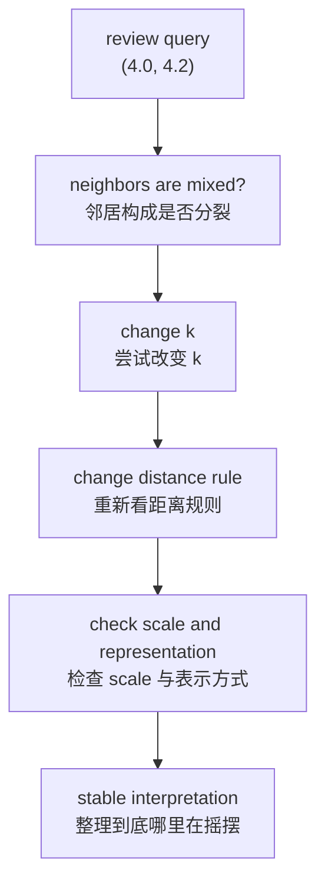

# P4-12.3 使用 k-NN 时，应该先检查什么

> Section ID: `P4-12.3`
> Version: `v2026.07.10`

在 P4-12.1 中，我们看了 k-NN 的直觉；在 P4-12.2 中，我们也看到了为什么距离(distance)和 scale 会改变结果。现在剩下的问题是这个。

当 k-NN 的判断开始摇摆时，应该先重新看什么？

这一节的目的，不是重新解释 preprocessing 的一般理论，而是整理在阅读 k-NN 时 `应该先检查哪里`。

## 本节范围

这一节回答下面这些问题。

- 在什么样的问题里，可以先把 k-NN 列为候选？
- 出现什么信号时，应该先怀疑距离或 scale 问题？
- 在 `距离规则`、`k`、`数据表示` 之间，应该先重新看哪一个？
- 需要 review 的 query 应该怎样去读？

这一节不会深入处理下面这些内容。

- preprocessing 的完整体系
- model selection 的完整一般理论
- 高级优化或近似最近邻搜索的实现

## 本节目标

- 你可以说明哪些问题适合先把 k-NN 列为候选。
- 你可以说明哪些信号会让你怀疑距离或 scale 问题。
- 当结果开始摇摆时，你可以排出先重新看什么的顺序。

## 主要学习内容

### 什么时候适合先把 k-NN 列为候选

k-NN 不是所有分类问题的基本答案。但在那些 `用附近案例来解释判断` 很自然的问题里，它会成为一个很好的第一比较候选。

| 当前问题状态 | 先想到 k-NN 的理由 |
| --- | --- |
| 相似案例往往会产生相似结果 | 容易用周围邻居作为依据来解释预测。 |
| 比起全局规则，局部模式看起来更重要 | 适合直接比较 query 周围的案例。 |
| 比起先给出公式，更想先展示基于例子的判断 | 看了哪些邻居本身就会成为解释依据。 |
| 数据量不是特别大，而且能承受比较成本 | 在预测时做比较在现实里是可行的。 |

核心不是 `因为立不出公式，所以才用 k-NN`，而是 `在那些先看局部相似性更自然的问题里，k-NN 可以是很好的起点`。

### 出现什么信号时，应该先怀疑距离或 scale 问题

在基于距离的模型里，当性能看起来异常时，往往要比模型结构更先怀疑 `是不是某一条轴几乎独自决定了距离`。

| 看到的信号 | 先怀疑什么 | 理由 |
| --- | --- | --- |
| 只有某一列的数值范围特别大 | scale 主导 | 因为大的轴可能会垄断距离。 |
| 在 scale 调整前后，邻居变化非常大 | 表示依赖性 | 说明接近程度的定义对表示变化很敏感。 |
| 数值范围小的列其实很重要，但预测里不太体现 | 被大轴遮住 | 重要信息可能在距离计算里被埋没。 |
| 同类型的 query 反复聚到边界附近 | 距离规则或 `k` 设置 | 这可能是邻居顺序很容易摇摆的信号。 |

这张表的目的，不是把 scale 调整当成万能解法，而是让你先确认 `接近程度的定义是不是已经在摇摆`。

### 应该先重新看什么

当结果开始摇摆时，通常比较好的检查顺序如下。

1. 这个问题真的适合用 `比较附近案例` 的方式来读吗？
2. 当前的距离规则和问题本身匹配吗？
3. `k` 是不是太小或太大？
4. scale 或数据表示是不是把某一条轴推得过强？
5. 在预测时，比较成本是否真的负担得起？

这个顺序之所以重要，是因为每个问题指向的是不同种类的问题。

- 第 1 项是 `模型家族` 的问题。
- 第 2 和第 3 项是 `判断规则` 的问题。
- 第 4 项是 `表示方式` 的问题。
- 第 5 项是 `运维成本` 的问题。

也就是说，哪怕只有一句 `结果有点怪`，里面也可能混着不同层次的原因。

尤其是在第 4 项里，如果真的开始怀疑是 scale 或表示方式问题，那么与其在这一节里重新长篇解释 preprocessing 一般理论，不如回到 `P4-7.2 preprocessing`，再按基准去确认。

### 如果重新读 P4-12.1 里的同一个 query

如果把上一节里出现过的 query `(4.0, 4.2)` 再拿回来，那么检查顺序就会变得更具体。

| 要重新看的问题 | 在 `(4.0, 4.2)` 里实际看的内容 | 当前应作的判断 |
| --- | --- | --- |
| `k` 是否太敏感？ | 在 `k=1` 时是 class 1，但在 `k=3` 时变成 class 0 | 因为可能被单点例外带偏，所以要重新看 `k` |
| 邻居构成是否混杂？ | 附近邻居的 label 像 `1, 0, 0, 1, 0` 一样混在一起 | 它很可能是一个靠近边界的 query |
| 如果换距离规则，会变吗？ | 即使坐标相同，邻居顺序也可能因距离规则不同而变化 | 继续连到 `P4-12.2` 的距离规则比较 |
| 是否已经到了连 scale 问题也要怀疑的程度？ | 现在这个例子用的是相同坐标轴，所以 scale 问题较弱 | 在真实数据里若数值范围不同，就回看 `P4-7.2` 和 `P4-12.2` |

这张表的目的，不是让人背 checklist，而是顺着一个 query 展示 `应该从哪里开始重新怀疑`。

### 一个把单个 query 检查到底的小流程

如果把前面的表再压缩成真实判断顺序，那么 `结果有点暧昧` 这句话，就不再只是感觉，而会变成重新寻找 `到底在哪一步发生了摇摆`。

1. 先看邻居构成是否明显偏向一边。
2. 如果只差一两个点就会分开，再看改变 `k` 之后，解释是否还成立。
3. 如果即使轻微改变 `k` 也仍然摇摆，就再看距离规则本身是否适合当前问题。
4. 如果存在数值范围差异很大的特征，最后再回头检查 scale 与数据表示。

也就是说，review query 更适合被读成 `展示判断规则哪一层在摇摆的观察点`，而不是 `一条错误预测`。

### 需要 review 的 query 应该怎样去读

需要 review 的 query，通常就是 `邻居构成没有明显倒向某一边` 的情况。

例如：

| query | nearest labels | 当前读法 |
| --- | --- | --- |
| `(4.0, 4.2)` | `[1, 0, 1]` | 它偏向 class 1，但可能在边界附近 |
| `(4.0, 4.2)` with `k=5` | `[1, 0, 1, 0, 0]` | 因为扩大 `k` 后解读可能改变，所以需要再确认 |

这里重要的是，`邻居分裂了` 这个事实，并不等于原因解释已经结束。它更像是一个先告诉你 `应该重新看哪里` 的信号。

也就是说，review query 往往按下面这个顺序来读。

1. 邻居构成分裂到什么程度？
2. 如果改变 `k`，解释是否还能保持？
3. 如果改变距离规则，邻居是否会改变？
4. 在 scale 调整前后，哪些邻居进来了，哪些邻居出去了？

这四个问题之所以重要，是因为它们分别瞄准不同原因。

- 第 1 项看的是 `这个 query 现在是不是靠近边界`。
- 第 2 项看的是 `它是不是对一两个例外邻居过度敏感`。
- 第 3 项看的是 `接近程度的定义是否真的适合当前问题`。
- 第 4 项看的是 `表示方式是否在扭曲判断`。

## 案例及示例

### 案例 1. 预测能做出来，但解释总在摇摆的时候

一个订阅服务团队正在用 k-NN 看客户流失可能性。分数本身是能算出来一些的，但却不断发生两位看起来相似的客户得到不同预测的情况。

这时，与其马上跳到 `是不是要换别的模型`，不如先重新看下面这些点。

- 这个问题是不是在按局部相似性来读
- 距离规则是否适合当前特征
- 是否用了像 `k=1` 这样过于敏感的设置
- 像支付金额这样的大轴是否正在压过其他特征

经过这个顺序后，就能把 `模型本身的失败` 和 `判断标准的摇摆` 稍微分开来读。

也就是说，这一节的目标不是一个模糊的结论 `k-NN 要小心用`。更准确地说，是让读者能自己说出：`即使预测在摇摆，也该先从哪里重新看起`。

## 本节要记住的视角

- k-NN 在局部相似性重要的问题里，可以成为很好的第一比较候选。
- 当结果开始摇摆时，比起模型名字，更应该先重新看 `距离规则`、`k`、`数据表示`。
- review query 不是用来直接确定错误原因的材料，而是告诉你 `该重新看哪里` 的信号。

## 简短检查

- 你能区分哪些问题值得先想到 k-NN，哪些则不是吗？
- 当结果开始摇摆时，你能说明 `距离规则`、`k`、`scale` 应该按什么顺序去看吗？
- 你是否把 review query 读成 `重新检查的信号`，而不是 `原因已经确定`？

## 出处与参考资料

- scikit-learn, *Nearest Neighbors*, scikit-learn User Guide, 确认日期：2026-06-27. <https://scikit-learn.org/stable/modules/neighbors.html>{: target="_blank" rel="noopener noreferrer" }
- scikit-learn, *Importance of Feature Scaling*, scikit-learn Examples, 确认日期：2026-06-27. <https://scikit-learn.org/stable/auto_examples/preprocessing/plot_scaling_importance.html>{: target="_blank" rel="noopener noreferrer" }
