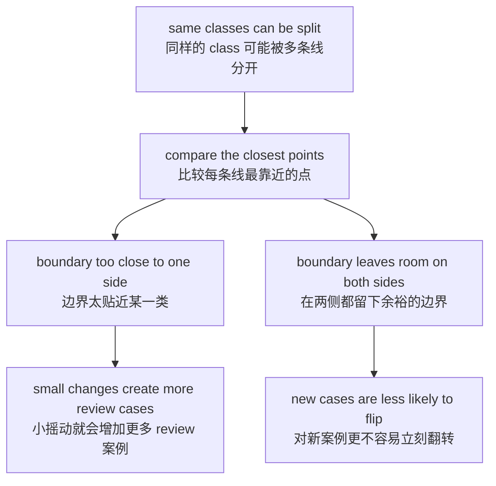
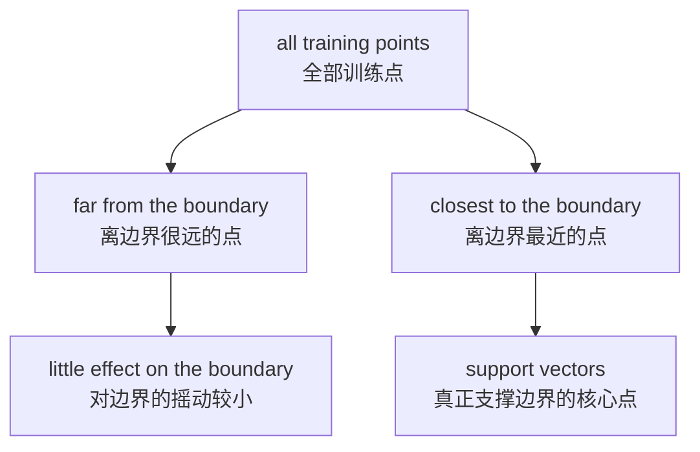
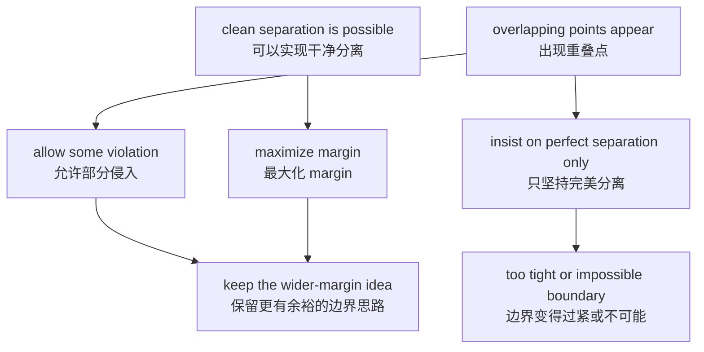
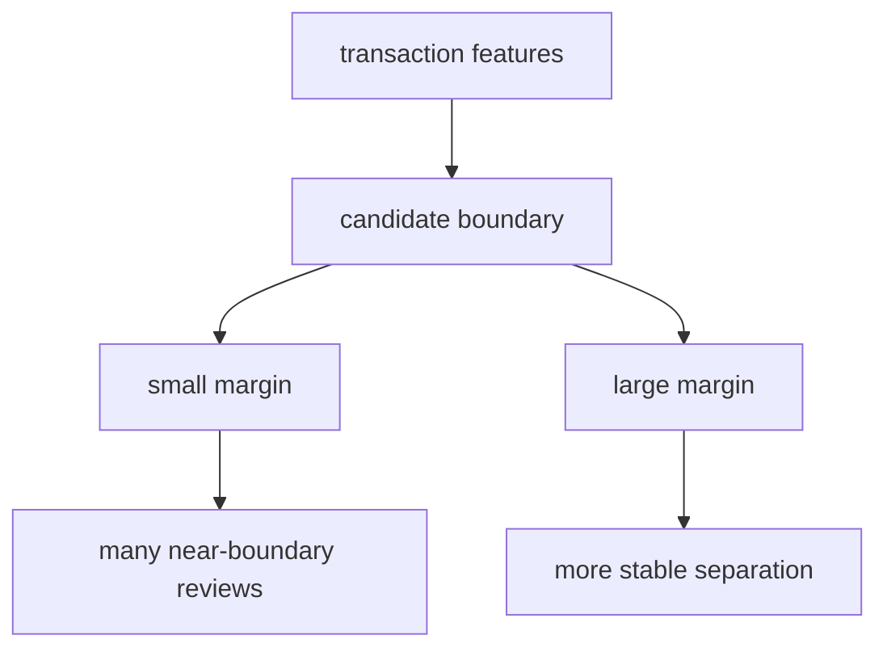
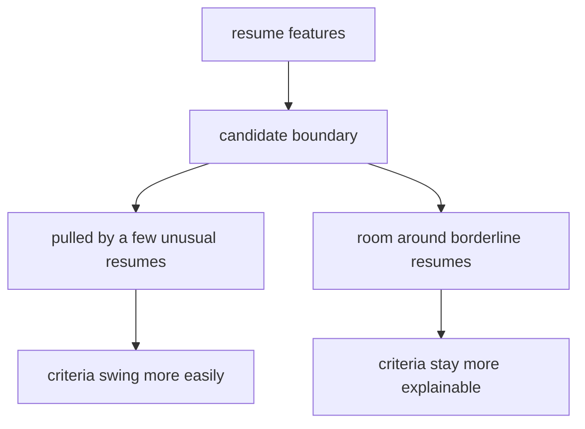
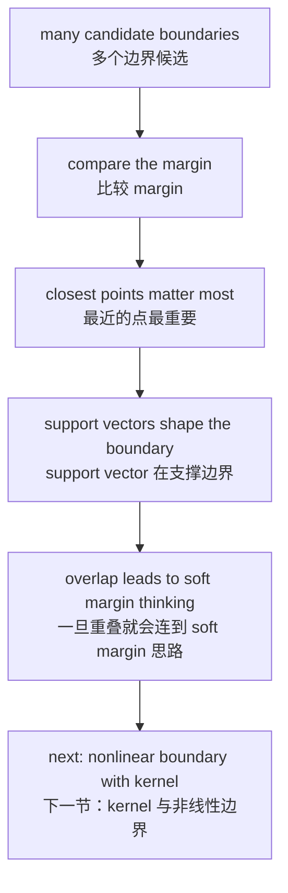

# P4-13.1 SVM 的直觉

> Section ID: `P4-13.1`
> Version: `v2026.07.10`

在 P4-11.2 中，我们把分类看成 `画出边界(boundary)，然后把空间分开`。在 P4-12 中，我们也看过 `通过观察附近邻居来做判断的方式`。现在，我们用另一个问题重新读取同一个分类问题。

如果可以画出边界，那么在这些边界里，哪一种边界才是更好的边界？

这个问题就是 SVM(support vector machine) 的出发点。

SVM 是一种寻找分开 class 的线，但又试图让这条线尽可能和两侧数据保持余裕的模型。

SVM 并不只是停在 `找到一条分类线` 上，而是在尝试寻找 `看起来最稳定的分离线`。

这一节解释 `SVM (support vector machine)`、`margin`、`support vector` 的基本含义。后面的章节会继续用这些把手把当前语境中的判断往下接，而读取边界稳定性的基础感觉，会通过这一节和 [概念词汇表](../../../reference/concept-glossary.md) 再次连起来。

## 本节范围

这一节是第一次用 SVM 的把手抓住 `什么叫好的边界` 这个问题的地方。在这里，我们围绕 margin、support vector、soft margin 的直觉，先读的不是 `能不能分开`，而是 `更稳定地分开的标准`。

这一节回答下面这些问题。

- 为什么 SVM 会把 `margin` 看得比单纯的边界线更重要？
- margin 是什么，为什么它会和分类稳定性连在一起？
- support vector 是什么，为什么它会重要到出现在名字里？
- 当数据无法被完美分开时，会多出什么新的想法？
- SVM 和前面的 logistic regression、k-NN 有什么不同？

这一节不会长篇展开优化目标函数的严格公式推导、拉格朗日乘子(Lagrange multiplier)与对偶(dual)问题、kernel trick 的细部计算，以及 `C`、`gamma` 等超参数的细调。kernel 的想法和非线性边界的大图景会在 P4-13.2 直接继续，`C`、`gamma` 等超参数的读取标准与验证成本会在 P4-9.1、P4-9.2 再次接回。优化目标函数、拉格朗日乘子与对偶问题的严格展开，则放在本书当前正文范围之外。

## 本节目标

- 你可以把 SVM 解释成 `最大化 margin 的分类器`。
- 你可以说明：在划分同一份数据的多个边界里，为什么有些边界可以说更好。
- 你可以说明：support vector 是 `距离边界最近的核心点`。
- 你可以在入门层次上理解：当完美分离变得困难时，margin 和错误容忍会一起出现。
- 你可以说明：为什么第 11 章的 decision boundary 和第 12 章的距离、scale 讨论会通向 SVM。

## 学习背景

P4-11 中的 logistic regression 展示了 `把输入空间分开的边界`。但只读那一节，还会留下下面这些问题。

- 只要能分开，就够了吗？
- 即使边界贴得离 class 太近，也没关系吗？
- 如果边界附近只要有一点小摇动，预测就很容易改变，那会怎样？

SVM 就是回答这些问题的第一个代表性例子。

这一节更接近于学习 `什么叫好的分类线的标准`，而不是分类线本身。

## 主要学习内容

### 为什么必须单独去看 margin

能够分开两个 class 的直线，未必只有一条。面对同一份数据，也可能画出很多条线。

问题在于，这些线看起来并不都一样好。

- 有的线贴某一侧的点贴得太紧。
- 有的线和两侧的点之间还留着更多空间。
- 有的线看起来只要来一点噪声(noise)，class 就会翻转。

SVM 正是用 `margin` 这个词来抓住这个差异。

`margin 是边界线和最接近它的数据点之间留下的余裕宽度。`

如果这个余裕宽度更大，那么就可以把这个边界读成是更稳定地放在数据之间。

换句话说，SVM 不止问 `能不能画出一条线`，而是在问 `几个边界候选中，哪一个更稳定`。关键不只是能不能分，而是要根据和最近点之间的最小间隔，选出那个更有余裕的边界。

如果把同样的想法再次压缩成判断顺序，会变成下面这样。



这张图的核心是：`单独去看 margin` 不是附加装饰。只有先把能够分开同一份数据的多个边界摆出来，再比较每个边界上最近的点，才可能区分出容易被小摇动击穿的边界，和留出余裕的边界。如果边界太靠近某一类，那么新案例只要稍微移动一点，near-boundary review 就会迅速增加；而在两侧都留出余裕的边界，在同样变化下立刻翻转的可能性就相对更小。

### 为什么大的 margin 更好

不能说大的 margin 永远就是绝对正确答案。但从教学角度看，它因为下面这些原因而成为非常重要的标准。

1. 边界不会太贴近两侧 class。
2. 对边界附近的小摇动看起来不那么敏感。
3. 它会给人一种直觉：在没见过的新数据上，也许可以期待更稳定的 generalization。

正因为有第三点，SVM 经常和 statistical learning theory 一起被提起。正如本书前面的章节所看到的，generalization 更接近 `在新数据上也维持合理判断`，而不是 `把训练数据背得很熟`。SVM 让你用 `margin` 这种几何语言去读这个 generalization 问题。

`SVM 把“把边界分对”的问题，重新读成“找到一条有余裕的边界”的问题。`

如果用项目备忘录的形式压缩一下，可以写成下面这样。

| 记录项 | 例子 |
| --- | --- |
| 当前候选边界 | `linear SVM` |
| margin 附近案例 | `交易 A`、`交易 B` |
| 是否需要 review | `离边界太近，需要复查` |
| 下一个问题 | `如果用 soft margin 放宽，同样的案例还会不会留下` |

有了这张表，SVM 的介绍就会先被读成 `比较候选 -> review 案例 -> 下一个问题` 的结构，而不是先从公式开始。即使出现了相同的准确率或相近的平均分数，也仍然需要单独确认：哪个候选留下了更大的余裕，哪个候选让更多案例停留在边界附近。

### 什么是 support vector

SVM 这个名字里包含了 `support vector`。这件事之所以重要，是因为并不是所有点都以同样程度决定边界。

在 SVM 的直觉里，最重要的点通常是 `离边界最近的点`。这些点可以被读成实际上在支撑边界的位置，所以才有 support vector 这个名字。

- 离得很远的点，对边界的决定没有那么敏感。
- 贴边界贴得最近的点，更强烈地左右边界的位置。
- 所以 SVM 会特别关注整份数据里 `最紧的那些点`。

简单画出来会是这样。



这张图展示了为什么 support vector 是特别的。意思是：并不是所有训练点都用相同权重决定边界；离边界较远的点对边界摇动较小，而最接近边界的少数点，在实际中更强烈地支撑着分离线的位置。

从实务角度，也可以这样读 support vector。

- 不是所有客户记录都拥有同样的重要性。
- 不是所有试卷都以同样程度摇动边界标准。
- 现实里，真正更改模型标准的，往往是 `边界附近那些暧昧案例`。

这种感觉对后面的模型解释和错误分析也很重要。无论面对什么模型，只要形成了去查看 `边界附近暧昧案例` 的习惯，你能读到的内容就会比单纯看准确率更多。

### 用 Python 看 `哪一个边界拥有更大的 margin`

这次的例子并不是直接实现一个 SVM 学习器。相反，它会摆出多个把同样两类数据分开的 `垂直边界候选`，然后直接计算哪条边界拥有更大的 margin。

- 问题场景：两个 class 分别位于 x 轴的左右两侧
- 输入(input)：二维点
- 正确答案(label)：negative / positive
- 要确认的概念：
  - 能够形成边界的候选可能不止一个。
  - SVM 的兴趣在于找到那个 `最小余裕(minimum gap)` 最大的边界。
  - 离边界最近的点会被读成 support vector 那样的角色。

```python
negative = [(1.0, 2.0), (2.0, 3.0), (3.0, 2.5)]
positive = [(5.0, 2.2), (6.0, 3.2), (7.0, 2.8)]

candidates = [3.4, 4.0, 4.6]

for boundary_x in candidates:
    neg_min = min(boundary_x - x for x, _ in negative)
    pos_min = min(x - boundary_x for x, _ in positive)
    margin = min(neg_min, pos_min)

    support_neg = [p for p in negative if abs((boundary_x - p[0]) - neg_min) < 1e-9]
    support_pos = [p for p in positive if abs((p[0] - boundary_x) - pos_min) < 1e-9]

    print("boundary x =", boundary_x)
    print("  negative-side nearest distance =", round(neg_min, 3))
    print("  positive-side nearest distance =", round(pos_min, 3))
    print("  margin =", round(margin, 3))
    print("  support-like points =", support_neg + support_pos)
    print()
```

执行结果示例如下。

```text
boundary x = 3.4
  negative-side nearest distance = 0.4
  positive-side nearest distance = 1.6
  margin = 0.4
  support-like points = [(3.0, 2.5), (5.0, 2.2)]

boundary x = 4.0
  negative-side nearest distance = 1.0
  positive-side nearest distance = 1.0
  margin = 1.0
  support-like points = [(3.0, 2.5), (5.0, 2.2)]

boundary x = 4.6
  negative-side nearest distance = 1.6
  positive-side nearest distance = 0.4
  margin = 0.4
  support-like points = [(3.0, 2.5), (5.0, 2.2)]
```

从这个输出里要读到的核心如下。

- 三条边界都能把两个 class 分开。
- 但在 `x = 4.0` 时，最小余裕宽度最大。
- 离边界最近的 `(3.0, 2.5)` 和 `(5.0, 2.2)` 会像 support vector 一样工作。

SVM 不会停在 `能不能分开`，而是会继续追问 `分开时留下了多少余裕`。

## 细部学习内容

### 如果数据不能被完美分开，会怎样

现实数据并不会总是这么干净。有些点可能会混到反方向 class 的附近。这时，做出一条完美分离线(perfect separating line) 就会变得困难。

到了这里，SVM 的直觉会变成下面这样。

- 它不只执着于把所有点完美分开。
- 即使允许一部分错误或侵入，
- 也会尝试找到整体上更合理的 margin。

这个想法会在后面连到 `soft margin` 和超参数 `C`。在这一节里，只要先抓住下面这句话就够了。

`现实中的 SVM，不只处理完美分离，也一起处理余裕与错误容忍之间的平衡。`

如果把它概念化地画出来，会像下面这样。



### SVM 处理的是什么问题

在 scikit-learn 官方文档里，SVM 也被介绍成一组用于分类(classification)、回归(regression)、异常检测(outlier detection)的监督学习(supervised learning)方法族。但在这一节里，我们先只处理二元分类(binary classification)。

例如：

| 业务场景 | 要预测的值 |
| --- | --- |
| 正常交易 / 欺诈交易 | 0 / 1 |
| 不合格 / 合格 | 0 / 1 |
| 非流失 / 流失 | 0 / 1 |

此时，SVM 的关注点不只在 `预测对了没有`。它还会一起看 `那条分对的线留下了多少余裕`。

如果重新用实务感觉来读，会变成下面这样。

| 场景 | SVM 特别在意的问题 |
| --- | --- |
| 欺诈交易检测 | 正常交易与欺诈交易之间的边界是不是太密，以至于稍微摇一下就会翻转？ |
| 简历分类 | 合格 / 待定 的边界是不是被某些特定案例拉得太过？ |
| 设备异常检测 | 即使正常与异常状态能分开，边界会不会过紧，以至于警报不稳定？ |

SVM 是一种会让你同时意识到 `谁属于哪个 class` 和 `这个标准有多不稳定` 的模型。

### 它和 logistic regression、k-NN 有什么不同

如果把 SVM 和前面的模型并排放在一起，差异就会更清楚。

| 模型 | 中心问题 |
| --- | --- |
| logistic regression | 用什么线性分数和 threshold 来把 class 分开？ |
| k-NN | 这个点周围接近的案例属于什么 class？ |
| SVM | 在分开两个 class 的同时，什么样的边界最有余裕？ |

这个比较非常重要。三种模型都在做 classification，但它们 `把什么看成好的判断标准` 是不一样的。

- logistic regression 展示的是可以像分数和概率那样读取的输出。
- k-NN 展示的是把周围案例当作依据的判断。
- SVM 展示的是以边界和 margin 为中心的判断。

因此，在读 SVM 时，不能只看 `预测值`，还要一起看 `边界有多紧`、`哪些点在支撑这条边界`。

### 什么时候适合先把 SVM 列为候选

SVM 不是所有分类问题的基础答案，但在那些 `边界稳定性` 本身就很重要的问题里，它会是很好的候选。

| 当前问题状态 | 先考虑 SVM 的理由 | 要先确认的点 |
| --- | --- | --- |
| 分类边界看起来太紧 | 因为它优先找的是 margin 更大的边界 | 是否有很多案例停在边界附近 |
| 只要稍微摇动，class 就频繁改变 | 因为此时需要的是寻找更稳定分离线的思路 | 哪些点看起来像 support vector |
| 已经有线性边界候选，但余裕宽度可疑 | 因为即使都是分开，也可以比较出更好的边界 | 它与 baseline 或 logistic regression 有什么不同 |
| 想把边界附近案例单独当成 review 对象管理 | 因为适合把 margin 附近案例单独记录下来 | 哪些案例要留作 review 对象 |
| 以后可能继续扩展到非线性边界候选 | 因为它能自然地从线性 SVM 过渡到 kernel SVM | 目前线性形式是否已经足够 |

这张表的核心，是把 SVM 放在 `另一个分类器` 之外的位置上，读成 `更强烈追问“什么叫好的边界”的候选`。

这一节把和前面模型相比，哪些东西开始变得不同样重要，整理成下面这样。

| 模型 | 先抓住的问题 | 本节会更强地看的标准 |
| --- | --- | --- |
| logistic regression | 用什么分数和 threshold 把 class 分开？ | 像概率一样可读的输出和线性边界 |
| k-NN | 应该参考周围哪些案例？ | 局部邻居和距离标准 |
| SVM | 多个边界里，哪一个更稳定？ | margin 和 support vector |

SVM 会把中心问题从 `能不能画出边界` 改写成 `这条边界有多少余裕、是否稳定`。只有把这个标准固定下来，后面的 soft margin、kernel、`C` 等解释，才不会被读成新选项清单，而会被读成 `调节“好的边界标准”的装置`。

如果再补上一点，这一节的 SVM 也会和前面整理出的比较记录结构直接连起来。把 SVM 列为候选时，不能只留下 `margin 很大` 这句话，还要一起记下 `哪些案例停留在 margin 附近`、`和 baseline 或其他候选相比，什么看起来更稳定`、`下一步还要调整什么`。此时，margin 附近案例要先被读成提高 review 优先级的信号，而不能把它们为什么停在那里，直接当成已经自动解释完了。

| 需要一起留下的记录 | 为什么需要 |
| --- | --- |
| baseline 与 SVM 的比较 | 为了看 margin 视角和简单标准相比，实际改变了什么 |
| margin 附近案例 | 为了找到需要留作 review 对象的暧昧案例 |
| 像 support vector 一样读到的点 | 为了再看哪些点在最强烈地摇动边界 |
| 下一轮实验问题 | 为了决定下一步看 `C`、提出 kernel 候选，还是继续看更多特征 |

## 练习与示例

### 用 Python 看 `完美分离` 被打破后，什么会改变

这次的例子，会在前一个例子的基础上，再加入一个靠近边界的 `暧昧 negative 点`。

问题场景：

- 原本分得很开的两类之间，插进来一个靠近边界的例外案例

输入(input)：

- negative 点列表
- positive 点列表
- 多个候选边界 `boundary_x`

期望输出(output)：

- 每个边界上的 negative 一侧最近距离
- positive 一侧最近距离
- margin 值

要确认的概念：

- 有些边界已经不能再形成完美分离
- 当完美分离变得困难时，就不能只想 `margin 大不大`，还要一起想 `允许多大程度的侵入`

```python
negative = [(1.0, 2.0), (2.0, 3.0), (3.0, 2.5), (4.7, 2.4)]
positive = [(5.0, 2.2), (6.0, 3.2), (7.0, 2.8)]

for boundary_x in [4.0, 4.8, 5.2]:
    neg_min = min(boundary_x - x for x, _ in negative)
    pos_min = min(x - boundary_x for x, _ in positive)
    margin = min(neg_min, pos_min)

    print("boundary x =", boundary_x)
    print("  negative-side nearest distance =", round(neg_min, 3))
    print("  positive-side nearest distance =", round(pos_min, 3))
    print("  margin =", round(margin, 3))
    print("  perfectly separates? =", neg_min > 0 and pos_min > 0)
    print()
```

执行结果示例如下。

```text
boundary x = 4.0
  negative-side nearest distance = -0.7
  positive-side nearest distance = 1.0
  margin = -0.7
  perfectly separates? = False

boundary x = 4.8
  negative-side nearest distance = 0.1
  positive-side nearest distance = 0.2
  margin = 0.1
  perfectly separates? = True

boundary x = 5.2
  negative-side nearest distance = 0.5
  positive-side nearest distance = -0.2
  margin = -0.2
  perfectly separates? = False
```

从这个输出里，要读到的点很明确。

- 只要在边界附近加入一个例外点，有些边界就不再能完美分离。
- 即使勉强还能分开，margin 也可能变得非常小。
- 所以现实中的 SVM 会往 `不只坚持完美分离，而是一起调节 margin 与错误容忍` 的方向前进。

### 再改一个值：如果例外点更靠近边界，什么保持不变，什么发生变化

这一次，把那个暧昧 negative 点从 `(4.7, 2.4)` 再往右移动到 `(4.9, 2.4)`。

```python
negative = [(1.0, 2.0), (2.0, 3.0), (3.0, 2.5), (4.9, 2.4)]
positive = [(5.0, 2.2), (6.0, 3.2), (7.0, 2.8)]

for boundary_x in [4.8, 4.95]:
    neg_min = min(boundary_x - x for x, _ in negative)
    pos_min = min(x - boundary_x for x, _ in positive)
    margin = min(neg_min, pos_min)

    print("boundary x =", boundary_x)
    print("  negative-side nearest distance =", round(neg_min, 3))
    print("  positive-side nearest distance =", round(pos_min, 3))
    print("  margin =", round(margin, 3))
    print("  perfectly separates? =", neg_min > 0 and pos_min > 0)
    print()
```

执行结果示例如下。

```text
boundary x = 4.8
  negative-side nearest distance = -0.1
  positive-side nearest distance = 0.2
  margin = -0.1
  perfectly separates? = False

boundary x = 4.95
  negative-side nearest distance = 0.05
  positive-side nearest distance = 0.05
  margin = 0.05
  perfectly separates? = True
```

### 什么保持不变，什么发生变化

- 保持不变的点：问题仍然不是只问 `能不能把 class 分开`，而是在问 `能留下多少余裕来分开`。
- 发生变化的点：例外点一旦更接近边界，原本看起来还能用的边界，也更容易变成分离失败，或者只剩下非常小的 margin。
- 首先要留下的判断：即使同样都叫分离成功，margin 是 `0.2` 和 `0.05` 时，稳定性也完全不同。

### 这个练习如何回收 Part 4 的目标

这个练习会把 SVM 从 `答对结果的分类器` 重新回收到 `比较边界质量的模型`。Part 4 的目标，不是只看一个分类结果，而是去读出：哪些案例让边界变得更紧，哪些案例提高了 generalization 风险。只有加入一点点移动例外点的重复练习，margin 才能从数字定义连接成 `对摇动的感觉`。

| 共同记录语言 | 这次练习里应当立刻留下的内容 |
| --- | --- |
| 看见的结构 | 边界附近的例外点只稍微移动一点，分离可能性和 margin 大小就一起强烈摇动了 |
| 解释边界 | 不能因为一个玩具例子里 margin 变小了，就断定同一条边界在真实所有数据里都一定更差 |
| 下一个问题 | 如果引入 soft margin 和 `C`，应该把这种侵入允许到什么程度，与其他分类器比较时最先会看到什么？ |

## 案例及示例

这一节的直觉如果只停在抽象层面，很容易发散。所以有必要用业务场景重新读一遍。

### 案例 1. 欺诈交易检测

- 太小的 margin：
  - 正常交易和欺诈交易的边界太密。
  - 金额小额变化、海外访问、时间段等特征只要稍微摇一下，class 就可能变化。
- 更大的 margin：
  - 边界会和两侧 class 稍微保持更远一点。
  - 即使还会留下暧昧交易，标准线本身也会没那么敏感地摇动。



### 案例 2. 简历分类

- 太小的 margin：
  - 少数几份特殊简历把边界拉得太厉害。
  - 只要评分体系变化，或者来了背景更新的候选人，结果就可能很容易摇摆。
- 更大的 margin：
  - 边界不会那么容易被一两个案例拉走。
  - 标准更有可能保持在更一般、更容易解释的方向上。



`SVM 的 margin 直觉，会连接到一个问题：模型给出的边界在现场到底会多敏感地摇动。`

### 学术背景与历史

SVM 是在 statistical learning theory 和 generalization 讨论中非常重要的方法。正如前面 P4-5.2 所看到的，generalization 连接的是这样的问题：`它在新数据上是否还能维持合理判断`，而不只是把训练数据拟合得很好。

在这一节里，学术背景和历史并不是取代正文的解释，而只是作为一个辅助语境，帮助短暂抓住：为什么要用 margin 单独去问 `什么叫好的边界`。

从历史上看，1990 年代 Cortes 和 Vapnik 的论文 *Support-Vector Networks* 是这条发展脉络的代表。在这一节里，重要的不是细节证明，而是下面这个变化。

1. 分类可以被读成寻找边界的问题。
2. 边界可能不止一条。
3. 因此，需要一个标准去回答 `哪个边界更好`。
4. SVM 用最大化 margin 的语言给出了这个标准。

因此，SVM 经常不仅仅被介绍为一个算法名字，也会被介绍成 `试图用几何方式解释 generalization 的代表性例子`。

## 本节要记住的视角

- SVM 是一种会在分开 class 的边界中，寻找 `margin 更大` 的那条边界的模型。
- margin 可以读成边界和最近数据点之间留下的余裕宽度。
- support vector 是离边界最近的核心点。
- 在真实数据里，比起完美分离，`余裕` 与 `错误容忍` 的平衡更重要。
- 因此，SVM 会让你把分类问题重新看成 `边界质量的问题`。

这一节的核心，不是去背 SVM 这个名字，而是固定下来：应该用什么标准去读“好的边界”。

如果把同样的脉络再一次重新绑起来，可以写成下面这样。



| 需要一起看的内容 | 本节先读取的问题 | 立刻会连到哪里 |
| --- | --- | --- |
| margin 与 support vector | 多个边界里，哪一个更有余裕、更稳定？ | P4-13.2 kernel 与非线性边界 |
| soft margin 与错误容忍 | 比起完美分离，应当选什么平衡？ | P4-9 超参数与 `C` 的解读 |
| 和前面模型的比较 | logistic regression 和 k-NN 没能展示出的新标准是什么？ | 后面的分类器比较与 generalization 解读 |

## 简短检查

- 在当前问题里，比起单纯分开，边界的余裕和稳定性是不是更重要？
- 你能重新去看，哪些案例像 support vector 一样真正支撑着边界？
- 你是否除了小的分数差异之外，也一起查看了 margin 附近案例的性质？

## 什么时候应当先想到这个视角

- 当边界的余裕与稳定性看起来比单纯把 class 分开更重要时，就先拿出 margin 视角。
- 当你看到少数边界附近案例左右了整个判断时，就重新想起 support vector 为什么是核心。
- 当你需要整理 SVM 相对 logistic regression 或 k-NN 到底在问什么时，就回到 `什么叫更好的边界` 这个标准来读。

## 出处与参考资料

- scikit-learn, *Support Vector Machines*, scikit-learn User Guide, 确认日期：2026-06-27. <https://scikit-learn.org/stable/modules/svm.html>{: target="_blank" rel="noopener noreferrer" }
- C. Cortes and V. Vapnik, *Support-Vector Networks*, Machine Learning, 1995, DOI: 10.1007/BF00994018, 确认日期：2026-06-27.
