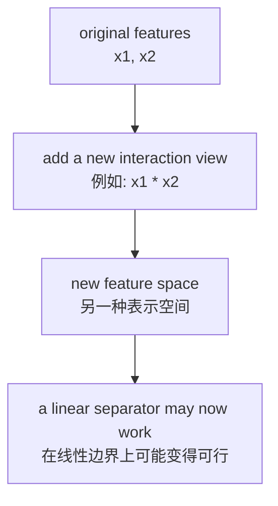
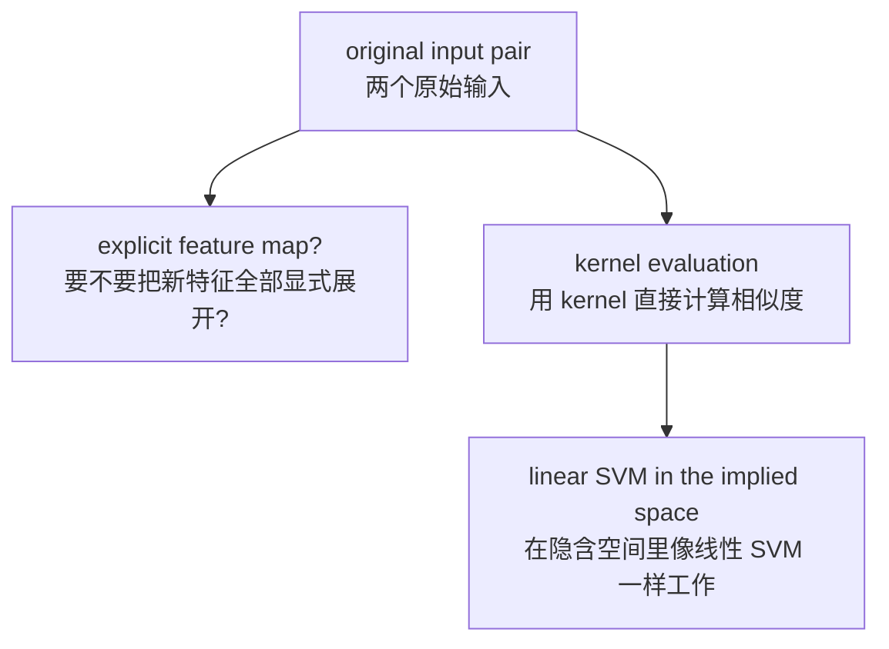
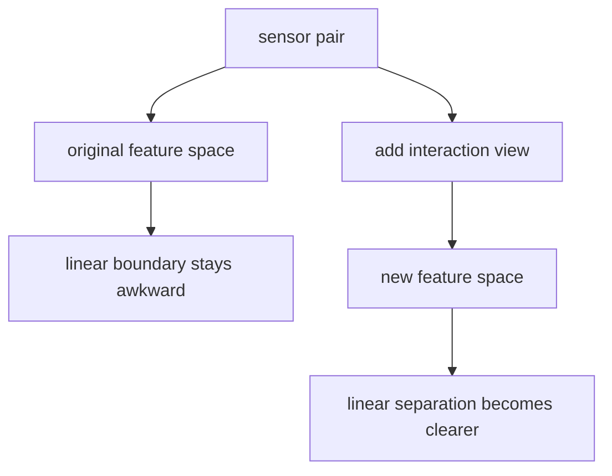

# P4-13.2 kernel 的入门含义

> Section ID: `P4-13.2`
> Version: `v2026.07.10`

在 P4-13.1 中，我们把 SVM(support vector machine) 看成 `寻找 margin 更大的边界的分类器`。但在那里自然会出现下一个问题。

如果这个边界必须是一条直线(line)，那么那些无法被直线很好分开的数据该怎么办？

这正是为什么必须介绍 kernel 的原因。

kernel 是一种思路，它让数据在另一种表示空间里被比较，从而使原本难以线性划分的问题也能更好地处理。

也就是说，13.2 的核心不是 `一个新的魔法函数`，而是这样一种视角：`只要改变表示，线性边界本身也可能拥有完全不同的意义`。

这一节不会把 SVM 的基本定义再长篇重复一遍。`寻找 margin 更大的边界` 这个核心直觉，会通过 P4-13.1 和 [概念词汇表](../../../reference/concept-glossary.md) 再次连回；这里则只专注于：为什么会需要去改变表示空间的想法。

## 本节范围

这一节回答下面这些问题。

- 为什么有些数据仅靠线性边界无法很好分开？
- 改变表示(feature space) 到底是什么意思？
- 为什么会说 kernel 即使 `不直接创造新特征` 也能带来帮助？
- polynomial、RBF 这样的 kernel 名字各自暗示了什么？
- 什么时候可以把基于 kernel 的 SVM 提出来当候选？

这一节不会深入处理下面这些内容。

- kernel 函数严格的正半定(positive semidefinite)条件
- RKHS(reproducing kernel Hilbert space) 的数学
- dual optimization 中 kernel 进入公式的推导
- `gamma`、`degree`、`coef0` 的细部调参策略

像 `gamma`、`degree`、`coef0` 这样的设置值应当如何读取，以及它们带来的验证成本，会在 P4-9.1、P4-9.2 再次接回。正半定条件、RKHS、dual optimization 的数学展开，则放在本书当前正文范围之外；如果需要，更适合去看更深入的数学文档。

## 本节目标

- 你可以用例子说明：为什么线性边界有时并不好用。
- 你可以说明：一旦表示空间(feature space)变化，同一份数据也可能被读出不同结构。
- 你可以在入门层次上把 kernel 解释成 `一种计算相似度的方式，也是绕开显式新表示空间的思路`。
- 你可以凭直觉说明 polynomial kernel 和 RBF kernel 各自更在意哪一种非线性。
- 你可以把基于 kernel 的方法放在 `当线性边界看起来不够时才会想到的候选` 上，而不是 `永远默认使用的选择`。

## 学习背景

在 13.1 中，SVM 被读成寻找 `好的线性边界` 的模型。但现实数据经常会呈现下面这些样子。

- class 像曲线一样缠绕
- 具有像中心与外围那样的圆形结构
- 两个特征的乘积或相互作用看起来很重要

这时，问题不会停在 `还有没有更好的直线？` 上，而是会移动成 `是不是用直线来读的方式本身就不够？`

| 前一节 | 这一节里变化后的问题 |
| --- | --- |
| P4-13.1 SVM 的直觉 | 什么是好的直线边界？ |
| P4-13.2 kernel 的入门含义 | 是不是必须连“用直线读取的空间”本身都换掉？ |

也就是说，13.2 不是推翻 13.1 的一节，而是一节在承认 `线性边界的力量` 之后，再补上 `只要表示变了，线性的意义也会跟着改变` 这一点。

## 主要学习内容

### 我们在前一节已经看到了什么，而这一节又新增了什么

如果这一节看起来像是突然开始讲一个全新的故事，那么最好先重新抓住前面已经看到的三件事。

- 在 P4-11.2 中，我们看过 `线性分数与决策边界`。
- 在 P4-12.2 中，我们看过 `只要表示和计算标准改变，同样的数据也可能被读出不同结构`。
- 在 P4-13.1 中，我们看过在 `同一个坐标空间里` 寻找更好线性边界的标准。

P4-13.2 并不是丢掉这三件事的一节。相反，它是在讨论：当这三件事还不足以工作时，还要继续问什么。

`如果 13.1 是在同一个空间里找更好的边界，那么 13.2 就是在重新追问：这个空间本身是不是已经把问题呈现得足够简单。`

### 为什么有些数据很难被直线分开

最著名的例子就是像 XOR 那样的分类问题。假设二维平面上有四个点。

- 左下和右上属于 class 0
- 左上和右下属于 class 1

在这种情况下，很难只用一条直线把两个 class 干净地分开。因为无论画哪条线，对角方向的两个点都很容易一起留在同一侧。

`问题未必是“太难”，而可能只是当前使用的坐标和特征表示对线性分离不利。`

核心在于：与其说数据本身 `困难`，不如说当前的表示方式可能并不利于线性分离。也就是说，如果在原始坐标空间里，直线边界看起来总是很别扭，那么就有理由在改边界之前先试着改表示。

这里重要的是区分 `是不是继续找更好的直线就够了` 和 `是不是要连读取直线的空间本身都换掉`。

- P4-13.1 的问题：能否在同一个坐标空间里找到更好的边界？
- P4-13.2 的问题：这个坐标空间本身，是不是足够简单地呈现了问题？

也就是说，重新去看 soft margin 或 `C`，更接近 `在同一个空间里把边界挑得更好`；而 kernel 更接近 `重新读取边界所处的空间本身`。

### 改变表示到底是什么意思

改变表示，并不等于 `把原来的特征丢掉`。通常它更接近下面这些事情。

- 组合原有特征
- 创造新的交互特征
- 用另一个视角重新看同样的数据

例如，如果有两个特征 \(x_1\) 和 \(x_2\)，就可以额外加上一个像 `x1 * x2` 这样的新特征。这样一来，原本在二维里难以分开的模式，就可能在加入新特征之后的空间里，看起来更简单。

如果把这个流程简单画出来，会变成下面这样。



这张图展示了 kernel 思路的出发点。与其先把边界搞复杂，不如先看到：如果特征表示变了，同样的数据也可能被更简单的线性边界重新读出来。

核心句子是下面这一句。

`kernel 的出发点，是在改边界之前，先试着改表示。`

读者在这里尤其要抓住的是下面几点。

- 不能因为 class 看起来复杂，就立刻断定 `模型太弱`。
- 更应该问的是：`现在看到的坐标轴和特征组合，是否没有把问题简单地显露出来？`
- kernel 正是对这个问题的一类代表性回答。

也就是说，kernel 与其说是让模型更复杂的技术，不如说更接近 `重新摆放读取问题的坐标系的技术`。

### 直接增加特征和 kernel 是怎样连起来的

这里还要再追问一个问题。

- `那是不是直接把新特征做出来就够了？`
- `为什么还要单独用 kernel 这个词？`

在入门层次上，最好先这样理解。

- 直接增加特征：人显式地手动构造 `x1 * x2`、`x1^2` 这样的新特征
- kernel 思路：在更丰富的表示空间里发生的比较效果，可以通过原始空间里的计算绕过去处理

也就是说，kernel 并不是和 `直接加特征` 竞争的另一种完全不同的魔法。更自然的读法是：它把 `让表示变得更丰富` 这个想法，在计算上进一步做了一般化。

### 为什么名字叫 `kernel`

`kernel` 这个名字很容易显得抽象。在这一节里，比起数学上的严格性，更重要的是先抓住这个名字在实际中指向什么。

`kernel 是一个核心计算：它接收两个输入，然后计算这两个输入在新表示空间里会被读成多近、多相似。`

也就是说，kernel 这个词并不是指 `所有新增特征的整体`，而更适合被读成：在那个空间里负责执行比较的核心计算部件。

所以，在理解 kernel 时，读者真正需要抓住的问题是这些。

- 这个 kernel 更强调两个样本之间哪一种相似性？
- 它会不会让交互作用更明显？
- 它会不会让局部邻近结构更敏感？
- 因此，边界会不会更容易变成弯曲而灵活的样子？

只要抓住这些问题，你最终读到的就不只是 `kernel 名字`，而会是 `kernel 推动了怎样一种比较方式`。

### 为什么会说 kernel 不需要把新特征全部显式做出来

一旦对名字的感觉抓住之后，下一个问题就会跟着出现。

- 那是不是把所有新特征都直接做出来就行了？
- 为什么还要特地使用 kernel 这个词？

`kernel 是一种想法：它让新表示空间里的内积(inner product)或相似度，可以用原始空间中的计算来替代得到。`

也就是说，不需要把所有高维特征都显式展开出来，也能获得 `在那个空间里它们有多相似` 的计算方法。

可以把它理解成：`不用把整个高维空间全写出来，也能模拟出在那个空间里进行比较的效果的计算`。

如果把它画成流程，会变成下面这样。



这张图展示了为什么会说 kernel `即使不把所有新特征都显式做出来` 也有帮助。关键就在于：从原始输入对出发，直接计算相似度，从而走一条绕路，让模型在隐含的高维空间里表现得像线性 SVM。

## 细部学习内容

### polynomial 和 RBF kernel 各自暗示了什么

在 13.2 里，不需要把所有 kernel 都背下来。只要抓住两个代表名字在尝试什么就够了。

#### polynomial kernel

- 它更在意特征之间的乘积、平方和交互。
- 不只是看 `x1`、`x2`，而是当 `x1^2`、`x1*x2`、`x2^2` 这样的组合看起来很重要时，比较容易想到它。
- 在入门层次上，它可以被读成 `和显式增加很多交互特征很像的思路`。

#### RBF kernel(radial basis function kernel)

- 它更在意点周围的局部性(locality)和基于距离的相似度。
- 它给人的感觉是：远了以后相似度会很快降低，近了以后就会有更强反应。
- 在入门层次上，它经常被介绍成 `能够让复杂曲线边界更灵活的代表 kernel`。

如果把这两者非常简单地比较，就会得到下面这样。

| kernel | 给读者的直觉 |
| --- | --- |
| polynomial | 更去看交互特征 |
| RBF | 更敏感地去看附近的局部结构 |

如果再用一点实务感觉把这种差别展开，可以读成下面这样。

| kernel | 数据暗示出的结构 | 给读者的问题 |
| --- | --- | --- |
| polynomial | 特征之间的乘积、平方、组合看起来很重要 | `是不是组合比单个值本身更重要？` |
| RBF | 附近点会局部聚成团，边界更像曲线 | `是不是附近的形状本身就在划分类别？` |

也就是说，kernel 的名字不是简单选项，而是在暗示：`我们打算通过哪一种镜头重新看这份数据。`

### 怎样重新读取圆形结构

XOR 是展示交互特征直觉的代表例子。相对地，当要想到 RBF 时，更清楚的画面往往是像 `中心与外围` 那样的圆形结构。

例如，可以想象下面这种情况。

- 靠近中心的点属于 class 0
- 随着半径变大，变成 class 1

在这种情况下，如果只看 `x1` 或只看 `x2`，直线边界会显得很别扭。但如果更强地使用 `离原点有多远` 这种距离感觉，问题就会读得更清楚。

把它整理成入门层次，可以写成下面这样。

- polynomial 系列更容易连到 `多看特征组合` 的思路
- RBF 系列更容易连到 `多看基于距离的局部结构` 的思路

也就是说，两种 kernel 都在处理非线性问题，但它们并不是用同一种方式读取非线性。

如果把这种差异写成项目备忘录风格，会变成下面这样。

| 比较项 | 原始空间 | 新表示或 kernel 视角 | 读取方式 |
| --- | --- | --- | --- |
| 暧昧案例 | class 看起来混在一起 | 可能会更清楚地分开 | 只要表示变了，同样案例也会被不同地读取 |
| 是否需要 review | 高 | 可能降低，或者其性质改变 | review 问题也会一起变化 |
| 下一个问题 | 线性标准是否不足 | 哪个 kernel 更合适 | 不把表示问题和边界问题分开 |

也就是说，kernel 这一节不是从 `公式更复杂了` 去读，而是从 `案例在另一个空间里被重新摆放` 去读。即使分类结果看起来差不多，也仍然要单独确认：哪些案例一直模糊，哪些案例会更清楚地分开。

### logistic regression、线性 SVM、kernel SVM 是怎样连起来的

这三种方法并不是彼此完全不同的世界，而是读取边界的层次一点点发生变化。

| 模型 | 核心想法 |
| --- | --- |
| logistic regression | 像线性分数和概率一样可读的输出 |
| 线性 SVM | 拥有更大 margin 的线性边界 |
| kernel SVM | 改变表示空间，让看起来像非线性的结构，也能继续用线性 SVM 的思路来读 |

也就是说，更准确的理解方式不是把 kernel SVM 看成 `抛弃线性 SVM`，而是把它看成 `让线性 SVM 工作的空间变得更丰富`。

如果再用课程结构语言把同样的脉络压缩一下，会变成下面这样。

- P4-11 的 logistic regression：学习线性分数与决策边界
- P4-13.1 的 SVM：在那些线性边界里选出更稳定的一条
- P4-13.2 的 kernel：重新设计线性边界得以工作的那个空间本身

一旦这个整理抓住了，那么以后即使再出现更多模型，读者也仍然可以通过这些问题重新整理：`这个模型是在改边界`、`改比较方式`，还是 `改表示`？

### 什么算边界调整，什么算表示变化

在这一节里，最容易混淆的一点是：把 `更好地调整边界` 和 `改变表示空间` 读成同一件事。

| 问题 | 更接近哪一节 | 在这里的解读 |
| --- | --- | --- |
| 在同一个坐标空间里，能否找到更有余裕的边界？ | P4-13.1 | margin、support vector、soft margin 那一类问题 |
| 当前坐标空间本身，是否把 class 结构呈现得足够简单？ | P4-13.2 | kernel、显式加特征、表示空间那一类问题 |

这个区分很重要。因为当直线边界显得很别扭时，首先要分开的不是马上 `去找一个更复杂的模型`，而是要先拆清楚：到底缺的是什么。

- 是边界不够？
- 是 threshold 不够？
- 是距离规则不够？
- 还是表示空间不够？

kernel 更接近这四个问题中的最后一个。

## 案例及示例

### 案例 1. 直线分不开，但看交互特征后能分开的不良模式

制造团队想用两个传感器来分类产品是否不良。人先观察到的，不是 `只有温度高` 或 `只有压力高`，而是：`两个值以某种组合同时出现时`，不良更多。

他们先尝试线性模型和线性 SVM，但边界总显得别扭。只看单个轴时，正常和不良会混在一起；一条直线也很难把像对角交叉那样的四个区域干净地分开。此时，如果只把问题读成 `是不是还有更好的直线`，就会一直卡住。



在这个场景里，kernel 的想法更接近 `先改表示试试`，而不是 `先把边界画得更复杂`。例如，只要开始把两个传感器值的乘积或平方这种交互特征纳入视野，那么原本空间里纠缠在一起的模式，在新表示空间里就可能被看成更简单的线性边界。也就是说，变化的不是数据本身，而是读取数据的坐标系。

可验证的结果，会在比较“只用原始特征”与“使用强调交互的表示”时显现出来。如果原始空间里的直线边界一直暧昧，但新表示空间里的 class 变得更清楚，那么就可以解释：kernel 不是 `魔法函数`，而是 `重新安放表示空间的想法`。

## 案例及示例

### 在实务中，什么时候可以把 kernel SVM 当候选提出来

在这里，也可以把记录结构一起固定下来。kernel 这一节并不是单纯学习 `另一个函数名字`，而是记录 `同样的案例在另一个表示空间里会怎样被重新读取` 的一节。因此，要一起记下：哪些案例在原始空间里是暧昧的，在新表示里它们被怎样重新摆放，以及结果是 review 对象减少了，还是出现了新的 review 对象。这个变化首先要被读成一个信号：它告诉你 `即使给出相同分数，哪一种失败模式能被分得更清楚`，而不能把一个表示变化直接当成原因解释已经完成。

| 需要一起留下的记录 | 为什么需要 |
| --- | --- |
| 原始空间里的暧昧案例 | 为了重新查看为什么线性分离一直显得别扭 |
| 新表示空间里的重新摆放 | 为了确认哪些案例变得更清楚地分开了 |
| review 状态变化 | 为了看表示变化是否真的减少了 review 对象 |
| 下一个问题 | 为了决定接下来先看 polynomial、RBF，还是显式特征增加 |

如果把 kernel 的位置重新带回实务问题，那么基于 kernel 的 SVM 并不是所有问题的默认选项。但在下面这些场景里，它可以被想成候选。

| 场景 | 为什么会成为候选 |
| --- | --- |
| 线性模型的表现一直模糊 | 只靠直线边界可能不足以表达模式 |
| 特征交互看起来很重要 | polynomial 系列的思路可能更合适 |
| 数据量不是特别巨大，而且边界形状很重要 | 基于 kernel 的边界可能更灵活 |
| 维度不高，但模式看起来像曲线 | 可能需要比线性 SVM 更丰富的表示 |

反过来，如果数据非常大，或者实时预测成本特别重要，那么基于 kernel 的方法就可能负担较重。这一点会在 P4-9 的超参数与计算成本部分再次接回。

这里还需要顺便整理读者常见的误解。

- `只要看起来是非线性的，就一定要上 kernel SVM 吗？` 不是。
- `只要线性模型看起来弱，就要立刻换更复杂的 kernel 吗？` 也不是。

通常，按下面这个顺序去读，解释会更不容易摇摆。

1. 先确认特征 scale 和 preprocessing 是否合适。
2. 再确认线性基准是否真的不够。
3. 同时考虑显式增加特征或简单的非线性标准。
4. 之后再把基于 kernel 的 SVM 提为候选。

之所以要守住这个顺序，是因为 kernel 越强大，就越可能模糊掉 `到底什么真正变好了`。这里重要的不是尽快用上 kernel，而是能说出：`为什么线性不够，以及为什么 kernel 恰好补上了这个不足。`

### 学术背景与历史

kernel 的想法，是随着 SVM 被广泛认识而一起变得重要起来的。从历史上看，Boser、Guyon、Vapnik 的 *A Training Algorithm for Optimal Margin Classifiers*，以及接下来的 kernel 方法研究，为把 `最优 margin 分类器` 应用到更灵活的数据结构打开了道路。

在这一节里，重要的不是细节证明，而是下面这个脉络。

1. 线性边界很强，但它并不能容纳所有结构。
2. 那么就可以在更丰富的特征空间里寻找线性边界。
3. 为了不把所有新特征都显式展开，需要一种能在那个空间里计算相似度的方法。
4. kernel 提供了这条绕路。

正因为如此，kernel 不只是一个函数列表，它也可以被读成 `改变表示的计算性绕路策略`。

## 练习与示例

### 用 Python 重新读取 XOR 形状

到目前为止，最简单的确认方法，就是重新去读一个 XOR 形的例子。这个例子能让人直观看到 `为什么我们会想去改表示`。

- 问题场景：四个点按对角方向交错成两个 class
- 输入(input)：`x1`、`x2`
- 正确答案(label)：class 0 / class 1
- 要确认的概念：
  - 在原始坐标里，像 `x1 + x2` 这样的简单线性读法并不自然
  - 如果多看一个新特征 `x1 * x2`，class 就会变得更简单

```python
points = [
    ((-1, -1), 0),
    ((-1,  1), 1),
    (( 1, -1), 1),
    (( 1,  1), 0),
]

print("original space")
for (x1, x2), label in points:
    print((x1, x2), "label=", label, "x1+x2=", x1 + x2)

print()
print("transformed space with z = x1 * x2")
for (x1, x2), label in points:
    z = x1 * x2
    print((x1, x2), "label=", label, "z=", z)
```

执行结果示例如下。

```text
original space
(-1, -1) label= 0 x1+x2= -2
(-1, 1) label= 1 x1+x2= 0
(1, -1) label= 1 x1+x2= 0
(1, 1) label= 0 x1+x2= 2

transformed space with z = x1 * x2
(-1, -1) label= 0 z= 1
(-1, 1) label= 1 z= -1
(1, -1) label= 1 z= -1
(1, 1) label= 0 z= 1
```

从这个结果中，必须清楚读到的核心是：

- 在原始空间里，四个点沿对角方向交错，读成一条直线会显得很别扭。
- 但只要看 `z = x1 * x2`，class 0 就落在 `z = 1`，class 1 就落在 `z = -1`。

也就是说，变的不是数据本身，而是 `表示方式`。

这个例子之所以重要，是因为它能防止把 kernel 误解成只是 `把模型变成非线性的一种技巧`。更准确的读法，应该是下面这个流程。

1. 在原始坐标里，class 看起来是交错的。
2. 多看一个新特征之后，结构变简单了。
3. 在那个变简单的空间里，线性边界的思路又重新活了起来。

也就是说，kernel 更适合被介绍成 `重新获得一种可线性读取的表示` 的技术，而不是 `直接抓住非线性问题的技术`。

## 如果用同一个小数据场景，把 Module 4 再比较一遍

当要把 Module 4 一次重新读回来时，更好的做法不是逐个罗列算法名字，而是把 `在同一个问题场景里，它们会让你先比较什么` 绑在一起。

首先，在回归场景里，线性回归会是起点。

| 同一个场景 | 先想到的模型 | 先看的比较轴 | 立刻留下的下一个问题 |
| --- | --- | --- | --- |
| 用广告费、季节、访问量来预测销售额这类连续值 | 线性回归 | 和 baseline 相比，平均误差是否真的减少了 | 哪些大误差区间是直线没抓住的？ |

在分类场景里，同样的客户流失问题可以再放回三种模型上比较。

| 同一个场景 | 先想到的模型 | 先看的比较轴 | 立刻留下的下一个问题 |
| --- | --- | --- | --- |
| 想把客户流失分成 0/1，同时一起读取分数和策略 | logistic regression | 分数、threshold、边界附近案例 | 是改 threshold，还是继续看更多特征？ |
| 想先通过相似旧客户来判断新客户 | k-NN | 哪些邻居进来了，`k` 改变时结果怎么摇摆 | 是否要重新调整距离规则和 scale？ |
| 在同一个分类问题里，是否需要更有余裕的边界 | 线性 SVM | margin 附近案例和像 support vector 一样的点 | 是调整 `C`，还是继续看 soft margin？ |
| 直线边界一直显得别扭，特征组合或曲线结构看起来更重要 | kernel SVM | 同样的案例在表示空间变化后会怎样被重新摆放 | polynomial、RBF、显式增加特征，应该先看哪一个？ |

这个比较的核心并不是 `谁更高级`。即使是同一个客户流失场景，logistic regression 会先让你看 `分数和策略`，k-NN 会先让你看 `邻居和距离`，线性 SVM 会先让你看 `边界的余裕`，而 kernel SVM 会先让你看 `表示空间的变化`。也就是说，Module 4 的目标不是增加算法数量，而是握住不同的 `看问题结构的问题`。

| 共同记录语言 | 在 Module 4 比较里应当立刻留下的内容 |
| --- | --- |
| 看见的结构 | 即使是同一个分类问题，也会被分数、邻居、margin、表示空间这些不同问题重新读取 |
| 解释边界 | 更复杂的候选，并不总是更好的起点，也不总是更容易解释 |
| 下一个问题 | 是不是该先区分：现在不足的是平均误差解释、threshold 策略、距离标准、边界余裕，还是表示空间？ |

## 本节要记住的视角

- 看到线性边界不够，并不意味着立刻放弃线性思考。
- 真正要问的是：`只要表示空间变了，线性边界能不能重新获得意义？`
- kernel 是一种想法：用原始空间里的计算去替代新空间里的相似度处理。
- polynomial 会更强地让你意识到交互特征，RBF 会更强地让你意识到局部相似结构。
- 基于 kernel 的 SVM 是处理非线性模式的强候选，但它并不是永远的默认选项。

## 简短检查

- 你现在是否区分清楚：困难来自直线边界不足，还是来自特征表示不足？
- 你能否把 kernel 解释成不是一个新魔法函数，而是一副观看另一种表示空间的镜头？
- 你是否在记录：同样的案例在新表示空间里是如何被重新摆放的？

## 什么时候应当先想到这个视角

- 当直线边界一直显得别扭，但输入本身还有重新表示空间的余地时，比起直接想 kernel，本应先想到表示空间变化这个视角。
- 当需要重新解释像 XOR 这样在原始坐标里纠缠的案例时，就要拿出“一个新特征就能让结构变简单”这一点。
- 当 polynomial 和 RBF 不能只按名字比较，而必须区分它们强调了哪一种相似结构时，就把 kernel 重新读成一种表示镜头。

## 出处与参考资料

- scikit-learn, *Support Vector Machines*, scikit-learn User Guide, 确认日期：2026-06-27. <https://scikit-learn.org/stable/modules/svm.html>{: target="_blank" rel="noopener noreferrer" }
- B. E. Boser, I. M. Guyon, V. N. Vapnik, *A Training Algorithm for Optimal Margin Classifiers*, COLT 1992, 确认日期：2026-06-27.
