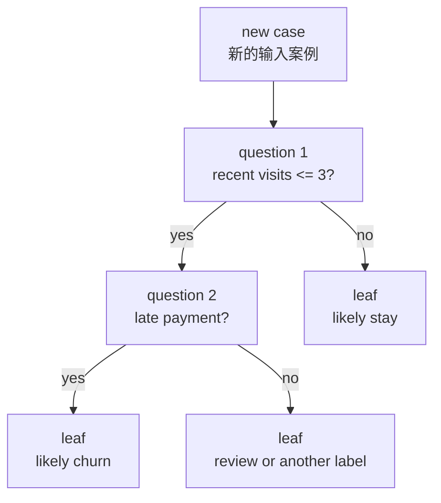
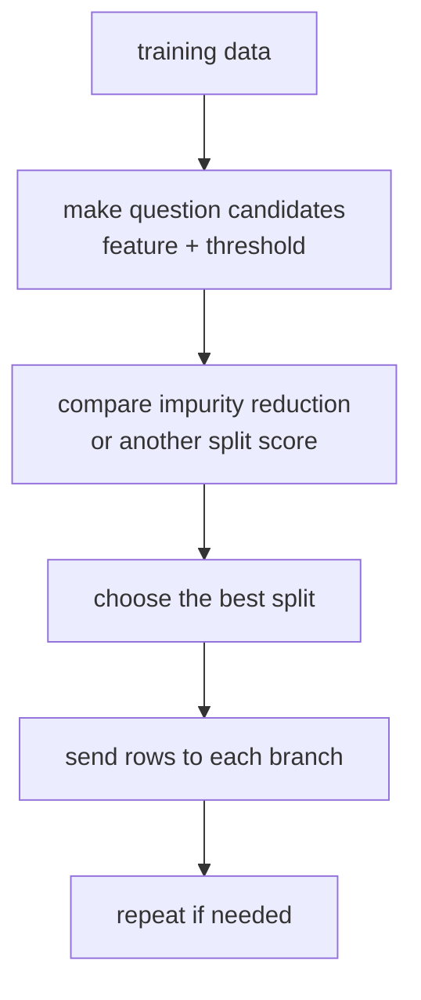
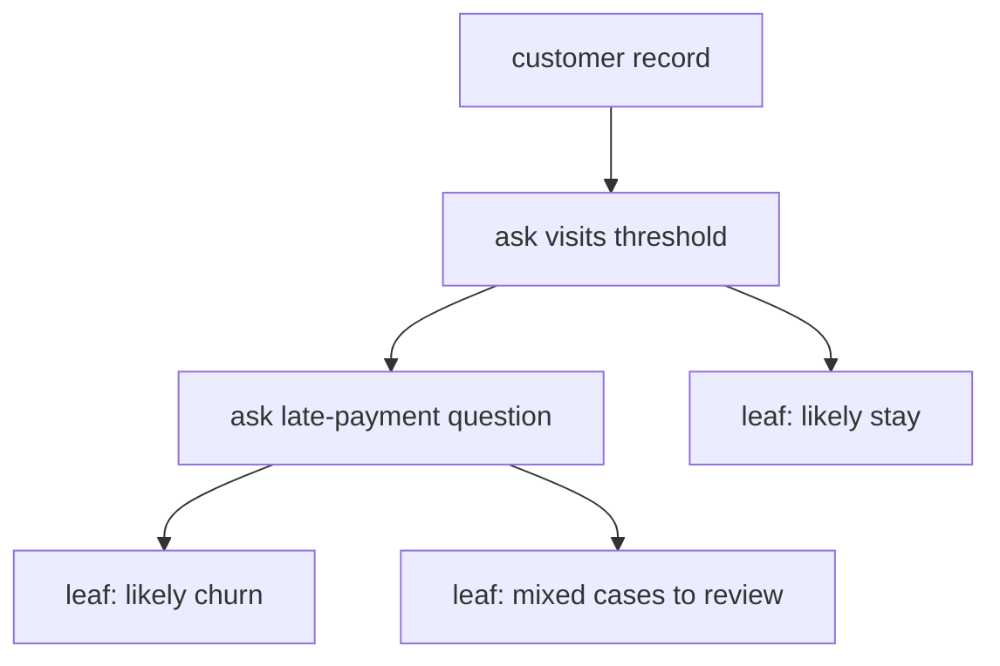

# P4-14.1 决策树(decision tree)

> Section ID: `P4-14.1`
> Version: `v2026.07.10`

在 P4-11 中，我们看过像画直线那样去看边界(boundary)的视角；在 P4-12 中，我们看过观察附近邻居的方式；在 P4-13 中，我们看过把 margin 当作更好边界标准的方式。现在，我们用一种完全不同的方式重新读取同一个 supervised learning 问题。

如果不是画出一条直线，而是把问题一层一层地拆成许多问题来问，会怎样？

这个问题就是决策树(decision tree) 的出发点。

决策树是一种模型：它不会试图一次性解释整份数据，而是不断重复 yes/no 问题，把案例逐渐切分到越来越相似的组里，再给出预测。

也就是说，决策树比起 `一条边界线`，更接近 `问题流(question flow)`。

这一节解释 `决策树(decision tree)`、`分裂(split)`、`节点(node)`、`叶子(leaf)` 的基本含义。后面的章节会继续用这些把手把当前语境下的判断接下去，而通过连续问题来得到预测的基本感觉，会再次通过这一节和 [概念词汇表](../../../reference/concept-glossary.md) 连起来。

## 本节范围

这一节回答下面这些问题。

- 决策树是怎样做预测的？
- `split`、`node`、`leaf` 分别是什么？
- 为什么树会被认为是相对容易让人读懂的模型？
- 在训练时，会比较哪些问题候选？
- 为什么它既能用于 classification，也能用于 regression？

这一节不会深入处理下面这些内容。

- 当树变得很深时出现的 overfitting
- pruning 的细节流程
- random forest 和 gradient boosting
- entropy、information gain 的公式展开

这些内容会在 P4-14.2、P4-15、P4-16 中继续展开。

## 本节目标

- 你可以把决策树解释成 `通过拆分问题来做预测的模型`。
- 你可以说出 split、node、leaf、threshold 的含义。
- 你可以理解：决策树既能用于 classification，也能用于 regression。
- 你可以说明：它的学习过程就是 `反复挑选看起来更好的问题`。
- 你可以区分：`容易读懂` 和 `容易长得过深` 这两个特性会同时出现。

## 学习背景

前几章看过的代表模型，大致给人下面这种印象。

- linear regression：用直线或平面去看关系
- logistic regression：看边界概率
- k-NN：看附近邻居
- SVM：看有余裕的边界

决策树在这里改变的是问题本身。

| 前一节的视角 | 在决策树里改变后的问题 |
| --- | --- |
| 能不能把一条边界画好？ | 用什么问题去切数据会更好？ |
| 距离或 margin 是否重要？ | 现在一分开，label 会不会更整齐？ |
| 用公式来表达趋势吗？ | 能不能像条件语句流那样把案例分开？ |

也就是说，决策树会把视角从 `在空间里画线的模型` 转成 `把问题接起来的模型`。这一点也会直接连到后面的 random forest 和 boosting。

如果再补上一点，这一节的决策树也会直接接到前面整理好的比较记录结构。把决策树列为候选时，不能只记下 `第一个 split 是什么`，还要一起写下 `哪些案例留在 split 附近`、`和 baseline 或其他候选相比，什么更容易读`、`下一步还要再考虑哪一个分裂问题`。即使表面上分数差不多，不同的树里也可能有某个 leaf 混着更多不同 class，所以 split 后留下的模式差异也要另外去读。

| 需要一起留下的记录 | 为什么需要 |
| --- | --- |
| baseline 与决策树比较 | 为了看规则式问题流到底多解释了什么 |
| 第一个 split 附近的案例 | 为了回头看哪些案例在问题边界附近仍然暧昧 |
| 聚集到 leaf 的代表案例 | 为了确认 split 的结果到底形成了什么样的分组 |
| 下一个问题 | 为了决定要不要继续加深、还是改用别的特征去 split |

### 什么时候适合先把决策树列为候选

决策树在 `问题流本身就能成为解释` 的问题里，尤其是很强的第一候选。

| 当前问题状态 | 先考虑决策树的理由 | 要先确认的点 |
| --- | --- | --- |
| 以条件语句形式解释很重要 | 因为 split 流程可以被读得更接近人的语言 | 第一个 split 是否没有严重违背领域常识 |
| tabular 特征是核心 | 因为数值/类别特征很容易用阈值问题来切 | 哪些特征主导了分裂 |
| 比起线性边界或距离标准，更自然的是问题顺序 | 因为分步骤区分可能比整体空间更有解释力 | 每个 leaf 里的案例是否没有混得太厉害 |
| 想在同一结构下比较 classification 和 regression | 因为只改 leaf 输出就能复用同一结构 | 是否使用了适合问题类型的评价指标 |
| 之后可能扩展到 random forest / boosting | 因为可以先抓住整棵树家族的起始结构 | 是否理解了 depth 和 leaf size 这些把手 |

这张表的核心，是不把决策树只放成 `容易读懂的模型`，而是放成 `当问题流本身就是解释单位时，值得先试的候选`。

## 主要学习内容

### 决策树是一种什么模型

scikit-learn 用户手册把决策树(decision tree)介绍成一种用于 classification 和 regression 的 non-parametric supervised learning 方法。同一份文档还解释说，这种模型的目标是 `从数据特征中学出简单的决策规则(simple decision rules)，再用来预测目标值(target value)`。它还补充说，这个结构也可以被看成一种 `piecewise constant approximation`。

把这段话翻得更容易一些，可以写成下面这样。

`决策树是一种模型：它会看输入特征，然后不断问出“是否大于某个阈值”这样的问题，把输入空间切成许多块，并在每一块上放一个代表性预测值。`

例如，想一想客户流失(churn)预测。

| 特征(feature) | 示例问题 |
| --- | --- |
| 最近 30 天访问次数 | 访问次数是否小于等于 3？ |
| 是否有延迟付款 | 最近是否发生过延迟付款？ |
| 客服咨询次数 | 是否出现过 2 次以上咨询？ |

决策树会先在这些问题里挑一个，然后根据答案把数据分成两支或更多支。之后，在每一支里，还可以继续问下去。

### 先把它看成一个小流程

在把决策树看成学习器之前，先把它看成 `沿着问题往下走的决策流程`。



这张图会让人把决策树读成 `沿着问题一路往下走，最终到达某个 leaf 的流程`。和一次性画出一条边界线的模型不同，树的关键在于：它会通过一连串中间问题，把案例逐渐缩小到更相似的组。

这张图里的核心是下面这些点。

- 中间装着问题的框就是 node。
- 根据问题结果分开的地方就是 split。
- 不再继续问问题、而是直接输出预测的终点就是 leaf。

也就是说，可以把决策树读成 `沿着问题 node 往下走，最后走到某个 leaf 的结构`。

如果把它压成项目备忘录风格，可以写成这样。

| 记录项 | 例子 |
| --- | --- |
| first split | `visits <= 3` |
| near-split cases | `客户 C`、`客户 D` |
| 当前 leaf 预测 | `churn` 或 `stay` |
| 是否需要 review | `边界附近客户需要再看` |
| 下一个问题 | `late_payment` 是否应该作为下一道 split 问题 |

有了这张表，决策树的介绍就能先被读成 `比较候选 -> split 附近案例 -> 下一个问题` 的结构。此时，split 附近的案例和 leaf 的构成都要一起看，这样即使表面上准确率差不多，也能区分哪棵树更容易读，哪棵树更不稳定。

### node、split、leaf 适合怎样理解

在这一节里，最重要的是把术语短而清楚地切开。

| 术语 | 简单解释 | 在本节里的作用 |
| --- | --- | --- |
| node | 放问题的点 | 放置用来切分数据的标准 |
| split | 根据问题结果发生分支 | 尝试把数据切成更相似的组 |
| leaf | 写着最后预测的终点 | 输出 class 或数值 |
| threshold | 切开数字的阈值 | 形成像 `x <= 3.5` 这样的提问 |

这些术语也会直接连到后面的超参数部分。

- `max_depth` 会连接到树被允许长多深。
- `min_samples_split` 会连接到一个 node 是否有足够案例值得继续往下 split。

但在这一节里，我们还不把重点放在 `到底允许它长多深`，而是放在 `这种不断拆问题的结构本身到底是什么`。

## 细部学习内容

### 为什么会说它是比较容易读的模型

在 Part 4 里第一次见到的模型中，决策树属于相对 `像规则一样容易读` 的一类。scikit-learn 用户手册会用 `white box model` 这个视角来解释它。也就是说，只要观察到模型里发生了什么，就比较容易用布尔逻辑(boolean logic)去解释那个条件。和前面看到的线性模型的权重(weight)或 SVM 的 margin 相比，`顺着问题走下去就能看到预测` 这种结构更接近人熟悉的方式。

例如，把下面两种说明放在一起比较，感觉会更明显。

- 线性模型：如果多个特征的加权和大于某个标准，就是 positive
- 决策树：如果最近访问少而且有延迟付款，那么 churn 可能性高

两者都是模型，但后者更像人去读工作规则的方式。

在实务中，这种优点也经常被提到。

| 场景 | 决策树带来的优点 |
| --- | --- |
| 客户流失分析 | 容易看到它是按什么问题顺序切出 churn 的 |
| 贷款审核辅助 | 容易解释是什么条件形成了第一个 split |
| 设备异常检测 | 容易读出哪一段传感器数值范围形成了什么 split |

但在这里也必须立刻补上一点警告。

`容易读懂，并不等于总能带来好的 generalization。`

这个风险会在下一节 P4-14.2 直接展开。

### 为什么它能同时用于 classification 和 regression

决策树既可以用于 classification，也可以用于 regression。变化的只是 `leaf 最后输出什么`。

| 问题类型 | leaf 输出的内容 |
| --- | --- |
| classification | 最多的 class，或者各 class 比例 |
| regression | 进入该 leaf 的值的平均数之类的代表数值 |

例如：

- 客户流失预测：`流失`、`留存`
- 房价预测：`预计价格 5.2 亿`

也就是说，树的结构很相似，只是最后输出的性质不同。scikit-learn 的 `predict_proba` 说明也把分类树的预测概率读成 `进入该 leaf 的同类样本比例`。因此，正如 Part 4 的评价指标部分反复强调的那样，比起算法名字，更应该先确认：`这个问题到底是 classification 还是 regression。`

### 学习是怎样挑选问题的

决策树学习的核心，就是 `比较那些看起来更好的问题候选`。

1. 先看多个 feature。
2. 在每个 feature 上构造可以切的 threshold 候选。
3. 计算切开之后，是否比切开之前更能把 label 整理清楚。
4. 把当前最好的问题放到当前 node。
5. 如果需要，就在每个分支里继续重复。

把它简单画出来，会像下面这样。



这张图展示了：决策树学习本质上就是 `不断挑选好的第一问题和下一个问题`。它比较 feature 和 threshold 候选，选出更能降低 impurity 的 split，然后在每个分支里继续重复同样过程。

这里的 `impurity` 指的是一个 node 里面有多混杂。按照 API 文档里的标准，在分类树里 `criterion` 可以使用 `gini`、`entropy`、`log_loss` 等标准。与其先去背很长的公式，不如先抓住这种感觉：`如果一个 node 里的 class 混得厉害，impurity 就高；如果开始朝某一类更集中，impurity 就低。`

### 直觉地读取 impurity

在分类树中，我们想看的，是 `这个问题一问出来，label 有没有更整齐？`

例如，假设某个 node 里有 10 位客户，其中：

- 5 位是 churn
- 5 位是 stay

那就说明它们混得很厉害。

反过来，如果用某个问题切开之后：

- 左边分支里有 churn 4 位，stay 1 位
- 右边分支里有 churn 1 位，stay 4 位

那就可以把这两支都读成：比切开之前更整齐。

也就是说，好的 split 通常就是 `把混杂的 node 变成更不混杂 node 的问题`。

## 案例及示例

### 案例 1. 当你想不用一次性解释客户流失，而是通过问题逐步缩小时

一个订阅服务团队正在构建客户流失预测模型。人们先看的标准，是 `最近访问少不少`、`有没有发生延迟付款`、`客服咨询是否频繁` 这样的问题。

这个团队需要的，不是像线性模型那样一次性算出一个分数，而是一条现业人员能够读懂的问题流。因此，如果它先问 `最近访问是否小于等于 3 次？`，然后再问 `是否有延迟付款？`，那么行为相似的客户就会越来越集中到同一条分支上。这时，决策树就会被读成不是一条边界线，而是寻找 `好的问题顺序` 的模型。



在这个场景里，重要的是：问题本身是从数据里被选出来的。不是随便拿来一个条件，而是比较那些更能整理当前 node 内 label 的 feature 和 threshold，选出第一个 split，然后继续重复同样的过程。所以，决策树不是人随手写规则的模型，而是不断累积那些更能整理数据的问题的模型。

可验证的结果，会在比较第一个 split 候选时的分数，以及最终得到的小树结构中显现出来。如果 `visits <= 3` 比别的问题分得更好，就可以解释为什么这个问题会放在第一个 node；而只要再看每个 leaf 聚集了哪些客户，也就能确认这棵树为什么会像规则一样被读懂。

## 案例及示例

### 在实务场景里可以怎样读

决策树尤其常常在 `tabular data` 中被先想到。原因是，把数值和类别特征切成阈值或条件，本来就显得比较自然。

| 业务场景 | 决策树式问题示例 |
| --- | --- |
| 客户流失 | 最近访问次数少吗？有没有发生延迟付款？ |
| 贷款审核辅助 | 收入是否高于某个标准？是否有逾期记录？ |
| 设备异常检测 | 温度是否超过标准？振动是否超出某个范围？ |
| 营销响应预测 | 最近是否购买过？折扣消息响应率是否较高？ |

在这些场景里，决策树往往会比线性模型更直观。反过来，如果数据是非常平滑的连续关系，或者只要一点小摇动就会造成结构大变，那就必须小心。并且，正如 API 文档所提醒的，如果不设置基本的大小控制值，树就可能在 fully grown and unpruned 的状态下变得非常大。这个点会直接连到下一节关于 overfitting 的讨论。

## 练习与示例

### 用 Python 找出 `好的第一个问题`

这次的例子并不是立刻调用 scikit-learn 学习器，而是直接做一个小练习，让人确认决策树挑选第一个 split 的感觉。

- 问题场景：为客户流失(churn)分类挑出第一个问题
- 输入(input)：`visits`、`late_payment`
- 正确答案(label)：`stay`、`churn`
- 要确认的概念：
  - 只要 feature 和 threshold 改变，split 分数就会改变
  - 整理得更好的问题，就可能成为更好的第一个问题
  - 决策树最终就是不断重复这种选问题的过程

```python
rows = [
    {"customer": "A", "visits": 1, "late_payment": 1, "label": "churn"},
    {"customer": "B", "visits": 2, "late_payment": 1, "label": "churn"},
    {"customer": "C", "visits": 2, "late_payment": 0, "label": "stay"},
    {"customer": "D", "visits": 4, "late_payment": 0, "label": "stay"},
    {"customer": "E", "visits": 5, "late_payment": 0, "label": "stay"},
    {"customer": "F", "visits": 6, "late_payment": 1, "label": "stay"},
]


def gini(group):
    total = len(group)
    if total == 0:
        return 0.0

    counts = {}
    for row in group:
        counts[row["label"]] = counts.get(row["label"], 0) + 1

    score = 1.0
    for count in counts.values():
        p = count / total
        score -= p * p
    return score


def weighted_gini(left, right):
    total = len(left) + len(right)
    return (len(left) / total) * gini(left) + (len(right) / total) * gini(right)


candidates = [
    ("visits", 1.5),
    ("visits", 3.0),
    ("visits", 5.5),
    ("late_payment", 0.5),
]

best = None

for feature, threshold in candidates:
    left = [row for row in rows if row[feature] <= threshold]
    right = [row for row in rows if row[feature] > threshold]
    score = weighted_gini(left, right)

    print(f"feature={feature:12} threshold={threshold:>3} weighted_gini={score:.3f}")
    print("  left :", [(row["customer"], row["label"]) for row in left])
    print("  right:", [(row["customer"], row["label"]) for row in right])
    print()

    if best is None or score < best["score"]:
        best = {"feature": feature, "threshold": threshold, "score": score}

print("best first split")
print(best)
```

执行结果示例如下。

```text
feature=visits       threshold=1.5 weighted_gini=0.400
  left : [('A', 'churn')]
  right: [('B', 'churn'), ('C', 'stay'), ('D', 'stay'), ('E', 'stay'), ('F', 'stay')]

feature=visits       threshold=3.0 weighted_gini=0.222
  left : [('A', 'churn'), ('B', 'churn'), ('C', 'stay')]
  right: [('D', 'stay'), ('E', 'stay'), ('F', 'stay')]

feature=visits       threshold=5.5 weighted_gini=0.400
  left : [('A', 'churn'), ('B', 'churn'), ('C', 'stay'), ('D', 'stay'), ('E', 'stay')]
  right: [('F', 'stay')]

feature=late_payment threshold=0.5 weighted_gini=0.250
  left : [('C', 'stay'), ('D', 'stay'), ('E', 'stay')]
  right: [('A', 'churn'), ('B', 'churn'), ('F', 'stay')]

best first split
{'feature': 'visits', 'threshold': 3.0, 'score': 0.2222222222222222}
```

从这个输出里，应该读出三点。

1. 并不是任何问题都会给出同样质量。
2. 对当前数据来说，`visits <= 3.0` 看起来是最能把它整理好的第一个问题。
3. 树的学习就是通过反复这样的比较来搭出结构。

也就是说，决策树不是 `人凭直觉去写问题的模型`，而是 `不断找到并累积那些能更好整理数据的问题的模型`。

### 亲手应用一棵非常小的树

基于刚才找到的第一个 split，如果把一棵人可以手写读懂的小树写下来，就可以读成下面这样。

```text
if visits <= 3:
    if late_payment == 1:
        predict churn
    else:
        predict stay
else:
    predict stay
```

这段代码不是 `完整学习器`，而是把学习结果怎样被人读取，做了一个简化。当人们说决策树比较容易解释时，通常就是从这种形态来的。

如果再用 Python 很短地执行一下同样结构，就会更清楚。

问题场景：

- 决策树的分支规则不只是停留在图上，把真实输入放进去看结果怎么出来，会更有助于理解

输入(input)：

- 简单树规则 `predict`
- 客户样例列表 `examples`

期望输出(output)：

- 每个客户样例对应的预测结果

要确认的概念：

- 决策树可以被读成 if-else 形式的分支规则
- 所谓解释性高，更接近于说人能够顺着这个分支过程走下去

```python
def predict(tree_input):
    if tree_input["visits"] <= 3:
        if tree_input["late_payment"] == 1:
            return "churn"
        return "stay"
    return "stay"


examples = [
    {"customer": "G", "visits": 2, "late_payment": 1},
    {"customer": "H", "visits": 2, "late_payment": 0},
    {"customer": "I", "visits": 5, "late_payment": 1},
]

for row in examples:
    print(row["customer"], "->", predict(row))
```

执行结果示例如下。

```text
G -> churn
H -> stay
I -> stay
```

这个例子展示了决策树的重要性格。

- 可以沿着预测路径一路读下去。
- 容易解释它是在什么问题处分开的。
- 但如果问题继续增加，结构也会迅速变大。

最后这一点，正是下一节的主题。

## 本节要记住的视角

- 决策树是 `通过拆分问题来做预测的模型`。
- node 是问题，split 是分支，leaf 是最终预测。
- 好的 split 通常会把 label 变成更不混杂的组。
- 决策树既能用于 classification，也能用于 regression。
- 它相对容易读，但一旦变深，风险也会一起增大。

## 简短检查

- 在当前问题里，相比起直线边界，是不是问题流的解释更自然？
- 你能重新去看第一个 split 和 leaf 组成的结构，到底形成了什么样的案例分组吗？
- 你是否没有把“容易读懂”和“generalization 性能好”混成一回事？

## 什么时候应当先想到这个视角

- 当比起画线，更自然的是把问题按顺序一路拆下去时，就先想到决策树的问题流视角。
- 当你需要解释哪个 `feature + threshold` 真的把分组切得更好时，就重新把 split 看成问题候选。
- 当你开始混淆 leaf 到底是分类结果还是数值预测时，要一起想起树既能用于 classification，也能用于 regression。

## 出处与参考资料

- scikit-learn developers, `1.10. Decision Trees`, scikit-learn User Guide, 确认日期：2026-06-27. [https://scikit-learn.org/stable/modules/tree.html](https://scikit-learn.org/stable/modules/tree.html){: target="_blank" rel="noopener noreferrer" }
- scikit-learn developers, `DecisionTreeClassifier`, scikit-learn API Reference, 确认日期：2026-06-27. [https://scikit-learn.org/stable/modules/generated/sklearn.tree.DecisionTreeClassifier.html](https://scikit-learn.org/stable/modules/generated/sklearn.tree.DecisionTreeClassifier.html){: target="_blank" rel="noopener noreferrer" }
- Leo Breiman, Jerome Friedman, Richard Olshen, Charles Stone, *Classification and Regression Trees*, Routledge, 1984.
