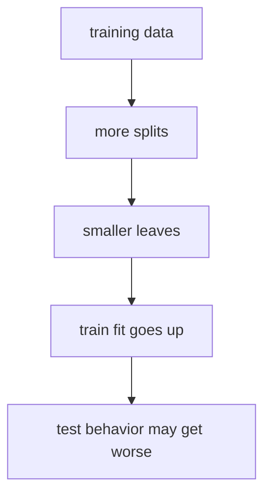
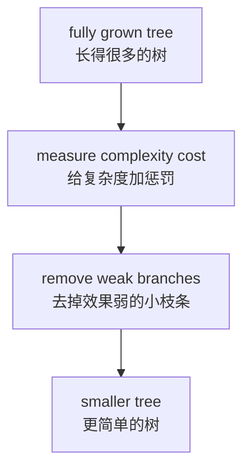
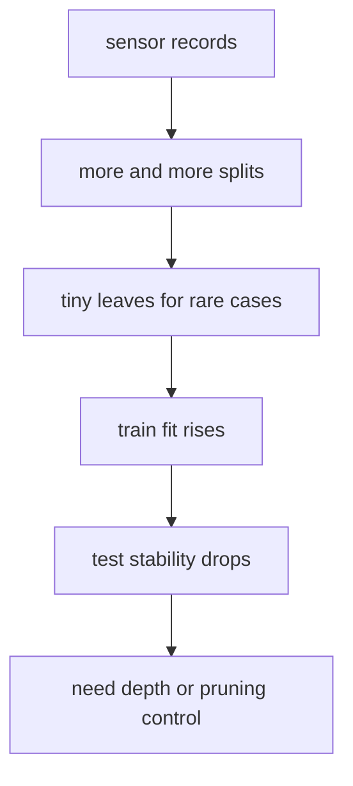
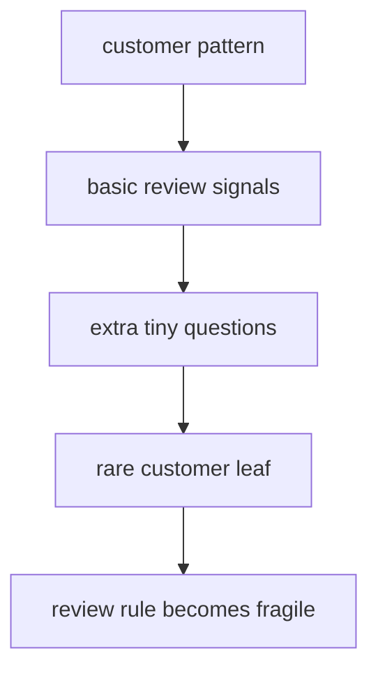

# P4-14.2 树的过拟合

> Section ID: `P4-14.2`
> Version: `v2026.07.10`

在 P4-14.1 中，我们把决策树(decision tree) 看成 `通过拆分问题来做预测的模型`。那一节的优点很明确。

- 它容易被读成一个问题流。
- 它容易像条件语句那样解释。
- 在 tabular data 中，它显得很直观。

但同样的特性，也会立刻变成风险。

如果问题可以不断往下加，那是不是也可能几乎把训练数据背下来？

这个问题，正是树的过拟合(overfitting)问题。

这一节不会把决策树的基本定义再长篇重复一遍。`通过拆分问题来做预测` 这个核心直觉，会通过 P4-14.1 和 [概念词汇表](../../../reference/concept-glossary.md) 再连回来；而过拟合本身的一般把手，则也要一起重新想起 P4-5.1。

## 本节范围

这一节回答下面这些问题。

- 为什么树比起其他一些模型，更容易看出过拟合？
- 树越长越深时，会发生什么？
- `max_depth`、`min_samples_leaf`、`ccp_alpha` 分别起什么作用？
- 为什么 train 表现和 test 表现会朝不同方向走？

这一节不会深入处理下面这些内容。

- random forest 的 bagging 缓解效果
- gradient boosting 的顺序修正结构
- pruning 算法的数学优化细节
- 基于交叉验证的精细超参数搜索流程

这些内容会在 P4-15、P4-16 以及 P4-9 的调参语境中再接回来。

## 本节目标

- 你可以把树的过拟合解释成 `过于细碎的问题开始背诵训练数据的现象`。
- 你可以说明：深度、leaf 大小、pruning 都是在控制树复杂度的装置。
- 你可以再次确认：train 表现上升并不保证 test 表现也跟着上升。
- 你会获得一个标准，能够一起读取决策树的优点与过拟合风险。

## 学习背景

### 为什么在树里更容易看见过拟合

决策树本质上是一种 `通过不断 split，把 node 切得越来越小的结构`。这种结构很强，但如果没有限制，就会继续制造越来越小的 leaf。

scikit-learn 用户手册指出，决策树学习器可能会产生 `over-complex trees`，而这样的树无法很好地 generalize。文档也直接把这个现象称为 overfitting，并说明需要 pruning、`min_samples_leaf`、`max_depth` 这样的装置。

`树的问题越加越多，就越可能连训练数据里的例外也一起跟着走。但这些例外并不能保证在新数据里也会重复。`

这里也同样把记录结构一起固定下来。过拟合这一节并不是只说 `长深了就危险`，而是在记录 `复杂度增加以后，出现了什么新的失败`、`哪些 review 案例一直没消失`、`应该在哪一点停下或剪掉分支`。即使同样看起来像是相同准确率或差不多的平均分，长得更深的树到底新背下了哪些案例，又留下了哪些原本的失败，也都需要单独去读。

| 需要一起留下的记录 | 为什么需要 |
| --- | --- |
| 深度或 leaf 大小变化 | 为了看复杂度把手到底是怎样变化的 |
| train/test 差异 | 为了区分背诵与 generalization |
| 仍然留下的失败案例 | 为了回头看即使多了更多分支也没解决的案例 |
| 下一个 pruning 问题 | 为了决定接下来调 `max_depth`、`min_samples_leaf`，还是 `ccp_alpha` |

### 什么时候应该先怀疑树的过拟合

在树里，想更早抓到过拟合，往往不能只看性能数字，还要一起看 `问题是不是已经细到过头了`。

| 看到的信号 | 先怀疑什么 | 理由 |
| --- | --- | --- |
| train 几乎完美，但 test 下降 | 深度过大 | 因为它可能已经开始背训练数据 |
| 一个 leaf 几乎没有样本 | leaf 过小 | 因为它可能在把例外说成模式 |
| 分支继续变多，但同样失败还留着 | 错误的复杂度增加 | 因为只是问题数量变多，本质问题却没被解决 |
| 第一个 split 以后，后面的分支变得异常多 | 后段细碎分裂 | 因为后段分支可能在跟着偶然摇动走 |
| 解释越来越长，理解却反而更难 | 需要 pruning | 因为原本“容易读懂”的优点正在消失 |

这张表能让树的过拟合不只停在 `长深了就危险`，而会进一步变成：`从哪一刻开始，这些问题不再谈模式，而开始谈例外。`

## 主要学习内容

### 从比较小树和大树开始的直觉

再想一想客户流失数据。

| 树的状态 | 直觉 |
| --- | --- |
| 浅树 | 只看大的倾向 |
| 适中深度的树 | 在重要模式和例外之间保持平衡 |
| 过深的树 | 开始追着训练数据里的偶然波动走 |

如果把同样内容再画得更短，会变成下面这样。



这张图展示的是：树的过拟合并不是 `问题越多越好`。随着 split 增加，它当然可能更贴合训练数据，但在最后阶段，开始发生的可能不是 generalization，而是 memorization。

关键就在最后那条箭头上。

`更贴合` 和 `更好地 generalize` 并不是同一句话。

如果把它压成项目备忘录风格，可以写成下面这样。

| 记录项 | 例子 |
| --- | --- |
| 复杂度变化 | `max_depth 3 -> 5` |
| train 变化 | `0.971 -> 1.000` |
| test 变化 | `0.933 -> 0.911` |
| 是否需要 review | `深度增加了，但失败案例还在` |
| 下一个问题 | `是不是要增大 leaf，或者做 pruning？` |

有了这张表，过拟合这一节就会被读成 `复杂度变化 -> 失败仍然存在 -> 下一个 pruning 问题` 的结构。最终重要的，不是一格分数，而是要一起看：`留下来的失败模式，是不是更简单了？还是只是更贴训练数据了？`

### 越深会发生什么

随着树变深，每个 leaf 里会剩下更少的样本。于是会发生下面这些事情。

1. 一两个例外就可能制造出新的分支。
2. 一个 leaf 可能只靠极少的样本做出预测。
3. 在 train 数据上，它可能会几乎不再犯错。
4. 但在 test 数据上，只要轻微摇动，预测就可能很容易改变。

scikit-learn 文档说明，树每增加一层，填满整棵树所需的样本数大约会加倍，并建议用 `max_depth` 来控制规模。文档也建议用 `min_samples_split` 和 `min_samples_leaf`，让每个判断都建立在多个样本之上。

把这段解释缩成一句话，会变成下面这样。

`树越深，当然会越细；但如果没有足够的数据去支撑这种细节，那么树变得更像的不是“更聪明”，而是“更敏感”。`

### 把过拟合看成一种数据流

如果把过拟合读成一种流，而不是公式，记忆会更牢。

前面的 split 往往在抓大趋势。问题通常是从后面开始的。最后几层开始解释的，可能不再是 `真正结构`，而是 `只在训练数据里出现过的偶然波动`。

把这个流分成几个阶段，可以读成下面这样。

| 流程阶段 | 树主要在做什么 | 先想到的问题 |
| --- | --- | --- |
| 前段 split | 切大模式 | 它真的抓住了重要差异吗？ |
| 中段 split | 更多看到例外与子模式 | 它现在看到的还是会重复出现的结构吗？ |
| 后段 split | 开始单独隔离少数案例 | 它是不是在背偶然摇动？ |
| 最后 leaf | 可能变成几乎只服务于训练数据的规则 | 这个 leaf 到新数据里还会活着吗？ |

例如，在前段，可能会有像 `温度高且振动大吗`、`访问下降与抱怨信号是不是一起出现` 这样的大标准。可到了后段，就很容易接上 `是不是只在第三个时点稍微抖了一下`、`是不是只在某一周里掉了两次访问` 这样的窄问题。

此时重要的不是 `问题变多了` 这件事本身，而是 `问题的性质是否开始从解释大模式，变成解释训练数据中的例外`。

也就是说，把过拟合读成数据流，更接近去读下面这段移动。

- 前面：大量样本一起移动的大倾向
- 后面：只解释越来越少样本的细碎问题
- 最后：train 分数虽然上升，但在 test 上不一定会再次出现的 leaf

所以，读树时不能只看 `split 有没有增加`，还要一起看 `后段 split 还在解释结构，还是已经开始单独背少数案例`。

### 为什么必须一起看 train 和 test 表现

树的过拟合，只要一起看 train 和 test 表现，就会特别清楚。

| 观察 | 解读 |
| --- | --- |
| train 和 test 都低 | 可能还太简单，尚未学够 |
| train 和 test 一起都高 | 当前看起来平衡还不错 |
| 只有 train 很高而 test 掉下来 | 应该怀疑过拟合 |

这个视角虽然在决策树里特别常见，但其实也是 Part 4 全体的共同原理。无论是 linear regression、logistic regression、SVM，还是树模型，最后更重要的都是 `它在没见过的数据上是否还能撑住`。

## 细部学习内容

### 为什么需要 `min_samples_leaf`

如果 `max_depth` 是限制树整体高度的把手，那么 `min_samples_leaf` 就是防止一个 leaf 变得太小的把手。

API 文档把 `min_samples_leaf` 解释成：leaf node 里必须包含的最少样本数。文档还说明，这个值在 regression 中可以带来让模型更平滑(smoothing) 的效果。

`如果让一个 leaf 里只剩下一两个案例，那么这个 leaf 说的就更可能是例外，而不是模式。`

例如：

- `min_samples_leaf=1`：允许只剩一个案例的 leaf
- `min_samples_leaf=5`：至少要剩五个案例，才承认它是一个 leaf

这两者的差别，可以读成：`我们愿意相信多小的例外？`

### 用 Python 看 leaf 大小控制

这次不固定深度，而只改变 leaf 大小。

问题场景：

- 在同一份数据里，只要改变 leaf 最小允许规模，train 和 test 的读法就可能变化

输入(input)：

- iris 数据集的 `X_train`、`X_test`、`y_train`、`y_test`
- 多个 `leaf_size`

期望输出(output)：

- 每个 leaf size 的 train score
- 每个 leaf size 的 test score

要确认的概念：

- 如果 leaf 太小，train 分数更容易升高
- 如果把 leaf 大小放大，结构可能会变得不那么敏感

```python
from sklearn.datasets import load_iris
from sklearn.model_selection import train_test_split
from sklearn.tree import DecisionTreeClassifier

X, y = load_iris(return_X_y=True)

X_train, X_test, y_train, y_test = train_test_split(
    X, y, test_size=0.3, random_state=42, stratify=y
)

for leaf_size in [1, 2, 5, 10]:
    model = DecisionTreeClassifier(
        min_samples_leaf=leaf_size,
        random_state=42
    )
    model.fit(X_train, y_train)

    print(f"min_samples_leaf={leaf_size}")
    print("  depth          :", model.get_depth())
    print("  leaves         :", model.get_n_leaves())
    print("  train accuracy :", round(model.score(X_train, y_train), 3))
    print("  test accuracy  :", round(model.score(X_test, y_test), 3))
    print()
```

执行结果示例如下。

```text
min_samples_leaf=1
  depth          : 5
  leaves         : 8
  train accuracy : 1.0
  test accuracy  : 0.911

min_samples_leaf=2
  depth          : 4
  leaves         : 7
  train accuracy : 0.981
  test accuracy  : 0.933

min_samples_leaf=5
  depth          : 3
  leaves         : 4
  train accuracy : 0.971
  test accuracy  : 0.933

min_samples_leaf=10
  depth          : 2
  leaves         : 3
  train accuracy : 0.952
  test accuracy  : 0.889
```

这个例子给出一个重要感觉。

`阻止 leaf 变得太小，并不一定会让性能变差。相反，test 侧有时反而会更稳定。`

### pruning 在做什么

如果说提前限制深度的方法可以读成 `pre-pruning`，那么把已经长出来的树重新缩小的做法，就可以读成 `pruning`。

scikit-learn 支持 `Minimal Cost-Complexity Pruning`，API 文档把 `ccp_alpha` 解释成这个 pruning 的复杂度参数。它越大，就越可能剪掉更多节点。

- `max_depth`、`min_samples_leaf`：从一开始就防止树过于复杂
- `ccp_alpha`：在长出来之后，再通过类似惩罚的方式重新降低复杂度

也就是说，它们的目的其实是同一个。

`不去背训练数据，而是尽量留下在新数据上也能站得住的结构`

在这里，初学者首先要抓住的差别是：`它是在什么时候介入的`。

| 方式 | 什么时候介入 | 最先读出的意思 |
| --- | --- | --- |
| `max_depth`、`min_samples_leaf` | 树生长过程中 | 从一开始就挡住过于细碎的 split |
| pruning、`ccp_alpha` | 已经长完以后 | 再次裁掉那些效果弱的小枝条 |

也就是说，pre-pruning 是 `一开始就防止它长得太深的把手`，而 pruning 是 `在一棵已经长出来的树里，重新决定哪些枝条要留下、哪些要丢掉的把手`。

如果用一个小场景来看，就会更清楚。

| 分支状态 | pruning 前 | pruning 后 |
| --- | --- | --- |
| 前段大分支 | 可能保留 | 大多仍保留 |
| 只解释少数案例的 leaf | 可能还留着 | 可能被剪掉 |
| train 分数 | 可能看起来更高 | 可能会稍微下降 |
| test 稳定性 | 可能摇摆 | 可能更稳定 |

这张表的核心，是要把 pruning 读成不是 `把树弄坏`，而是 `留下大结构、去掉细碎残枝`。

例如，假设后面某条分支再多长出一个 leaf，它依赖的是像 `温度高`、`振动大`、`只有第三个时点压力在某个范围` 这样非常窄的条件。如果这个 leaf 只不过勉强解释了训练数据中的两个产品，那么 pruning 就是在重新追问：`这条枝条真的值得留下吗？`

所以，`ccp_alpha` 不是单纯再多加一个数字选项，而是一个把手，让人重新去问：`这条小枝条提升 train 分数的收益，是否真的大于它增加复杂度的代价？`

只先记方向的话，可以记成下面这样。

- `ccp_alpha` 很小时，更容易保留更多枝条
- `ccp_alpha` 越大，就越容易更积极地剪掉小枝条
- 太小时可能会偏向背诵，太大时则连重要模式也可能一起被剪掉

### 把 pruning 看成一个流程



在这一节里，我们不会去算 pruning 公式。相反，我们围绕的是：`哪些小残枝不应该留`，以及 `为什么愿意牺牲一点 train 分数，换来 test 稳定性`。

## 案例及示例

### 案例 1. 当缺陷检测树开始连工厂数据中的例外都背下来时

制造团队正在用传感器值构建一棵判断产品是否不良的决策树。人们首先看的标准，是 `温度是否高于标准`、`振动是否超出某个范围`、`压力变化是否过于剧烈` 这样的问题。

问题越多，看起来就越像模型变聪明了。实际上，如果把树放得很深，在训练数据上它可能几乎不会再犯错。但只要往后面的分支去看，就会出现只解释一两个例外案例的 leaf，而这些 leaf 只要工艺稍微变化，在新数据上就会很容易摇动。

如果换成一个小场景，可以看成下面这样。

| 产品 | 温度 | 振动 | 压力变化 | 人最先做的判断 |
| --- | --- | --- | --- | --- |
| A | 高 | 大 | 剧烈 | 不良 review 优先级高 |
| B | 中等 | 小 | 稳定 | 正常可能性高 |
| C | 高 | 中等 | 略大 | review 候选 |
| D | 略高 | 仅短暂偏大 | 稳定 | 很难直接判成不良 |

这里，人最先看的标准是 `温度升高 + 振动 / 压力异常` 这样比较大的模式。但过深的树会继续加上像 `是不是只在第三个测量时点振动短暂升高`、`压力变化是否在某个范围里折了两次` 这样的细碎问题，试图只去解释训练数据里少数和 D 相似的产品。

| 人最先看的标准 | 过深的树容易抓住的东西 |
| --- | --- |
| 温度和振动异常是否一起出现 | 某个时点的短暂抖动 |
| 压力变化是否能被读成工艺异常 | 训练数据里的罕见传感器组合 |
| 是否值得先纳入 review | 只匹配一两个产品的过细 split |



如果把同一个场景分成 `比较简单的读取` 和 `过深的读取`，差异会更明显。

| 读取方式 | 如何看产品 D |
| --- | --- |
| 比较简单的树 | 温度略高，但压力稳定，所以保留为 review 候选 |
| 过深的树 | 把特定时点的振动抖动和罕见传感器组合拼起来，单独分成一个 leaf |

在这个场景里，树的过拟合应当被读成 `问题过于细碎，以至于开始背训练数据的现象`。`max_depth` 会挡住树长到哪里，`min_samples_leaf` 会防止 leaf 变成过小的例外集合，而 `ccp_alpha` 会重新修剪已经长出来的枝条。也就是说，更多问题并不总是意味着更好的解释。

可验证的结果，会在一起看 train accuracy 和 test accuracy 时显现出来。如果 train 分数持续上升，但 test 分数在某个点之后下降或停住，那么那个点之后的分支就应该被读成更接近 memorization，而不是 generalization。最终重要的问题，不是 `它是不是更好解释了传感器异常`，而是 `它是不是让一个能在新工艺数据里重复的标准变得更清楚`。

### 案例 2. 当客户流失树开始比 review 标准更认真地背例外客户时

假设一个订阅服务团队正在构建一棵预测客户是否流失的决策树。人最先看的标准，是 `最近访问是否明显下降`、`是否有支付失败`、`联系客服后是否出现了不满信号` 这样比较大的模式。

但如果树继续长深，那么在后段分支里，就可能出现越来越多只解释训练数据中少数客户的组合，比如 `最近 17 天里访问了 2 次`、`上个月支付金额在某个范围里`、`是否打开过一次促销邮件`。这些组合在训练数据里可能显得很准，但在真实运营中，可能根本不会再次出现，或者意义很弱。

如果换成一个小场景，可以看成下面这样。

| 客户 | 最近访问变化 | 支付失败 | 不满信号 | 人最先做的判断 |
| --- | --- | --- | --- | --- |
| A | 大幅下降 | 有 | 有 | review 优先级高 |
| B | 略微下降 | 无 | 无 | 很难立即看成流失 |
| C | 大幅下降 | 无 | 有 | review 候选 |
| D | 几乎无变化 | 无 | 无 | 更可能留存 |

这里，人最先看的标准是 `访问下降 + 支付 / 抱怨信号` 这种比较大的模式。但过深的树会继续加上像 `过去 3 周里只有第二周访问是 0 次`、`是不是在周三上午打开了活动邮件` 这样的细碎问题，只为了分开训练数据里少数和 C 相似的客户。

| 人最先看的标准 | 过深的树容易抓住的东西 |
| --- | --- |
| 访问下降是否明确 | 某一周的小抖动 |
| 支付问题和不满信号是否一起出现 | 训练数据里的少数客户组合 |
| 是否值得先拿去做 review | 只匹配一个 leaf 的细碎 split |

如果把同一个场景分成 `浅层读取` 和 `过深读取`，差异会更清楚。

| 读取方式 | 如何看客户 C |
| --- | --- |
| 比较简单的树 | 因为有访问下降和不满信号，所以提升为 review 候选 |
| 过深的树 | 再拼上训练数据里的某一周模式、金额范围、邮件响应，分成单独 leaf |

在这个场景里，过拟合应当被读成这样一种现象：那些 `看起来解释力很强的细碎问题`，实际上并不是让 review 标准更清楚，而是在更精细地背训练数据里的偶然组合。所以看树时，不能只问 `解释是不是变得更细了`，还要一起问 `这种细节会不会在新客户里重复出现`、`它是不是更好地排列了 review 优先级`。



## 案例及示例

### 在实务中应该看哪些把手

对于入门者和实务前期来说，与其一次同时乱动所有值，不如先按角色拆开去看。

| 把手 | 先读的问题 |
| --- | --- |
| `max_depth` | 树到底允许长到多深？ |
| `min_samples_split` | 这个 node 真的有足够样本值得继续 split 吗？ |
| `min_samples_leaf` | 要不要防止一个 leaf 变得太小？ |
| `ccp_alpha` | 已经长出来的枝条要剪掉多少？ |

如果换成实务感觉，可以读成下面这样。

- 解释太长太复杂 -> 先看 `max_depth`
- 看起来有很多只解释少数案例的 leaf -> 先看 `min_samples_leaf`
- 分支太多，小枝太多 -> 考虑 `ccp_alpha`

## 练习与示例

### 用 Python 看深度带来的过拟合

这次的例子，是在同一个决策树分类器里只改变深度，然后观察 train/test 结果怎样分岔。

- 问题场景：用 iris 数据集做品种分类
- 输入(input)：花萼、花瓣的长度和宽度
- 正确答案(label)：三个品种
- 要确认的概念：
  - 深度增加后，train 表现很容易继续上升
  - test 表现可能在某个点以后不再提升，甚至下降
  - 树的深度是复杂度把手之一

如果先把输入输出里要比较的值整理成一张表，可以写成下面这样。

| 要比较的值 | 为什么要一起看 |
| --- | --- |
| `max_depth` | 为了看树长到了哪里 |
| `leaves` | 为了看这个深度实际上造出了多少终端节点 |
| train accuracy | 为了看训练数据被贴合到了什么程度 |
| test accuracy | 为了看它对新数据能否 generalize |
| `train - test` 差距 | 为了看 memorization 和 generalization 分开了多少 |

```python
from sklearn.datasets import load_iris
from sklearn.model_selection import train_test_split
from sklearn.tree import DecisionTreeClassifier

X, y = load_iris(return_X_y=True)

X_train, X_test, y_train, y_test = train_test_split(
    X, y, test_size=0.3, random_state=42, stratify=y
)

for depth in [1, 2, 3, 5, None]:
    model = DecisionTreeClassifier(max_depth=depth, random_state=42)
    model.fit(X_train, y_train)

    train_score = model.score(X_train, y_train)
    test_score = model.score(X_test, y_test)

    print(f"max_depth={depth}")
    print("  depth          :", model.get_depth())
    print("  leaves         :", model.get_n_leaves())
    print("  train accuracy :", round(train_score, 3))
    print("  test accuracy  :", round(test_score, 3))
    print("  train-test gap :", round(train_score - test_score, 3))
    print()
```

执行结果示例如下。

```text
max_depth=1
  depth          : 1
  leaves         : 2
  train accuracy : 0.667
  test accuracy  : 0.667
  train-test gap : 0.0

max_depth=2
  depth          : 2
  leaves         : 3
  train accuracy : 0.952
  test accuracy  : 0.889
  train-test gap : 0.063

max_depth=3
  depth          : 3
  leaves         : 5
  train accuracy : 0.981
  test accuracy  : 0.933
  train-test gap : 0.048

max_depth=5
  depth          : 5
  leaves         : 8
  train accuracy : 1.0
  test accuracy  : 0.911
  train-test gap : 0.089

max_depth=None
  depth          : 5
  leaves         : 8
  train accuracy : 1.0
  test accuracy  : 0.911
  train-test gap : 0.089
```

从这个结果里，应该读到下面这些点。

1. 深度一增加，train accuracy 往往很容易继续变好。
2. 但 test accuracy 在某个点之后，可能就不会再提高。
3. 只要 `train-test gap` 变大，memorization 的信号就会更强。
4. 在当前这个例子里，`max_depth=3` 附近看起来更平衡。

也就是说，看树的性能时，不能只看 `是不是更深了`，而要一起看：`一旦更深以后，train 和 test 是怎样分开的`。

如果再简短地绑一下，核心比较如下。

| 深度区间 | 先读出的判断 |
| --- | --- |
| 太浅 | 是不是还太简单，根本没学够？ |
| 中等深度 | train 和 test 是不是一起变好？ |
| 太深 | 是不是只有 train 变好了，而 gap 在变大？ |

直接改值之后，还会出现一些更容易看见的问题。

- 如果加入 `max_depth=4`，那么在 3 和 5 之间会发生什么？
- 如果改变 `random_state`，这种按深度变化的 gap 模式会不会重复出现？
- 当 `max_depth=None` 时，它实际上会停在多深？

## 本节要记住的视角

- 树容易读懂，但如果没有限制，就很容易过度追随训练数据。
- 只要深度变大、leaf 变小，过拟合风险就会上升。
- 即使 train 表现上升，也不保证 test 表现会一起上升。
- `max_depth`、`min_samples_leaf`、`ccp_alpha` 是控制树复杂度的代表性把手。
- 所谓降低过拟合，通常就是 `少背一点，更多 generalize 一点`。

这一节的核心，不只是“树变深了”这个事实，而是要一起读出：这种深度到底制造了什么失败。

| 需要一起看的内容 | 本节先读的问题 | 后面会再次连到哪里 |
| --- | --- | --- |
| train-test gap | 长得更深的树，真的也让 generalization 更好吗？ | P4-5 generalization, P4-9 tuning |
| 复杂度把手 | `max_depth`、`min_samples_leaf`、`ccp_alpha` 分别怎样减少过拟合？ | P4-9 超参数 |
| 代表性失败区间与下一个模型 | 哪些分支在背例外，bagging 或 boosting 又会怎样缓解它 | P4-15 random forest, P4-16 gradient boosting |

## 简短检查

- 你是不是把 train 表现变好和 test 表现变好，当成了同一件事？
- leaf 是不是已经小到在把例外当规则说了？
- 你现在能区分：下一步应该调的是深度限制、leaf 大小，还是 pruning 吗？

## 什么时候应当先想到这个视角

- 当 train 一直上升，但 test 没跟上来时，先想到树是不是开始背例外了。
- 当你搞不清楚该调深度限制、leaf 大小还是 pruning 时，就重新看它们各自是用什么方式减少复杂度的。
- 在 переход 到 random forest 或 boosting 之前，如果需要先整理单棵树的复杂度感觉，就把这一节当成基准线。

## 出处与参考资料

- scikit-learn developers, `1.10. Decision Trees`, scikit-learn User Guide, 确认日期：2026-06-27. [https://scikit-learn.org/stable/modules/tree.html](https://scikit-learn.org/stable/modules/tree.html){: target="_blank" rel="noopener noreferrer" }
- scikit-learn developers, `DecisionTreeClassifier`, scikit-learn API Reference, 确认日期：2026-06-27. [https://scikit-learn.org/stable/modules/generated/sklearn.tree.DecisionTreeClassifier.html](https://scikit-learn.org/stable/modules/generated/sklearn.tree.DecisionTreeClassifier.html){: target="_blank" rel="noopener noreferrer" }
- Leo Breiman, Jerome Friedman, Richard Olshen, Charles Stone, *Classification and Regression Trees*, Routledge, 1984.
