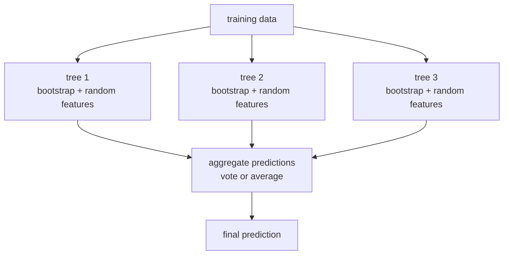
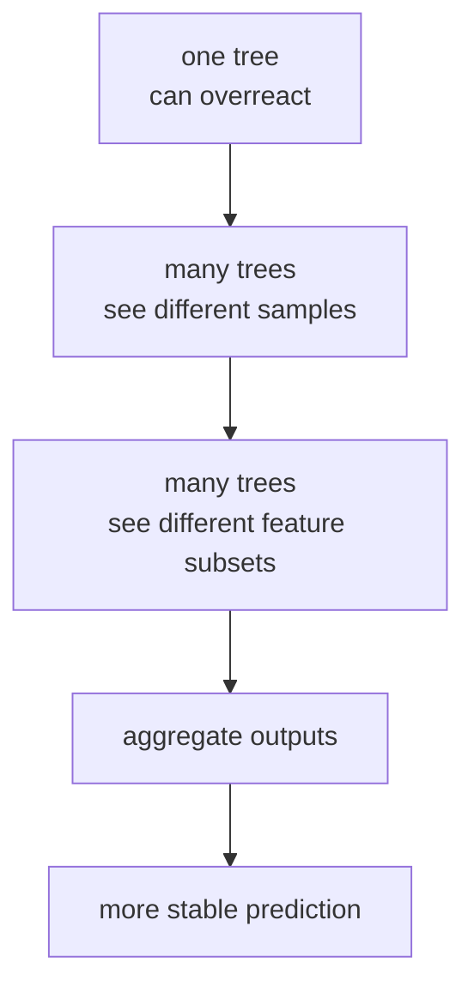
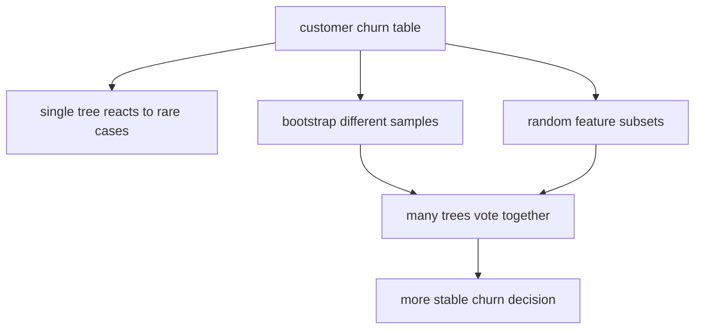

# P4-15.1 随机森林

> Section ID: `P4-15.1`
> Version: `v2026.07.10`

在 P4-14 中，我们已经看到，为什么决策树(decision tree) 一方面很直观，另一方面又很容易陷入过拟合(overfitting)。接下来就会自然冒出一个问题。

那么，有没有办法既保留树的优点，又减轻单棵树那种过度摇摆？

这个问题，正是随机森林(random forest) 的出发点。

随机森林是一种把多棵以略微不同方式训练出来的决策树预测收集起来，从而形成比单棵树更稳定判断的模型。

也就是说，随机森林不是 `把树丢掉的模型`，而是 `把许多树聚在一起以减弱弱点的模型`。

这一节说明 `随机森林(random forest)`、`集成(ensemble)`、`bootstrap`、`特征随机选择` 的基本含义。后面的各节会在这些把手的基础上继续判断当前语境，而通过多棵树的合意来降低摇摆的基本直觉，也会以本节和[概念词汇表](../../../reference/concept-glossary.md) 为基准重新连回来。

## 本节范围

这一节回答下面这些问题。

- 为什么随机森林要使用多棵树？
- `bootstrap`、`max_features`、`averaging` 分别起什么作用？
- 为什么它看起来会比单棵树更稳定？
- 随机森林在分类和回归里是怎样工作的？
- `n_estimators`、`max_features`、`bootstrap`、`oob_score` 各自是什么意思？

这一节不会深入处理下面这些内容。

- 特征重要度(feature importance) 的解释
- OOB(out-of-bag) 分数的严格评估解释
- 与 Extra Trees 的细部比较
- 与 gradient boosting 的深化比较

特征重要度会在 P4-15.2 继续。
OOB(out-of-bag) 分数的评估解释会在 P4-15.3 继续。
与 gradient boosting 的比较会在 P4-16.1、P4-16.2 中，以 `并行平均型集成` 和 `顺序误差修正型集成` 的对照继续展开。
与 Extra Trees 的细部比较会在 P4-15.4 的补充学习中继续。

## 本节目标

- 你可以把随机森林说明为 `多棵随机化树的平均/聚合模型`。
- 你可以说明为什么需要 bootstrap 采样和特征随机选择。
- 你可以理解：随机森林是在尝试降低决策树方差(variance)。
- 你可以在入门层面区分代表性超参数的作用。

## 学习背景

读到决策树这一章时，通常会同时留下两种感觉。

- 好的一面：它容易读，也很像适合表格数据
- 不安的一面：树一旦变深，好像就会记住太多

随机森林正是在这种张力之上出现的。

| 第 14 章留下的问题 | 15.1 想回答的方向 |
| --- | --- |
| 如果单棵树会摇摆，该怎么办？ | 把多棵树聚起来，对摇摆取平均 |
| 能不能减少被例外牵着走的分支？ | 让每棵树彼此不同，从而减少错误绑在一起 |
| 会不会完全失去可解释性？ | 会失去一部分，但很多时候能换来稳定性和性能 |

也就是说，随机森林并不是 `否定决策树的弱点`，而是 `通过多棵树的集成(ensemble)结构来缓解这些弱点`。

如果这里再补上一点，随机森林这一节就会直接连到目前整理过的比较记录结构。把随机森林列为候选时，不能只留下 `它用了很多树` 这种说明，而要一起记下 `与单棵树相比，哪些错误案例变得不那么摇摆`、`仍然留下来的模糊案例是什么`、`下一步还要看什么森林设定`。即使平均分看起来差不多，也必须另外去读：哪个模型更常重复某种错误类型，哪个模型在换种子以后还能保持更稳定。

| 需要一起留下的记录 | 为什么需要 |
| --- | --- |
| 单棵树与随机森林的比较 | 为了看集成到底实际稳定了什么 |
| 剩余错误案例 | 为了重新查看即使聚合多棵树后仍然会错或仍然模糊的案例 |
| 摇摆是否减少 | 为了看改善的是平均稳定性，而不只是一次高分 |
| 下一步实验问题 | 为了决定接下来更该调整 `n_estimators`、`max_features`、`bootstrap` 中的哪一个 |

即使都属于树家族，问题的提法也会像下面这样变化。

| 模型 | 先抓住的问题 | 更要重点看的标准 |
| --- | --- | --- |
| 决策树 | 要按什么提问顺序来切分数据？ | 易读的分支结构与 leaf 规则 |
| 随机森林 | 怎样降低单棵树的摇摆？ | 多棵树之间的多样性与平均稳定性 |
| gradient boosting | 下一阶段怎样修正上一阶段的误差？ | 顺序修正与 residual 减少 |

所以，随机森林的核心不是 `用了更多树`，而是 `把彼此不同的树的摇摆聚起来并压低`。只有先立住这个标准，后面的 gradient boosting 才不会只是另一个集成名字，而会被读成 `以稳定性为中心的集成` 与 `以误差修正为中心的集成` 的对照。

### 什么时候适合先把随机森林列为候选

当你想在表格数据中快速立起一个更稳定的基础候选，即使要稍微牺牲一点单棵树的可解释性时，随机森林会很强。

| 当前问题状态 | 为什么值得先考虑随机森林 | 先检查什么 |
| --- | --- | --- |
| 单棵树经常摇摆 | 因为多棵树平均可以降低方差 | 分数会不会随着种子或切分明显摇动 |
| 在表格数据上需要一个强的基础候选 | 因为它常能保留树家族的优点，同时获得稳定性 | 深度与 leaf 大小是否受到控制 |
| 怀疑线性模型漏掉了非线性模式 | 因为树集成能更灵活地容纳复杂分支结构 | 是否同时在看过拟合与计算成本 |
| 在解释之前先需要更稳的 baseline 提升 | 因为通常能期待比单棵树更不敏感的默认性能 | 还留下哪些错误案例 |
| 之后还想一起看重要度或 OOB | 因为可以一并使用树家族内部的检查手段 | 是否对重要度与 OOB 过度相信 |

这张表的关键，是把随机森林读成不是 `多用几棵树`，而是 `降低单棵树摇摆的稳定性候选`。

## 主要学习内容

### 名为集成(ensemble) 的大框架

scikit-learn 用户手册把 ensemble methods 说明为：通过结合多个 base estimator 的预测，试图获得比单个 estimator 更好的 generalizability / robustness 的方法。

随机森林就是这个集成(ensemble) 家族里，使用多棵树的代表案例。

随机森林是一种把几棵略有不同的树的判断聚起来，以形成更稳定答案的集成方式。

`与其原样相信一个模型的判断，不如把几个略有不同的模型判断聚起来，做出更稳定的答案。`

只要看到这个大框架，就会更清楚随机森林为什么会出现。

### 随机森林是一种什么模型

scikit-learn 文档把 random forests 说明为 `decision tree based averaging algorithm`。每棵树都用从训练集里进行有放回复抽样(with replacement) 得到的 bootstrap sample 训练，而在每个 split 上，只看特征的随机子集作为候选。

核心是两种随机性。

1. 样本抽法不同。  
2. 每个分支看的特征也不同。

最后再把多棵树的预测聚合起来。

把这个结构压短，就是下面这样。

`随机森林不会把同一份数据原样喂给所有树，而是让每棵树看到略有不同的数据与特征候选，最后再把结果合起来。`

### 用一个场景来看



这张图里重要的一点是：`并不是所有树都看到完全相同的东西`。只有这样，才有空间让它们犯不同的错，也才有可能把这些错误通过平均或投票系在一起。

### 为什么只把同一棵树复制很多次还不够

这里初学者常会冒出一个问题。

`把决策树训练 100 次，不就直接变成随机森林了吗？`

关键在于 `那 100 棵树是否真的彼此不同`。如果用同样的数据、同样的特征候选、同样的规则做出很多几乎一样的树，那么错误也可能几乎朝同一个方向反复出现。那种情况更接近 `把同一种判断放大重复`，而不是 `把许多不同判断聚起来`。

随机森林之所以有必要，不在于只增加 `树的数量`，而在于制造出 `这些树彼此不同的理由`。

| 对比场景 | 实际发生的事 | 应该读出的结论 |
| --- | --- | --- |
| 把同一棵树复制很多次 | 几乎重复相同分支和相同错误 | 即使取平均，也不太能减少摇摆 |
| 只改变 bootstrap 样本 | 每棵树看到的案例会略有不同 | 每棵树被例外牵动的程度会稍有不同 |
| 连特征候选也随机限制 | 第一层分支与后续路径可能分化得更多 | 树彼此没那么像，合意才更有意义 |
| 最后做聚合 | 单棵树的过度自信会被缓和 | 整个森林的判断会更稳定 |

也就是说，随机森林的核心不是 `很多棵树`，而是 `对彼此不那么相像的树做聚合`。

### 为什么把多棵树聚起来会更稳定

决策树常被说明为高方差(high variance) 模型。scikit-learn 用户手册也说明，单个决策树的 variance 很大，而且容易过拟合。随机森林正是通过组合多棵多样的树来降低这种 variance。

面对读者的直觉可以这样理解。

- 一棵树可能会被某个特定的例外案例过度拉走
- 另一棵树因为 bootstrap 样本不同，可能不会那么强烈地看待那个例外
- 再另一棵树因为分支特征候选不同，可能会走出完全不同的路径
- 把多棵树的答案聚起来以后，单棵树那种过度摇摆就可能没那么明显

所以，随机森林通常选择的是 `多棵树的合意`，而不是 `单棵树的确信`。

如果把它压成项目备忘录格式，可以写成下面这样。

| 记录项 | 例子 |
| --- | --- |
| baseline 或单一候选 | `single tree` |
| 集成候选 | `random forest` |
| 剩余 review 案例 | `customer X is still ambiguous` |
| 摇摆变化 | `即使换了 seed，test 分数差也缩小了` |
| 下一个问题 | `把树数量继续增加，稳定性会不会更好` |

有了这张表，随机森林这一节就会被读成 `比较候选 -> 剩余错误案例 -> 下一个问题` 的结构。也就是说，随机森林的优点不是通过一个平均数字最清楚，而是要一起问：`剩余失败模式是不是变得没那么摇摆了？`

因此，实务里考虑随机森林的场景，大多是 `单棵树太容易摇摆，但数据规模或结构又还没大到需要直接跳去神经网络的表格数据问题`。这时更重要的期待值，不是追求 `某一次最高分`，而是尽快建立一个 `没那么摇摆的基础候选`。

### bootstrap 在做什么

随机森林的第一种随机性是 bootstrap sampling。

scikit-learn 文档说明，每棵树都是由训练集里有放回复抽样得到的 bootstrap sample 构成的。因为是有放回抽样，同一个样本可以在一棵树里出现两次，而另一个样本也可能完全被漏掉。

把它读成直觉，就是下面这样。

`每棵树都不是把整份数据完整复制下来学习，而是会经历一个略有不同的训练经验。`

想一个很小的例子。

如果原始数据是 `A, B, C, D, E`，那么一个 bootstrap sample 可能长成这样。

- tree 1: `A, B, B, D, E`
- tree 2: `A, C, D, D, E`
- tree 3: `B, C, C, D, E`

即使都从同一份原始数据出发，每棵树的视野也会有一点不同。

把这个装置压成一句话，就是下面这样。

`bootstrap 是一种为每棵树制造不同训练经验的装置，好让它们不要全都以完全相同的方式背下同一个例外案例。`

### 特征随机选择在做什么

第二种随机性是 feature sub-sampling。

scikit-learn 文档说明，在每个 split 上，会查看候选特征的随机子集。承担这一角色的代表性超参数就是 `max_features`。

为什么这会有必要？

如果某个很强的特征总是在所有树的第一层分支中占主导，那么这些树就可能变得过于相似。那样的话，即使聚了很多棵，diversity 还是不够。

因此，如果每棵树只看部分特征候选：

- 有些树会以 feature A 为中心分支
- 有些树会先看 feature B
- 有些树可能走出不同的绕路路径

所以，更重要的读法不是把 `max_features` 看成单纯的速度选项，而是看成 `让树彼此没那么相像的装置`。

把 bootstrap 和 `max_features` 放在一起，角色差异就会更清楚。

| 装置 | 直接改变什么 | 试图防止的问题 |
| --- | --- | --- |
| `bootstrap` | 每棵树看到的样本集合 | 所有树都被同样案例以完全相同方式牵动的现象 |
| `max_features` | 每个 split 上看到的特征候选 | 同一个特征总是支配所有树的现象 |
| `averaging` 或 vote | 最后的预测聚合方式 | 单棵树的过度自信支配最终答案的现象 |

按这张表来读，随机森林就不再只是 `随机混一混` 的模糊感觉，而会变成分别设计 `样本多样性`、`分支多样性`、`最终聚合` 的结构。

### 在分类和回归里怎样合并

随机森林既可以用于分类，也可以用于回归。变化的只是把多棵树答案合起来的方法。

| 问题类型 | 多棵树的输出 | 最终聚合 |
| --- | --- | --- |
| 分类(classification) | 每棵树的 class 或 class 概率 | 投票或概率平均 |
| 回归(regression) | 每棵树的预测数值 | 平均 |

scikit-learn 文档说明，在分类随机森林中，会对各棵树的概率预测取平均再做组合。`majority vote` 这种说法在大方向上也成立，但如果按照 scikit-learn 的实现标准，概率平均会是更准确的描述。

### 把随机森林读成一个流程



关键并不在 `更多树` 本身，而在于 `能够制造不同错误的树`。

## 细部学习内容

### 该怎样读取代表性超参数

按照 API 文档，在随机森林里首先需要知道的把手大致有下面这些。

| 超参数 | 首先要读的问题 |
| --- | --- |
| `n_estimators` | 要建多少棵树？ |
| `max_features` | 每个 split 要把多少特征当作候选？ |
| `bootstrap` | 每棵树是否用 bootstrap 样本训练？ |
| `max_depth` | 单棵树最多能长多深？ |
| `min_samples_leaf` | 是否要防止单棵树的 leaf 变得太小？ |
| `oob_score` | 是否要用 bootstrap 漏掉的样本看内部评估？ |

其中，在 15.1 这个层级最重要的是下面三项。

- `n_estimators`：森林的大小
- `max_features`：树的多样性程度
- `bootstrap`：是否让每棵树拥有不同训练经验

这些把手不能只记名字，更要一起读：当数值改变时，什么会跟着改变。

| 超参数 | 改动数值后最先出现的变化 | 首先要警惕什么 |
| --- | --- | --- |
| `n_estimators` | 随着树数量增加，平均判断可能更稳定 | 计算成本会上升，而且改善幅度可能在某个点后缩小 |
| `max_features` | 树会变得更不像彼此，或者更像彼此 | 太大时树会变得相似，太小时单棵树可能变弱 |
| `bootstrap` | 各棵树之间会出现训练经验差异 | 关掉后树的多样性会下降，森林的优点可能变弱 |
| `max_depth` | 单棵树的复杂度会变化 | 太深时，森林里的每棵树仍可能过度记住例外 |
| `min_samples_leaf` | 它会阻止 leaf 被切得过细 | 太大时，连必要的分支也可能变钝 |

从实务角度，可以这样读。

- 如果分数还可以，但不同 seed 之间仍然摇摆，先看 `n_estimators` 和 `max_features`
- 如果所有树看起来都太像，就怀疑 `max_features` 是否过大
- 如果每棵树似乎都在过度记例外，也要一起看 `max_depth` 和 `min_samples_leaf`

### 什么是 OOB(out-of-bag)

使用 bootstrap sampling 时，有些样本不会进入某一棵树的训练。scikit-learn 文档说明，可以利用这些被漏掉的样本来做 OOB(out-of-bag) 方式的泛化误差估计。

OOB 可以理解为：利用每棵树没见过的样本，部分获得一种验证感。

但不能把 OOB 理解成 `可以替代任何验证流程的万能装置`。这一节只先抓住它的名字和作用再往下走。

不过，仍然有必要知道为什么这里会把 OOB 一起提到。因为随机森林用了 bootstrap，所以 `每棵树没有训练过的样本` 会自然出现，而 OOB 正是重新利用这些剩余样本的结构。也就是说，OOB 不是从随机森林外面硬贴上去的评估装置，而更自然的读法是：`因为用了 bootstrap，所以顺带出现的内部确认手段`。

## 案例及示例

### 案例 1. 在客户流失预测中，多棵树的合意有时比单条规则更好

订阅服务团队为了预测客户流失，先试用了决策树。人们最先看的标准，是 `最近访问次数`、`付款延迟`、`咨询次数`、`会员等级` 这类信号。

单棵树作为规则很好读，但它有一个问题：边界很容易被少数例外客户拉走。在某些数据切分里它表现不错，但在另一些切分里，只要有一点变化，第一层分支和预测结果就会摇动。团队希望保留树的提问流程，同时减少单棵树那种过度敏感。



在这个场景里，随机森林不该被读成 `把树丢掉的方法`，而应读成 `把许多略有不同的树聚起来形成合意的方法`。如果 bootstrap 让每棵树看到略微不同的客户集合，而 `max_features` 又让分支候选不同，那么单棵树被某个特定例外拉走的现象，在整个森林里就可能平均地减弱。

如果把这个案例像业务备忘录那样再写短一点，顺序如下。

| 阶段 | 团队实际看到的内容 |
| --- | --- |
| 人们最先看的标准 | `最近访问次数`、`付款延迟`、`咨询次数`、`会员等级` |
| 单棵树的局限 | 少数例外客户很容易摇动第一层分支和边界 |
| 随机森林改变了什么 | 多棵树看到不同的客户集合和不同的分支候选 |
| 最终判断方式 | 看多棵树的合意，而不是单棵树的过度规则 |
| 可验证结果 | 不只看最高分，还一起看不同 seed 的摇摆与剩余错误案例 |

可验证结果，只有在同时查看单棵树与随机森林的 test 分数，以及多个随机种子下的摇摆时才会更明显。如果改善的是平均稳定性，而不只是一次最高分，那么就可以说明：随机森林的优点不是 `更复杂的规则`，而是 `不那么摇摆的合意`。

### 案例 2. 在实务场景中可以怎样理解

随机森林尤其可以按下面这样的方式理解。

| 业务场景 | 为什么随机森林会显得有利 |
| --- | --- |
| 客户流失预测 | 它不那么容易被单棵树的例外分支拉走，而且容易从表格数据起步 |
| 贷款审批辅助 | 它能抓住非线性关系，同时保留树家族的感觉 |
| 设备异常检测 | 它可以把复杂的传感器组合分散到多棵树里去看 |
| 营销响应预测 | 相比过度依赖一两个特征的单棵树，它通常更容易获得稳定性 |

反过来说，在可解释性是第一优先级，必须立刻用单条规则解释 `为什么会出现这个预测` 的场景里，它会比单棵决策树更不占优。因为整片森林比一棵树难读得多。

## 练习及示例

### 用 Python 例子比较单棵树和多棵树

这次示例是在同一个 iris 分类问题上，对比一棵决策树和随机森林的小练习。

- 问题场景：看单棵树和多棵树森林之间的差异
- 输入(input)：iris 的 4 个特征
- 正确答案(label)：品种 class
- 要确认的概念：
  - random forest 会把多棵树聚起来
  - 即使是同一份数据，test 性能和稳定性也可能不同
  - `n_estimators` 与森林大小相连

```python
from sklearn.datasets import load_iris
from sklearn.model_selection import train_test_split
from sklearn.tree import DecisionTreeClassifier
from sklearn.ensemble import RandomForestClassifier

X, y = load_iris(return_X_y=True)

X_train, X_test, y_train, y_test = train_test_split(
    X, y, test_size=0.3, random_state=42, stratify=y
)

single_tree = DecisionTreeClassifier(random_state=42)
single_tree.fit(X_train, y_train)

forest = RandomForestClassifier(
    n_estimators=100,
    random_state=42
)
forest.fit(X_train, y_train)

print("single tree")
print("  train accuracy:", round(single_tree.score(X_train, y_train), 3))
print("  test accuracy :", round(single_tree.score(X_test, y_test), 3))
print("  depth         :", single_tree.get_depth())
print("  leaves        :", single_tree.get_n_leaves())
print()

print("random forest")
print("  train accuracy:", round(forest.score(X_train, y_train), 3))
print("  test accuracy :", round(forest.score(X_test, y_test), 3))
print("  trees         :", len(forest.estimators_))
print("  first depth   :", forest.estimators_[0].get_depth())
```

执行结果示例如下。

```text
single tree
  train accuracy: 1.0
  test accuracy : 0.911
  depth         : 5
  leaves        : 8

random forest
  train accuracy: 1.0
  test accuracy : 0.911
  trees         : 100
  first depth   : 4
```

如果只看这个小结果，两者可能会显得相似。所以接下来还要看的，就是改变 `random_state` 时的摇摆。

### 用 Python 例子看摇摆差异

这次示例是在同一份数据切分上，换多个随机种子重复实验，查看单棵树与随机森林的 test 性能会摇摆多少。

问题场景：

- 比较模型时，除了最高分，还要一起看性能在多个切分上会摇摆多少

输入(input)：

- iris 数据集
- 单棵树模型
- 随机森林模型
- 多个随机种子

期望输出(output)：

- 每个 seed 下的树分数与随机森林分数
- 两个模型在平均值或摇摆程度上的差异

要确认的概念：

- 随机森林的优点，比起最高分，更可能在 `摇摆减少` 上显得清楚
- 比较多个 seed，是读取稳定性的最简单方法

```python
from sklearn.datasets import load_iris
from sklearn.model_selection import train_test_split
from sklearn.tree import DecisionTreeClassifier
from sklearn.ensemble import RandomForestClassifier

X, y = load_iris(return_X_y=True)

X_train, X_test, y_train, y_test = train_test_split(
    X, y, test_size=0.3, random_state=42, stratify=y
)

tree_scores = []
forest_scores = []

for seed in range(10):
    tree = DecisionTreeClassifier(random_state=seed)
    tree.fit(X_train, y_train)
    tree_scores.append(tree.score(X_test, y_test))

    forest = RandomForestClassifier(n_estimators=100, random_state=seed)
    forest.fit(X_train, y_train)
    forest_scores.append(forest.score(X_test, y_test))

print("single tree test scores :", [round(s, 3) for s in tree_scores])
print("forest test scores      :", [round(s, 3) for s in forest_scores])
print("tree avg                :", round(sum(tree_scores) / len(tree_scores), 3))
print("forest avg              :", round(sum(forest_scores) / len(forest_scores), 3))
```

执行结果示例如下。

```text
single tree test scores : [0.978, 0.933, 0.911, 0.933, 0.911, 0.911, 0.933, 0.911, 0.911, 0.933]
forest test scores      : [0.978, 0.956, 0.933, 0.933, 0.933, 0.933, 0.956, 0.933, 0.933, 0.956]
tree avg                : 0.927
forest avg              : 0.944
```

这个例子展示的是下面几点。

1. 单棵树在某些 seed 上也可能表现得很好。
2. 但随机森林通常会在平均上更不摇摆，也更稳定。
3. 随机森林的价值，不是来自 `完全新的结构`，而是来自 `把不稳定的树做平均的方法`。

## 本节要记住的视角

- 随机森林是 `多棵随机化决策树的聚合模型`
- bootstrap 与特征随机选择，是让各棵树彼此没那么相像的装置
- 通过聚合多棵树的预测，它尝试降低单棵树的方差(variance)
- 它的优点常常不是体现在 `某一次最高性能`，而是体现在 `没那么摇摆的稳定性`
- 可解释性可能会低于单棵树

## 检查清单

- 你是否基于相同错误案例，检查了与单棵树相比摇摆是否真的减少？
- 你是否把随机森林的优点读在平均稳定性上，而不是最高分上？
- 你是否区分了 `n_estimators`、`max_features`、`bootstrap` 里当前更重要的把手？
- 当单棵树会随着 seed 或样本变化而轻易摇摆时，先想起通过多棵树聚合来降低方差的视角。
- 当需要说明为什么 bootstrap 与 `max_features` 必须一起存在时，再看一遍它们都是让树彼此没那么相像的装置这一点。
- 在平均稳定性比一次最高分更重要的比较场景里，把随机森林重新列为稳定性候选。

## 出处与参考资料

- scikit-learn developers, `1.11. Ensembles: Gradient boosting, random forests, bagging, voting, stacking`, scikit-learn User Guide, 确认日期: 2026-06-27. [https://scikit-learn.org/stable/modules/ensemble.html](https://scikit-learn.org/stable/modules/ensemble.html){: target="_blank" rel="noopener noreferrer" }
- scikit-learn developers, `RandomForestClassifier`, scikit-learn API Reference, 确认日期: 2026-06-27. [https://scikit-learn.org/stable/modules/generated/sklearn.ensemble.RandomForestClassifier.html](https://scikit-learn.org/stable/modules/generated/sklearn.ensemble.RandomForestClassifier.html){: target="_blank" rel="noopener noreferrer" }
- Leo Breiman, `Random Forests`, Machine Learning, 45(1), 5-32, 2001.
