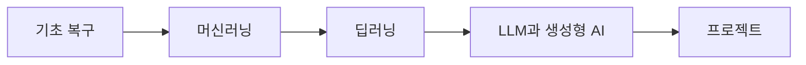

# 시각화 작성 원칙

차트와 다이어그램은 가능한 한 오픈소스 도구와 텍스트 기반 정의를 사용합니다. 원고 안에 시각화의 원본을 남겨두면 수정 이력이 명확하고, 정적 사이트 빌드와 배포 과정에서도 결과를 재현하기 쉽습니다.

## 기본 원칙

- 다이어그램은 우선 Mermaid 코드 블록으로 작성합니다.
- 간단한 비교와 수치 정리는 Markdown 표를 먼저 사용합니다.
- 데이터 기반 차트는 원본 데이터, 생성 스크립트, 결과 이미지를 함께 관리합니다.
- 복잡한 그림은 `docs/assets/` 아래에 SVG 또는 PNG로 저장하고, 가능하면 생성 원본도 함께 보관합니다.
- 외부 자료의 도식이나 차트를 재작성한 경우에도 출처를 남깁니다.
- 다국어를 도입하더라도 도식 원본은 가능한 한 공용 자산으로 유지합니다.
- 도식 안의 보이는 문구는 기본적으로 영어를 유지하고, 각 언어별 설명은 본문과 캡션에서 해결합니다.
- 공용 도식 자산의 기준 원본은 영문 버전입니다.
- 언어별 도식 자산은 기본 선택지가 아니라 예외 선택지입니다.

## 도구 선택 기준

| 목적 | 우선 도구 | 저장 방식 |
| --- | --- | --- |
| 개념 흐름, 모델 구조, 학습 순서 | Mermaid | Markdown 코드 블록 |
| 간단한 수치 비교 | Markdown 표 | Markdown |
| 데이터 기반 정적 차트 | Python 또는 Vega-Lite | 스크립트와 이미지 |
| 복잡한 시스템 구조 | Mermaid, Graphviz, PlantUML | 원본 코드와 SVG |
| 논문 그림 재구성 | 직접 작성한 SVG/PNG | 이미지와 출처 |

## Mermaid 예시

## 작성 규칙

다이어그램은 장식이 아니라 설명을 줄이기 위한 도구로 사용합니다. 본문에서 이미 충분히 설명한 내용을 단순히 다시 그리는 그림은 피하고, 관계, 순서, 비교, 구조를 빠르게 파악해야 할 때 추가합니다.

다국어 사이트를 고려할 때는 도식과 본문의 번역 범위를 구분합니다. 기본 원칙은 `본문을 번역하고 도식은 공용으로 유지`하는 것입니다. 도식 내부 텍스트를 언어별로 바꾸면 유지보수 비용과 레이아웃 검증 비용이 함께 늘어나므로, 본문 설명으로 회수 가능한 경우에는 도식 번역을 하지 않습니다.

시각화 파일을 추가할 때는 다음 정보를 함께 남깁니다.

- 무엇을 설명하는 그림인지
- 어떤 데이터나 자료를 바탕으로 만들었는지
- 자동 생성인지 수작업 작성인지
- 외부 자료를 참고했다면 출처
- 공용 자산인지, 언어별 자산인지
- 언어별 자산이라면 분리한 이유와 기준 원본
- 영문 기준 원본에서 파생되었는지 여부

## 출처와 참고 자료

- Material for MkDocs, "Diagrams", <https://squidfunk.github.io/mkdocs-material/reference/diagrams/>, 확인 날짜: 2026-06-22.
- PyMdown Extensions, "SuperFences", <https://facelessuser.github.io/pymdown-extensions/extensions/superfences/>, 확인 날짜: 2026-06-22.
